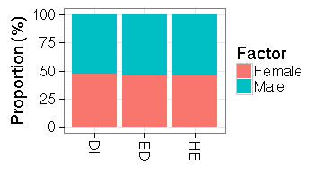

## Preprocessing taxonomic profiling data

Here we show how to manipulate microbiome data sets using tools from
the [phyloseq package](http://joey711.github.io/phyloseq/), including
subsetting, aggregating and filtering.


### Picking data from phyloseq  

Assuming your data ('pseq' below) is in the phyloseq format, many
standard tools are available.


Sample metadata:


```r
library(phyloseq)
meta <- sample_data(pseq)
```

```
## Error in sample_data(pseq): object 'pseq' not found
```

Taxonomy table:


```r
tax.table <- tax_table(pseq)
```

```
## Error in tax_table(pseq): object 'pseq' not found
```


Abundances for taxonomic groups ('OTU table') as a taxa x samples
matrix:


```r
otu <- taxa_abundances(pseq)
```

```
## Error in get_taxa(x): object 'pseq' not found
```


Melted data for plotting:


```r
df <- psmelt(pseq)
```

```
## Error in inherits(physeq, "phyloseq"): object 'pseq' not found
```

```r
kable(head(df))
```


|                                         |
|:----------------------------------------|
|function (x, df1, df2, ncp, log = FALSE) |
|{                                        |
|if (missing(ncp))                        |
|.Call(C_df, x, df1, df2, log)            |
|else .Call(C_dnf, x, df1, df2, ncp, log) |
|}                                        |


### Standard data processing operations

Let us look at [a two-week diet swap
study](http://dx.doi.org/10.1038/ncomms7342) between western (USA) and
traditional (rural Africa) diets including microbiota profiling:


```r
library(microbiome)
data("dietswap")
pseq <- dietswap
```

### Sample operations

Sample names and variables


```r
head(sample_names(pseq))
```

```
## [1] "Sample-1" "Sample-2" "Sample-3" "Sample-4" "Sample-5" "Sample-6"
```

Sample sums


```r
head(sample_sums(pseq))
```

```
## Sample-1 Sample-2 Sample-3 Sample-4 Sample-5 Sample-6 
##   533779  1330516  1822706   835998  1095023  1246234
```

Abundance of a given species in each sample


```r
head(get_sample(pseq, taxa_names(pseq)[1]))
```

```
## Sample-1 Sample-2 Sample-3 Sample-4 Sample-5 Sample-6 
##       11       67       21       42       16       20
```

Filter samples


```r
f1 <- filterfun_sample(topp(0.1))
taxa <- genefilter_sample(pseq, f1, A = round(0.5 * nsamples(pseq)))
```

Select samples by specific metadata fields:


```r
pseq.subset <- subset_samples(pseq, nationality == "AFR")
```


### Data transformations

The microbiome package provides a wrapper for standard sample/OTU transformations. For arbitrary transformations, use the transform_sample_counts function in the phyloseq package.

Log10 transformation (log(1+x) if the data contains zeroes)


```r
pseq.log <- transform_phyloseq(pseq, "log10")
```

Z transformation:


```r
pseq.zotu <- transform_phyloseq(pseq, "Z", "OTU")
```

Relative abundances (the input data needs to be in absolute scale, not logarithmic!):


```r
pseq1 <- transform_phyloseq(pseq, "relative.abundance", "OTU")
pseq2 <- transform_sample_counts(pseq, function(x) x/sum(x))
```


### Variable operations

Sample variable names


```r
sample_variables(pseq)
```

```
## [1] "subject"                "sex"                   
## [3] "nationality"            "group"                 
## [5] "sample"                 "timepoint"             
## [7] "timepoint.within.group" "bmi_group"
```

Pick variable values for a given variable


```r
head(get_variable(pseq, sample_variables(pseq)[1]))
```

```
## [1] byn nms olt pku qjy riv
## 38 Levels: azh azl byn byu cxj dwc dwk eve fua fud gtd gty hsf irh ... zaq
```

```r
# .. or assigning fields to metadata:
# sample_data(GP)$human <- ..
```

### Taxa operations


Number of taxa


```r
n <- ntaxa(pseq)
```


Names


```r
ranks <- rank_names(pseq)
taxa <- taxa_names(pseq)
```


Prune taxa:


```r
taxa <- map_levels(NULL, "Phylum", "Genus", pseq)$Bacteroidetes

# With given taxon names
ex2 <- prune_taxa(taxa, pseq)

# Taxa with positive sum across samples
ex3 <- prune_taxa(taxa_sums(pseq) > 0, pseq)
```


Subset taxa:


```r
pseq <- subset_taxa(pseq, Phylum == "Bacteroidetes")
```


Filter by user-specified function values (here variance):


```r
f <- filter_taxa(pseq, function(x) var(x) > 1e-05, TRUE)
```


List unique phylum-level groups: 


```r
head(get_taxa_unique(pseq, "Phylum"))
```

```
## [1] "Bacteroidetes"
```

Pick detected taxa by sample name:


```r
samplename <- sample_names(pseq)[[1]]
tax.abundances <- get_taxa(pseq, samplename)
```


Taxa sums


```r
head(taxa_sums(pseq))
```

```
##               Allistipes et rel.     Bacteroides fragilis et rel. 
##                          3513027                          2539567 
## Bacteroides intestinalis et rel.       Bacteroides ovatus et rel. 
##                           199684                          1516522 
##     Bacteroides plebeius et rel.  Bacteroides splachnicus et rel. 
##                           596972                           833871
```


### Merging operations

Aggregate taxa to higher taxonomic levels. This is particularly useful if the phylogenetic tree is missing. When it is available, see [merge_samples, merge_taxa and tax_glom](http://joey711.github.io/phyloseq/merge.html))


```r
pseq2 <- summarize_taxa(pseq, "Genus") 
```


Merging phyloseq objects


```r
merge_phyloseq(pseqA, pseqB)
```


### Rarification


```r
pseq.rarified <- rarefy_even_depth(pseq)
```


### Taxonomy 

Convert between taxonomic levels (here from Genus (Akkermansia) to
Phylum (Verrucomicrobia)):


```r
data(atlas1006)
m <- map_levels("Akkermansia", "Genus", "Phylum", tax_table(atlas1006))
print(m)
```

```
## [1] "Verrucomicrobia"
```


### Metadata

Visualize frequencies of given factor (sex) levels within the
indicated groups (group):


```r
data(dietswap)
res <- plot_frequencies(sample_data(dietswap), "group", "sex")
print(res$plot)
```



```r
kable(res$data, digits = 2)
```


|Groups |Factor |  n|   pct|
|:------|:------|--:|-----:|
|DI     |Female | 34| 47.22|
|DI     |Male   | 38| 52.78|
|ED     |Female | 34| 45.33|
|ED     |Male   | 41| 54.67|
|HE     |Female | 34| 45.33|
|HE     |Male   | 41| 54.67|

