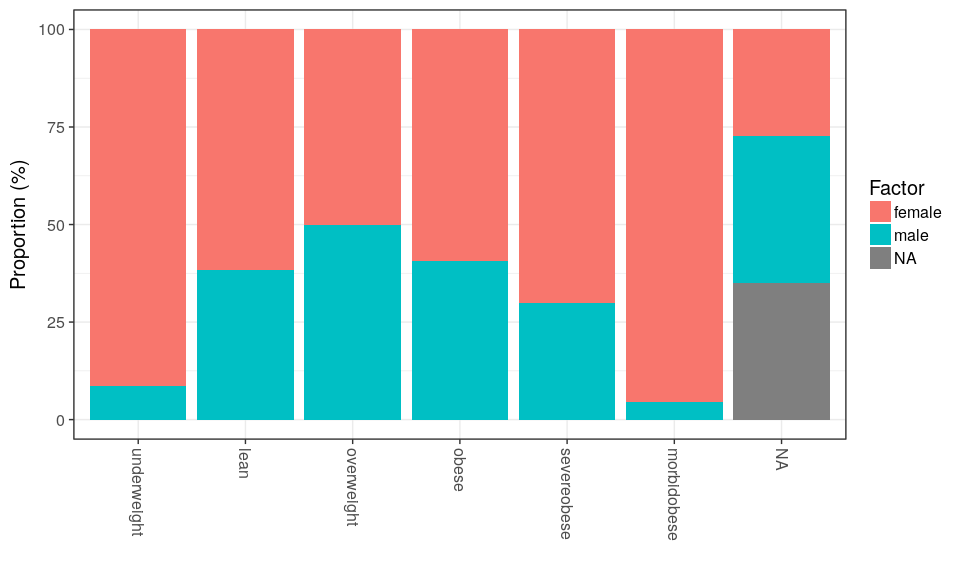

<!--
  %\VignetteEngine{knitr::rmarkdown}
  %\VignetteIndexEntry{microbiome tutorial - Preprocessing}
  %\usepackage[utf8]{inputenc}
  %\VignetteEncoding{UTF-8}  
-->
Processing taxonomic profiling data
-----------------------------------

Instructions to manipulate microbiome data sets using tools from the
[phyloseq package](http://joey711.github.io/phyloseq/) and some
extensions from the [microbiome
package](https://github.com/microbiome/microbiome), including
subsetting, aggregating and filtering.

Load example data:

    library(phyloseq)
    library(microbiome)

    data(atlas1006)   # Load the data
    pseq <- atlas1006 # Rename the data

### Retrieving data elements from a phyloseq object

A phyloseq object contains OTU table (taxa abundances), sample metadata,
taxonomy table (mapping between OTUs and higher-level taxonomic
classifications), and phylogenetic tree (relations between the taxa).
Some of these are optional.

Pick metadata:

    meta <- sample_data(pseq)

Taxonomy table:

    taxonomy <- tax_table(pseq)

Abundances for taxonomic groups ('OTU table') as a TaxaxSamples matrix:

    # Absolute abundances
    otu.absolute <- abundances(pseq)

    # Relative abundances
    otu.relative <- abundances(pseq, "compositional")

Melt phyloseq data for easier plotting:

    df <- psmelt(pseq)
    kable(head(df))

<table>
<thead>
<tr class="header">
<th align="left"></th>
<th align="left">OTU</th>
<th align="left">Sample</th>
<th align="right">Abundance</th>
<th align="right">age</th>
<th align="left">gender</th>
<th align="left">nationality</th>
<th align="left">DNA_extraction_method</th>
<th align="left">project</th>
<th align="right">diversity</th>
<th align="left">bmi_group</th>
<th align="left">subject</th>
<th align="right">time</th>
<th align="left">sample</th>
<th align="left">Phylum</th>
<th align="left">Genus</th>
</tr>
</thead>
<tbody>
<tr class="odd">
<td align="left">113110</td>
<td align="left">Prevotella melaninogenica et rel.</td>
<td align="left">Sample-448</td>
<td align="right">944002</td>
<td align="right">54</td>
<td align="left">female</td>
<td align="left">CentralEurope</td>
<td align="left">o</td>
<td align="left">18</td>
<td align="right">5.98</td>
<td align="left">lean</td>
<td align="left">448</td>
<td align="right">0</td>
<td align="left">Sample-448</td>
<td align="left">Bacteroidetes</td>
<td align="left">Prevotella melaninogenica et rel.</td>
</tr>
<tr class="even">
<td align="left">113015</td>
<td align="left">Prevotella melaninogenica et rel.</td>
<td align="left">Sample-360</td>
<td align="right">902034</td>
<td align="right">45</td>
<td align="left">female</td>
<td align="left">CentralEurope</td>
<td align="left">o</td>
<td align="left">13</td>
<td align="right">5.49</td>
<td align="left">severeobese</td>
<td align="left">360</td>
<td align="right">0</td>
<td align="left">Sample-360</td>
<td align="left">Bacteroidetes</td>
<td align="left">Prevotella melaninogenica et rel.</td>
</tr>
<tr class="odd">
<td align="left">112747</td>
<td align="left">Prevotella melaninogenica et rel.</td>
<td align="left">Sample-190</td>
<td align="right">862870</td>
<td align="right">34</td>
<td align="left">female</td>
<td align="left">CentralEurope</td>
<td align="left">r</td>
<td align="left">7</td>
<td align="right">6.06</td>
<td align="left">lean</td>
<td align="left">190</td>
<td align="right">0</td>
<td align="left">Sample-190</td>
<td align="left">Bacteroidetes</td>
<td align="left">Prevotella melaninogenica et rel.</td>
</tr>
<tr class="even">
<td align="left">113109</td>
<td align="left">Prevotella melaninogenica et rel.</td>
<td align="left">Sample-743</td>
<td align="right">852350</td>
<td align="right">52</td>
<td align="left">male</td>
<td align="left">US</td>
<td align="left">NA</td>
<td align="left">19</td>
<td align="right">5.21</td>
<td align="left">obese</td>
<td align="left">743</td>
<td align="right">0</td>
<td align="left">Sample-743</td>
<td align="left">Bacteroidetes</td>
<td align="left">Prevotella melaninogenica et rel.</td>
</tr>
<tr class="odd">
<td align="left">112944</td>
<td align="left">Prevotella melaninogenica et rel.</td>
<td align="left">Sample-366</td>
<td align="right">851147</td>
<td align="right">52</td>
<td align="left">female</td>
<td align="left">CentralEurope</td>
<td align="left">o</td>
<td align="left">15</td>
<td align="right">5.63</td>
<td align="left">obese</td>
<td align="left">366</td>
<td align="right">0</td>
<td align="left">Sample-366</td>
<td align="left">Bacteroidetes</td>
<td align="left">Prevotella melaninogenica et rel.</td>
</tr>
<tr class="even">
<td align="left">113639</td>
<td align="left">Prevotella melaninogenica et rel.</td>
<td align="left">Sample-375</td>
<td align="right">844482</td>
<td align="right">45</td>
<td align="left">female</td>
<td align="left">CentralEurope</td>
<td align="left">o</td>
<td align="left">16</td>
<td align="right">5.64</td>
<td align="left">severeobese</td>
<td align="left">375</td>
<td align="right">0</td>
<td align="left">Sample-375</td>
<td align="left">Bacteroidetes</td>
<td align="left">Prevotella melaninogenica et rel.</td>
</tr>
</tbody>
</table>

### Sample operations

Sample names and variables

    head(sample_names(pseq))

    ## [1] "Sample-1" "Sample-2" "Sample-3" "Sample-4" "Sample-5" "Sample-6"

Total OTU abundance in each sample

    head(sample_sums(pseq))

    ## Sample-1 Sample-2 Sample-3 Sample-4 Sample-5 Sample-6 
    ##   479428   640574   449884   684997   757697   499535

Abundance of a given species in each sample

    head(get_sample(pseq, "Akkermansia"))

    ## Sample-1 Sample-2 Sample-3 Sample-4 Sample-5 Sample-6 
    ##     1319     2299    29980     3824     2133      864

Filter samples

    f1 <- filterfun_sample(topp(0.1))
    taxa <- genefilter_sample(pseq, f1, A = round(0.5 * nsamples(pseq)))

Select samples by specific metadata fields

    pseq.subset <- subset_samples(pseq, nationality == "US")

Pick samples at the baseline time points only:

    pseq0 <- baseline(pseq)

### Data transformations

The microbiome package provides a wrapper for standard sample/OTU
transforms. For arbitrary transforms, use the transform\_sample\_counts
function in the phyloseq package.

Log10 transform (log(1+x) if the data contains zeroes). Also "Z", "clr",
and "hellinger" are available as common transforms.

    pseq.log <- transform(pseq, "log10")

Relative abundances (the input data needs to be in absolute scale, not
logarithmic!):

    pseq1 <- microbiome::transform(pseq, "compositional", "OTU")
    pseq2 <- phyloseq::transform_sample_counts(pseq, function(x) x/sum(x))

### Variable operations

Sample variable names

    sample_variables(pseq)

    ##  [1] "age"                   "gender"               
    ##  [3] "nationality"           "DNA_extraction_method"
    ##  [5] "project"               "diversity"            
    ##  [7] "bmi_group"             "subject"              
    ##  [9] "time"                  "sample"

Pick values for a given variable

    head(get_variable(pseq, sample_variables(pseq)[1]))

    ## [1] 28 24 52 22 25 42

Assign new fields to metadata

    # Calculate diversity for samples
    div <- microbiome::diversity(pseq, measures = "Shannon")$Shannon

    # Assign this to sample metadata
    sample_data(pseq)$diversity <- div

### Taxa operations

Number of taxa

    n <- ntaxa(pseq)

Most abundant taxa

    topx <- top_taxa(pseq, n = 10)

Names

    ranks <- rank_names(pseq)  # Taxonomic levels
    taxa  <- taxa(pseq)        # Taxa names at the analysed level

Subset taxa:

    pseq.bac <- subset_taxa(pseq, Phylum == "Bacteroidetes")

Prune (select) taxa:

    # List of Genera in the Bacteroideted Phylum
    taxa <- map_levels(NULL, "Phylum", "Genus", pseq)$Bacteroidetes

    # With given taxon names
    ex2 <- prune_taxa(taxa, pseq)

    # Taxa with positive sum across samples
    ex3 <- prune_taxa(taxa_sums(pseq) > 0, pseq)

Filter by user-specified function values (here variance):

    f <- filter_taxa(pseq, function(x) var(x) > 1e-05, TRUE)

List unique phylum-level groups:

    head(get_taxa_unique(pseq, "Phylum"))

    ## [1] "Actinobacteria"         "Bacilli"               
    ## [3] "Proteobacteria"         "Verrucomicrobia"       
    ## [5] "Bacteroidetes"          "Clostridium cluster XV"

Pick the taxa abundances for a given sample:

    samplename <- sample_names(pseq)[[1]]
    tax.abundances <- get_taxa(pseq, samplename)

### Merging operations

Aggregate taxa to higher taxonomic levels. This is particularly useful
if the phylogenetic tree is missing. When it is available, see
[merge\_samples, merge\_taxa and
tax\_glom](http://joey711.github.io/phyloseq/merge.html))

    pseq2 <- aggregate_taxa(pseq, "Phylum") 

Merging phyloseq objects

    merge_phyloseq(pseqA, pseqB)

### Rarification

    pseq.rarified <- rarefy_even_depth(pseq)

### Taxonomy

Convert between taxonomic levels (here from Genus (Akkermansia) to
Phylum (Verrucomicrobia):

    m <- map_levels("Akkermansia", "Genus", "Phylum", tax_table(pseq))
    print(m)

    ## [1] "Verrucomicrobia"

### Metadata

Visualize frequencies of given factor (sex) levels within the indicated
groups (group):

    res <- plot_frequencies(sample_data(pseq), "bmi_group", "gender")
    print(res$plot)

    # Retrieving the actual data values:
    kable(head(res$data), digits = 2)

<table>
<thead>
<tr class="header">
<th align="left">Groups</th>
<th align="left">Factor</th>
<th align="right">n</th>
<th align="right">pct</th>
</tr>
</thead>
<tbody>
<tr class="odd">
<td align="left">underweight</td>
<td align="left">female</td>
<td align="right">21</td>
<td align="right">91.30</td>
</tr>
<tr class="even">
<td align="left">underweight</td>
<td align="left">male</td>
<td align="right">2</td>
<td align="right">8.70</td>
</tr>
<tr class="odd">
<td align="left">lean</td>
<td align="left">female</td>
<td align="right">304</td>
<td align="right">61.66</td>
</tr>
<tr class="even">
<td align="left">lean</td>
<td align="left">male</td>
<td align="right">189</td>
<td align="right">38.34</td>
</tr>
<tr class="odd">
<td align="left">overweight</td>
<td align="left">female</td>
<td align="right">102</td>
<td align="right">50.00</td>
</tr>
<tr class="even">
<td align="left">overweight</td>
<td align="left">male</td>
<td align="right">102</td>
<td align="right">50.00</td>
</tr>
</tbody>
</table>
