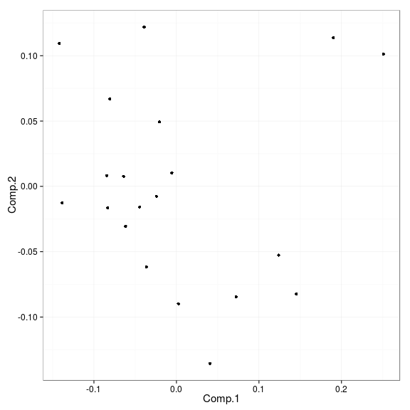

### Data projections

Project high-dimensional data on two-dimensional plane by various methods including PCA, MDS, Sammons mapping etc. (for visualization purposes; see help(project.data) for details):  


```r
library(microbiome, quietly = TRUE)
data.directory <- system.file("extdata", package = "microbiome")
genus.matrix.log10.simulated <- read.profiling(level = "L2", method = "frpa", 
			              data.dir = data.directory, log10 = TRUE)

# Note: transpose the data matrix into samples x features
proj <- project.data(t(genus.matrix.log10.simulated), type = "MDS.nonmetric")
```

```
## initial  value 15.632295 
## iter   5 value 12.895757
## iter  10 value 11.421017
## iter  15 value 11.072375
## iter  15 value 11.064577
## iter  20 value 10.139051
## iter  25 value 9.781502
## final  value 9.705087 
## converged
```

```r
# Plot the projection
library(ggplot2); 
theme_set(theme_bw(15))
ggplot(aes(x = Comp.1, y = Comp.2), data = proj) + geom_point()
```

 

Plot the projection with sample names:


```r
ggplot(aes(x = Comp.1, y = Comp.2, label = rownames(proj)), data = proj) + geom_text()
```

 
