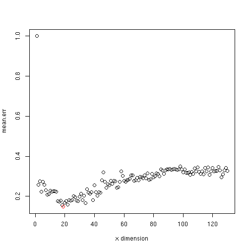

## RDA analysis and visualization. 

Load the package and example data:


```r
library(microbiome)
# Data from https://peerj.com/articles/32/
data("peerj32")
pseq <- peerj32$phyloseq
```

### Standard RDA 

Standard RDA for microbiota profiles versus the given (here 'time')
variable from sample metadata:


```r
# If x has zeroes we can use log(1 + x) transformation
pseq.log10 <- transform_phyloseq(pseq, "log10")
rda.result <- rda_physeq(pseq.log10, "time")
```

### RDA visualization

Visualizing the standard RDA output:


```r
library(phyloseq)
meta <- sample_data(pseq.log10)
plot(rda.result, choices = c(1,2), type = "points", pch = 15, scaling = 3, cex = 0.7, col = meta$time)
points(rda.result, choices = c(1,2), pch = 15, scaling = 3, cex = 0.7, col = meta$time)
library(vegan)
pl <- ordihull(rda.result, meta$time, scaling = 3, label = TRUE)
title("RDA")
```


See also the RDA method in phyloseq ordinate function, which is calculated without the formula.


### RDA significance test


```r
library(vegan)
permutest(rda.result) 
```

```
## 
## Permutation test for rda 
## 
## Permutation: free
## Number of permutations: 99
##  
## Call: rda(formula = otu ~ annot, scale = scale, na.action =
## na.action)
## Permutation test for all constrained eigenvalues
## Pseudo-F:	 0.6049309 (with 1, 42 Degrees of Freedom)
## Significance:	 0.94
```

### Bagged RDA

Fitting bagged (bootstrap aggregated) RDA on a phyloseq object:


```r
res <- bagged_rda(pseq.log10, "group", sig.thresh=0.05, nboot=100)
```



Visualizing bagged RDA:


```r
plot_bagged_rda(res)
```

```
## Error in text.default(scaled.scores, rownames(scaled.scores), cex = 0.5, : X11 font -adobe-helvetica-%s-%s-*-*-%d-*-*-*-*-*-*-*, face 1 at size 6 could not be loaded
```


### RDA with confounding variables 

For more complex RDA scenarios, use the vegan package directly:


```r
# Pick microbiota profiling data from the phyloseq object
otu <- otu_table(pseq.log10)@.Data

# Sample annotations
meta <- sample_data(pseq.log10)

# RDA with confounders
rda.result2 <- rda(t(otu) ~ meta$time + Condition(meta$subject + meta$gender))
```


