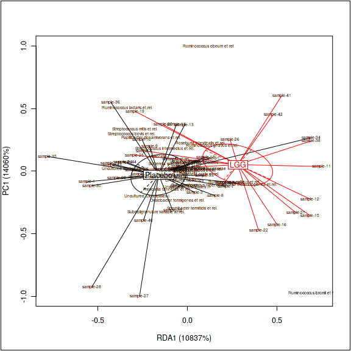
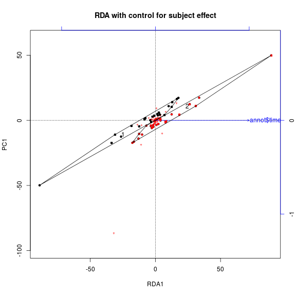

<!--
  %\VignetteEngine{knitr::rmarkdown}
  %\VignetteIndexEntry{microbiome tutorial - rda}
  %\usepackage[utf8]{inputenc}
  %\VignetteEncoding{UTF-8}  
-->


## RDA analysis and visualization. 

Load the package and example data:


```r
library(microbiome)
data(peerj32) # Data from https://peerj.com/articles/32/
pseq <- peerj32$phyloseq # phyloseq data

# Only check the core taxa to speed up examples
pseq <- core(pseq, detection = 10^2, prevalence = 95/100)

pseq.trans <- microbiome::transform(pseq, "hell") # Hellinger transform
```


### Bagged RDA

Bagged RDA provides added robustness in the analysis compared to the standard RDA. Fit bagged (bootstrap aggregated) RDA on a phyloseq object (alternatively you could apply it to the abundance matrix and covariates directly):


```r
# In any real study, use bs.iter = 100 or higher
# to achieve meaningful benefits from the bagged version.
# In this example we use bs.iter = 2 just to speed up the
# example code for educational purposes
res <- rda_bagged(pseq.trans, "group", bs.iter=2)
```

Visualizing bagged RDA:


```r
plot_rda_bagged(res)
```




### Standard RDA 

Standard RDA for microbiota profiles versus the given (here 'time')
variable from sample metadata (see also the RDA method in
phyloseq::ordinate)


```r
x <- pseq.trans
otu <- abundances(x)
metadata <- meta(x)

library(vegan)
rda.result <- vegan::rda(t(otu) ~ factor(metadata$time),
                         na.action = na.fail, scale = TRUE)
```

Proportion explained by the given factor


```r
summary(rda.result)$constr.chi/summary(rda.result)$tot.chi
```

```
## [1] 0.007763033
```


### RDA visualization

Visualize the standard RDA output.


```r
plot(rda.result, choices = c(1,2), type = "points", pch = 15, scaling = 3, cex = 0.7, col = metadata$time)
points(rda.result, choices = c(1,2), pch = 15, scaling = 3, cex = 0.7, col = metadata$time)
pl <- ordihull(rda.result, metadata$time, scaling = 3, label = TRUE)
```




### RDA significance test


```r
permutest(rda.result) 
```

```
## 
## Permutation test for rda 
## 
## Permutation: free
## Number of permutations: 99
##  
## Call: rda(formula = t(otu) ~ factor(metadata$time), scale = TRUE,
## na.action = na.fail)
## Permutation test for all constrained eigenvalues
## Pseudo-F:	 0.3285983 (with 1, 42 Degrees of Freedom)
## Significance:	 0.98
```


### RDA with confounding variables 

For more complex RDA scenarios, use the standard RDA available via the
vegan R package.


```r
# Pick microbiota profiling data from the phyloseq object
otu <- abundances(pseq.trans)

# Sample annotations
metadata <- meta(pseq.trans)

# RDA with confounders using the vegan function
rda.result2 <- vegan::rda(t(otu) ~ metadata$time + Condition(metadata$subject + metadata$gender))
```


