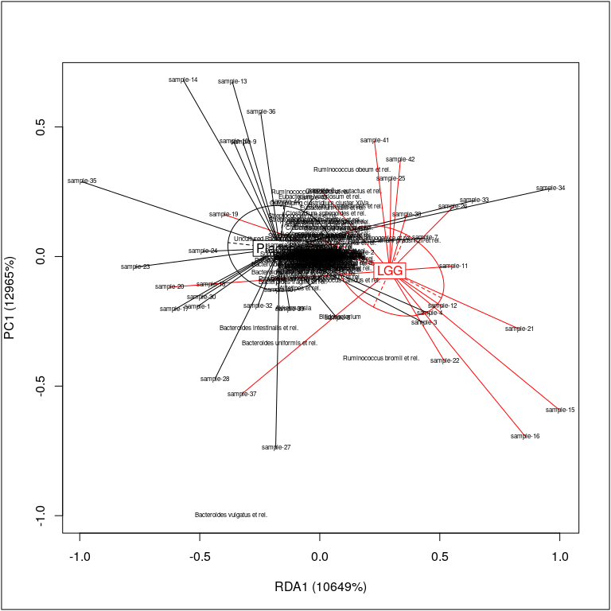
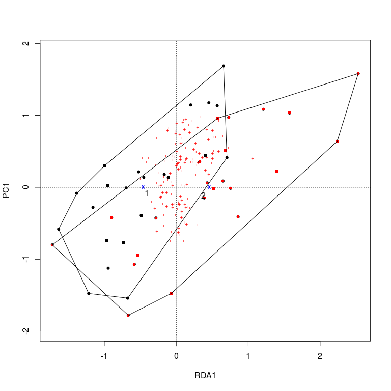

<!--
  %\VignetteEngine{knitr::rmarkdown}
  %\VignetteIndexEntry{microbiome tutorial - rda}
  %\usepackage[utf8]{inputenc}
  %\VignetteEncoding{UTF-8}  
-->
RDA analysis and visualization.
-------------------------------

Load the package and example data:

    library(microbiome)
    data(peerj32) # Data from https://peerj.com/articles/32/
    pseq <- peerj32$phyloseq # phyloseq data
    pseq.trans <- transform(pseq, "hell") # Hellinger transform

### Bagged RDA

Bagged RDA provides added robustness in the analysis compared to the
standard RDA. Fitting bagged (bootstrap aggregated) RDA on a phyloseq
object:

    res <- rda_bagged(pseq.trans, "group", bs.iter=100)

Visualizing bagged RDA:

    plot_rda_bagged(res)

### Standard RDA

Standard RDA for microbiota profiles versus the given (here 'time')
variable from sample metadata (see also the RDA method in
phyloseq::ordinate)

    x <- pseq.trans
    otu <- abundances(x)
    metadata <- meta(x)

    library(vegan)
    rda.result <- vegan::rda(t(otu) ~ factor(metadata$time),
                             na.action = na.fail, scale = TRUE)

Proportion explained by the given factor

    summary(rda.result)$constr.chi/summary(rda.result)$tot.chi

    ## [1] 0.01540884

### RDA visualization

Visualize the standard RDA output.

    plot(rda.result, choices = c(1,2), type = "points", pch = 15, scaling = 3, cex = 0.7, col = metadata$time)
    points(rda.result, choices = c(1,2), pch = 15, scaling = 3, cex = 0.7, col = metadata$time)
    pl <- ordihull(rda.result, metadata$time, scaling = 3, label = TRUE)

### RDA significance test

    permutest(rda.result) 

    ## 
    ## Permutation test for rda 
    ## 
    ## Permutation: free
    ## Number of permutations: 99
    ##  
    ## Call: rda(formula = t(otu) ~ factor(metadata$time), scale = TRUE,
    ## na.action = na.fail)
    ## Permutation test for all constrained eigenvalues
    ## Pseudo-F:     0.6572996 (with 1, 42 Degrees of Freedom)
    ## Significance:     0.96

### RDA with confounding variables

For more complex RDA scenarios, use the standard RDA available via the
vegan R package.

    # Pick microbiota profiling data from the phyloseq object
    otu <- abundances(pseq.trans)

    # Sample annotations
    metadata <- meta(pseq.trans)

    # RDA with confounders using the vegan function
    rda.result2 <- vegan::rda(t(otu) ~ metadata$time + Condition(metadata$subject + metadata$gender))
