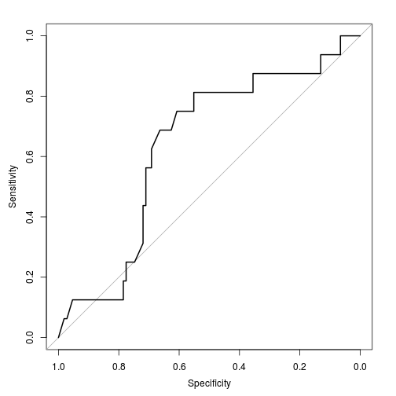

### ROC analysis

A basic example of ROC/AUC analysis.


### Load example data


```r
library(microbiome)
pseq <- download_microbiome("dietswap")
```

```
## Downloading data set from O'Keefe et al. Nat. Comm. 6:6342, 2015 from Data Dryad: http://datadryad.org/resource/doi:10.5061/dryad.1mn1n
```

```r
# Pick two groups of samples
# African, DI group, time points 1 and 2
# See the original publication for details: 
# references provided in help(dietswap)
pseq1 <- subset_samples(pseq, nationality == "AFR" & 
		     timepoint.within.group == 1 & 
		     group == "DI")
pseq2 <- subset_samples(pseq, nationality == "AFR" & 
		     timepoint.within.group == 2 & 
		     group == "DI")

# Pick OTU matrix
otu <- otu_table(pseq)@.Data

# Pick sample metadata
meta <- sample_data(pseq)

# Define two sample groups for demonstration purpose
g1 <- sample_names(pseq1)
g2 <- sample_names(pseq2)

# Compare the two groups with Wilcoxon test
pvalues <- c()
for (tax in rownames(otu)) {
  pvalues[[tax]] <- wilcox.test(otu[tax, g1], otu[tax, g2])$p.value
}

# Assume there are some known true positives 
# Here for instance Bacteroidetes
bacteroidetes <- levelmap("Bacteroidetes", from = "L1", to = "L2", GetPhylogeny("HITChip", "filtered"))$Bacteroidetes
```

```
## Error in levelmap("Bacteroidetes", from = "L1", to = "L2", GetPhylogeny("HITChip", : could not find function "GetPhylogeny"
```


### Overall ROC analysis 

Based on the [xrobin/pROC](https://github.com/xrobin/pROC) package
(see that page for more examples with confidence limits etc):


```r
library(pROC)
```

```
## Error in library(pROC): there is no package called 'pROC'
```

```r
res <- roc(names(pvalues) %in% bacteroidetes, pvalues)
```

```
## Error in eval(expr, envir, enclos): could not find function "roc"
```


### ROC/AUC value


```r
res$auc
```

```
## NULL
```


### Plot ROC curve


```r
plot(res)
```

 
