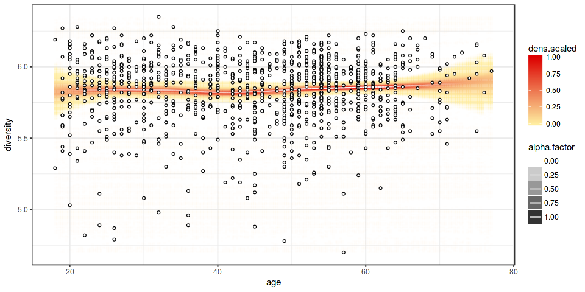

<!--
  %\VignetteEngine{knitr::rmarkdown}
  %\VignetteIndexEntry{microbiome tutorial - regression}
  %\usepackage[utf8]{inputenc}
  %\VignetteEncoding{UTF-8}  
-->
Regression plots
----------------

Load example data

    library(microbiome)
    data(atlas1006)
    pseq <- atlas1006

Regression curve with smoothed error bars based on the
[Visually-Weighted
Regression](http://www.fight-entropy.com/2012/07/visually-weighted-regression.html)
by Solomon M. Hsiang. The sorvi implementation extends [Felix
Schonbrodt's original
code](http://www.nicebread.de/visually-weighted-watercolor-plots-new-variants-please-vote/).
See also [potential analysis](Potential.md).

    p <- plot_regression(diversity ~ age, meta(pseq))
    print(p)

