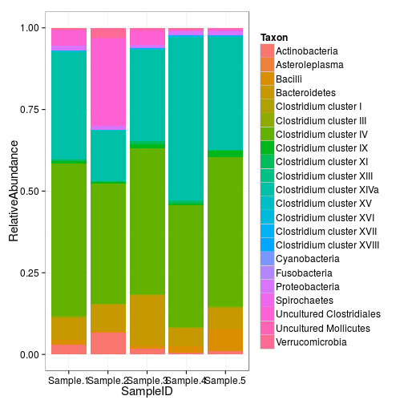
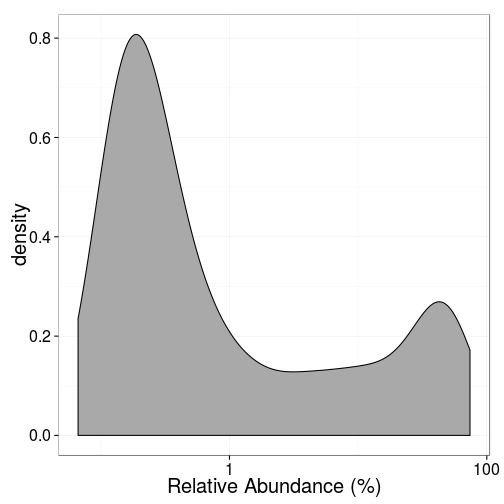

### Relative abundancies

Estimate relative abundance of the taxa in each sample. Note: the input
data set needs to be in absolute scale (not logarithmic).

    # Example data
    library(microbiome)
    data(peerj32)
    x <- peerj32$microbes
    rel <- relative.abundance(t(x))

    # Rearrange the data for ggplot visualization tools
    library(reshape)
    dfm <- melt(rel)
    colnames(dfm) <- c("Taxon", "SampleID", "RelativeAbundance")

    # Provide barplot visualizations of relative abundances for some randomly selected samples
    library(ggplot2)
    library(dplyr)
    dfmf <- filter(dfm, SampleID %in% c("sample-1", "sample-2", "sample-3", "sample-4", "sample-5"))
    p <- ggplot(dfmf, aes(x = SampleID, y = RelativeAbundance, fill = Taxon))
    p <- p + geom_bar(position = "stack", stat = "identity")
    print(p)

    # Also note that taking relative abundances likely changes the abundance histograms
    tax <- "Akkermansia"
    theme_set(theme_bw(20))
    p <- ggplot(filter(dfm, Taxon == tax), aes(x = 100*RelativeAbundance))
    p <- p + geom_density(fill = "darkgray")
    p <- p + scale_x_log10()
    p <- p + xlab("Relative Abundance (%)")
    p <- p + ggtitle(tax)
    print(p)

