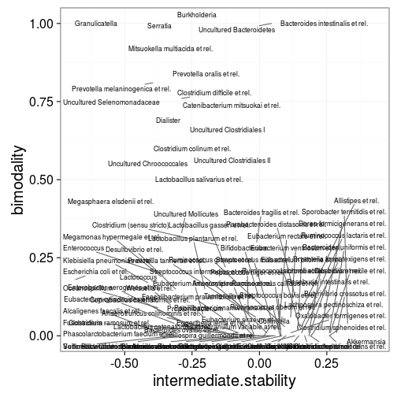
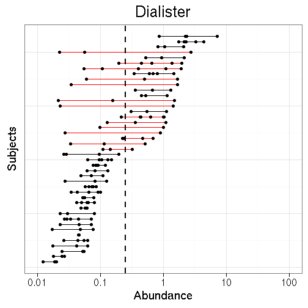
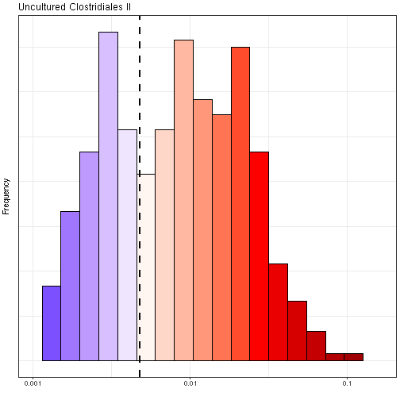

<!--
  %\VignetteEngine{knitr::rmarkdown}
  %\VignetteIndexEntry{microbiome tutorial - stability}
  %\usepackage[utf8]{inputenc}
  %\VignetteEncoding{UTF-8}  
-->


## Microbiome stability analysis

Get example data - [HITChip Atlas of 130 genus-like taxa across 1006 healthy western adults](http://www.nature.com/ncomms/2014/140708/ncomms5344/full/ncomms5344.html). A subset of 76 subjects have also short time series available for temporal stability analysis:


```r
# Load the example data
set.seed(134)
library(microbiome)
data(atlas1006)

# Rename the example data
pseq <- atlas1006

# Focus on specific DNA extraction method
pseq <- pseq %>% subset_samples(DNA_extraction_method == "r")

# Use relative abundances
pseq <- microbiome::transform(pseq, "compositional")

# Keep only the prevalent taxa to speed up examples
pseq <- core(pseq, detection = .2/100, prevalence = 90/100)

# For cross-sectional analysis, use only the baseline time point:
pseq0 <- baseline(pseq)
```


### Intermediate stability quantification

It has been reported that certain microbial groups exhibit bi-stable
abundance distributions with distinct peaks at low and high
abundances, and an instable intermediate abundance range. Instability
at the intermediate abundance range is hence one indicator of
bi-stability. [Lahti et al. 2014](http://www.nature.com/ncomms/2014/140708/ncomms5344/full/ncomms5344.html) used straightforward correlation analysis to quantify how the distance
from the intermediate abundance region (50% quantile) is associated
with the observed shifts between consecutive time points. This can be
calculated with:


```r
intermediate.stability <- intermediate_stability(pseq, output = "scores")
```


### Bimodality quantification

Check the [bimodality page](Bimodality.html) for more examples on bimodality indicators.

Bimodality of the abundance distribution provides another (indirect)
indicator of bistability, although other explanations such as sampling
biases etc. should be controlled. Multiple bimodality scores are
available.

Multimodality score using [potential analysis with bootstrap](http://www.nature.com/ncomms/2014/140708/ncomms5344/full/ncomms5344.html)


```r
# Bimodality is better estimated from log10 abundances
pseq0.log10 <- microbiome::transform(pseq0, "log10")

set.seed(4433)
# In practice, it is recommended to use more bootstrap iterations than in this example
bimodality.score <- bimodality(pseq0.log10, method = "potential_analysis",
                               bs.iter = 50, peak.threshold = 10,
			       min.density = 10)
```


### Comparing bimodality and intermediate stability

The analysis suggests that bimodal population distribution across individuals is often associated with instable intermediate abundances within individuals. The specific bi-stable groups in the upper left corner were suggested to constitute bistable tipping elements of the human intestinal microbiota in [Lahti et al. Nat. Comm. 5:4344, 2014](http://www.nature.com/ncomms/2014/140708/ncomms5344/full/ncomms5344.html):


```r
taxa <- taxa(pseq0)
df <- data.frame(group = taxa,
                 intermediate.stability = intermediate.stability[taxa],
		 bimodality = bimodality.score[taxa])

theme_set(theme_bw(20))
p <- ggplot(df,
       aes(x = intermediate.stability, y = bimodality, label = group)) +
       geom_text() +
       geom_point() 
print(p)
```




### Tipping point detection

Identify potential minima in cross-section population data as
tipping point candidates. 


```r
# Log10 abundance for a selected taxonomic group
# Pick the most bimodal taxa as an example
tax  <- names(which.max(bimodality.score))

# Detect tipping points detection at log10 abundances 
x <- log10(abundances(pseq)[tax,])

# Bootstrapped potential analysis to identify potential minima
# in practice, use more bootstrap iterations
potential.minima <- potential_analysis(log10(abundances(pseq)[tax,]), bs.iter = 20)$minima

# Same with earlywarnings package (without bootstrap ie. less robust)
# library(earlywarnings)
# res <- livpotential_ews(x)$min.points

# Identify the potential minimum location as a tipping point candidate
# and cast the tipping back to the original (non-log) space:
tipping.point <- 10^potential.minima

print(tipping.point)
```

```
## [1] 0.005096475
```


### Visualization with variation lineplot and bimodality hotplot

Pick subset of the [HITChip Atlas data set](http://doi.org/10.5061/dryad.pk75d) and plot the subject abundance variation lineplot (**Variation lineplot**) and **Bimodality hotplot** for a given taxon as in [Lahti et al. 2014](http://www.nature.com/ncomms/2014/140708/ncomms5344/full/ncomms5344.html). The bi-stable Dialister has bimodal population distribution and reduced temporal stability within subjects at intermediate abundances.


Variation plot:


```r
# Indicates the abundance variation range for subjects with multiple time points
pv <- plot_tipping(pseq, tax, tipping.point = tipping.point)
print(pv)
```



Bimodality hotplot:


```r
# Consider a unique sample from each subject: the baseline time point 
ph <- hotplot(pseq0, tax, tipping.point = tipping.point)
print(ph)
```



### Time series for individual subjects


```r
# Experimental function 
source(system.file("extdata/plot_longitudinal.R", package = "microbiome"))
p <- plot_longitudinal(pseq, "Dialister", subject = "831", tipping.point = 0.5)
print(p)
```

