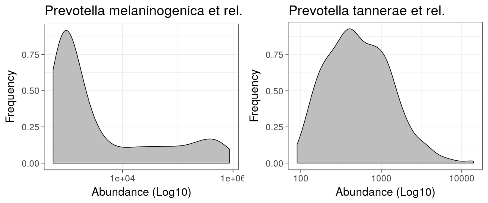
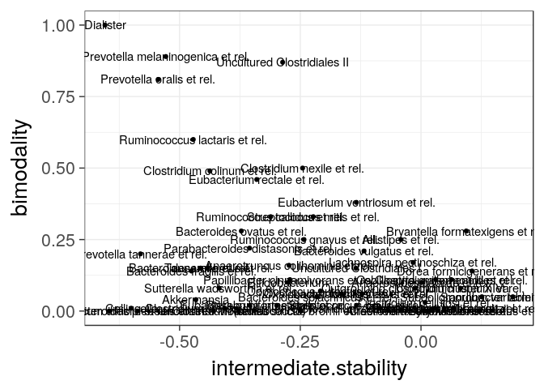
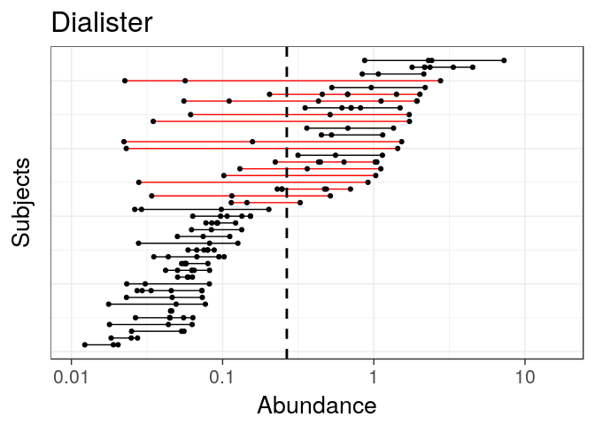
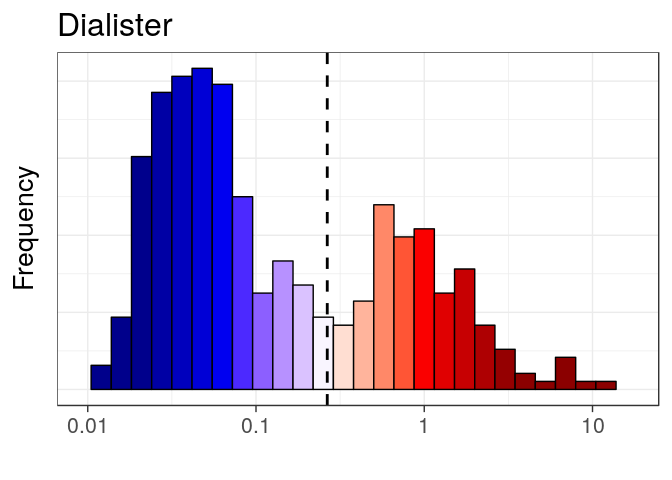
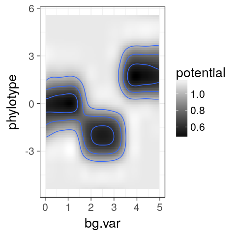

<!--
  %\VignetteEngine{knitr::rmarkdown}
  %\VignetteIndexEntry{microbiome tutorial - stability}
  %\usepackage[utf8]{inputenc}
  %\VignetteEncoding{UTF-8}  
-->
Microbiome stability analysis
-----------------------------

Get example data - [HITChip Atlas of 130 genus-like taxa across 1006
healthy western
adults](http://www.nature.com/ncomms/2014/140708/ncomms5344/full/ncomms5344.html).
A subset of 76 subjects have also short time series available for
temporal stability analysis:

    # Load the example data
    library(microbiome)
    data(atlas1006)

    # Rename the example data
    pseq <- atlas1006

    # Focus on Bacteroides Phylum and specific DNA extraction method
    pseq <- pseq %>%
            subset_taxa(Phylum == "Bacteroidetes") %>%
            subset_samples(DNA_extraction_method == "r")

    # Keep prevalent taxa (HITChip signal >3 in >95 percent of the samples)
    pseq <- core(pseq, detection.threshold = 10^3, prevalence.threshold = 20)

    # For cross-sectional analysis, include
    # only the zero time point:
    pseq0 <- subset_samples(pseq, time == 0)

### Intermediate stability quantification

It has been reported that certain microbial groups exhibit bi-stable
abundance distributions with distinct peaks at low and high abundances,
and an instable intermediate abundance range. Instability at the
intermediate abundance range is hence one indicator of bi-stability.
[Lahti et al.
2014](http://www.nature.com/ncomms/2014/140708/ncomms5344/full/ncomms5344.html)
used straightforward correlation analysis to quantify how the distance
from the intermediate abundance region (50% quantile) is associated with
the observed shifts between consecutive time points. This can be
calculated with:

    intermediate.stability <- intermediate_stability(pseq, output = "scores")

### Bimodality quantification

Bimodality of the abundance distribution provides another (indirect)
indicator of bistability, although other explanations such as sampling
biases etc. should be controlled. Multiple bimodality scores are
available.

Multimodality score using [potential analysis with
bootstrap](http://www.nature.com/ncomms/2014/140708/ncomms5344/full/ncomms5344.html)

    bimodality.pb <- bimodality(pseq0, method = "potential_bootstrap")

Sarle's bimodality coefficient (see help(coefficient\_of\_bimodality)):

    bimodality.sarle <- bimodality(pseq0, method = "Sarle.finite.sample")

Some other standard multimodality tests include the DIP test from the
[diptest](https://cran.r-project.org/web/packages/diptest/index.html)
package.

Visualize population densities

    # Pick the most and least bimodal taxa as examples
    bimodality <- bimodality.sarle
    unimodal <- names(which.min(bimodality))
    bimodal  <- names(which.max(bimodality))

    # Visualize population frequencies
    library(ggplot2)
    theme_set(theme_bw(20))
    p1 <- plot_density(pseq, variable = unimodal, log10 = TRUE) 
    p2 <- plot_density(pseq, variable = bimodal,  log10 = TRUE) 
    library(gridExtra)
    library(ggplot2)
    grid.arrange(p1, p2, nrow = 1)

### Comparing bimodality and intermediate stability

The analysis suggests that bimodal population distribution across
individuals is often associated with instable intermediate abundances
within individuals. The specific bi-stable groups in the upper left
corner were suggested to constitute bistable tipping elements of the
human intestinal microbiota in [Lahti et al. Nat. Comm. 5:4344,
2014](http://www.nature.com/ncomms/2014/140708/ncomms5344/full/ncomms5344.html):

    taxa <- taxa_names(pseq0)
    df <- data.frame(group = taxa,
                     intermediate.stability = intermediate.stability[taxa],
             bimodality = bimodality[taxa])
    theme_set(theme_bw(20))
    p <- ggplot(df, aes(x = intermediate.stability, y = bimodality, label = group))

    # Repel overlapping labels
    # Install ggrepel package if needed
    # install.packages("devtools")
    # devtools::install_github("slowkow/ggrepel")
    # See https://github.com/slowkow/ggrepel/blob/master/vignettes/ggrepel.md
    library(ggrepel)
    p <- p + geom_text_repel(size = 3)

    print(p)

Tipping point detection
-----------------------

Identify potential minima in cross-section population data as tipping
point candidates.

    # Pick example data
    library(phyloseq)
    pseq <- transform_phyloseq(pseq, "compositional")

    # Log10 for given group
    tax <- "Prevotella oralis et rel."
    x <- log10(get_sample(pseq, tax))

    # Potential analysis to identify potential minima
    library(earlywarnings)
    res <- livpotential_ews(x)

    # Identify the potential minimum location as a tipping point candidate 
    tipping.point <- 10^res$min.points

    print(tipping.point)

    ## [1] 5.034405

Variation lineplot and Bimodality hotplot
-----------------------------------------

Pick subset of the [HITChip Atlas data
set](http://doi.org/10.5061/dryad.pk75d) and plot the subject abundance
variation lineplot (**Variation lineplot**) and **Bimodality hotplot**
for a given taxon as in [Lahti et al.
2014](http://www.nature.com/ncomms/2014/140708/ncomms5344/full/ncomms5344.html).
The bi-stable Dialister has bimodal population distribution and reduced
temporal stability within subjects at intermediate abundances.

    # Variation line plot:
    # Indicates the abundance variation range
    # for subjects with multiple time points
    pv <- plot_variation(pseq, tax, tipping.point = tipping.point, xlim = c(0.01, 100))
    print(pv)

    # Bimodality hotplot:
    # Only consider a unique sample from each subject
    # baseline time point for density plot
    ph <- plot_bimodal(pseq0, tax, tipping.point = tipping.point)
    print(ph)

### Potential analysis

Potential analysis (following [Hirota et al. Science, 334,
232-235.](http://www.sciencemag.org/content/334/6053/232.long))

    # Create simulated example data
    X <- c(rnorm(1000, mean = 0), rnorm(1000, mean = -2), 
                   rnorm(1000, mean = 2))
    param <- seq(0,5,length=3000) 

    # Run potential analysis
    res <- movpotential_ews(X, param)

    # Visualize
    p <- plot_potential(res$res)
    print(p)

