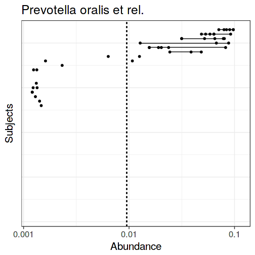

# Microbiome stability analysis

Get example data - [HITChip Atlas of 130 genus-like taxa across 1006 healthy western adults](http://www.nature.com/ncomms/2014/140708/ncomms5344/full/ncomms5344.html). A subset of 76 subjects have also short time series available for temporal stability analysis:


```r
library(microbiome)
data(atlas1006)
pseq <- atlas1006

# Let us keep only prevalent taxa
# (HITChip signal >3 in >20 percent of the samples)
pseq <- filter_prevalent(pseq, detection.threshold = 10^3, prevalence.threshold = 0.2)
```


## Quantify intermediate stability 

It has been reported that certain microbial groups exhibit bi-stable
abundance distributions with distinct peaks at low and high
abundances, and an instable intermediate abundance range. Instability
at the intermediate abundance range is hence one indicator of
bi-stability. [Lahti et
al. 2014](http://www.nature.com/ncomms/2014/140708/ncomms5344/full/ncomms5344.html)
used straightforward correlation analysis to quantify how the distance
from the intermediate abundance region (50% quantile) is associated
with the observed shifts between consecutive time points. This can be
calculated with:


```r
intermediate.stability <- intermediate_stability(pseq, output = "scores")
```


## Quantify bimodality 

Bimodality of the abundance distribution provides another (indirect)
indicator of bistability, although other explanations such as sampling
biases etc. should be controlled. Multiple bimodality scores are
available.

Let is stick to cross-sectional analysis of bimodality and include
only the samples from the zero time point:


```r
pseq0 <- subset_samples(pseq, time == 0 & DNA_extraction_method == "r")
```


Multimodality score using [potential analysis with
bootstrap](http://www.nature.com/ncomms/2014/140708/ncomms5344/full/ncomms5344.html)


```r
bimodality.pb <- bimodality(pseq0, method = "potential_bootstrap")
```

Sarle's bimodality coefficient (see help(coefficient_of_bimodality)):


```r
bimodality.sarle <- bimodality(pseq0, method = "Sarle.finite.sample")
```

Some other standard multimodality tests include the DIP test from the
[diptest](https://cran.r-project.org/web/packages/diptest/index.html)
package.


Visualize population densities 


```r
# Pick the most and least bimodal taxa as examples
bimodality <- bimodality.pb
unimodal <- names(which.min(bimodality))
bimodal  <- names(which.max(bimodality))

# Visualize population frequencies
library(ggplot2)
theme_set(theme_bw(20))
p1 <- plot_density(pseq, variable = unimodal, log10 = TRUE) 
p2 <- plot_density(pseq, variable = bimodal,  log10 = TRUE) 
library(gridExtra)
library(ggplot2)
grid.arrange(p1, p2, nrow = 1)
```


## Comparing bimodality and intermediate stability

The analysis suggests that bimodal population distribution across individuals is often associated with instable intermediate abundances within individuals. The specific bi-stable groups in the upper left corner were suggested to constitute bistable tipping elements of the human intestinal microbiota in [Lahti et al. Nat. Comm. 5:4344, 2014](http://www.nature.com/ncomms/2014/140708/ncomms5344/full/ncomms5344.html):


```r
taxa <- taxa_names(pseq0)
df <- data.frame(group = taxa,
                 intermediate.stability = intermediate.stability[taxa],
		 bimodality = bimodality.pb[taxa])
theme_set(theme_bw(20))
p <- ggplot(df, aes(x = intermediate.stability, y = bimodality, label = group))

# Repel overlapping labels
# Install ggrepel package if needed
# install.packages("devtools")
# devtools::install_github("slowkow/ggrepel")
# See https://github.com/slowkow/ggrepel/blob/master/vignettes/ggrepel.md
library(ggrepel)
p <- p + geom_text_repel(size = 3)

print(p)
```


## Detecting a tipping point

Identify potential minima in cross-section population data as
tipping point candidates. 


```r
# Pick example data
library(phyloseq)
library(microbiome)
data("atlas1006")
pseq <- atlas1006
pseq <- subset_samples(pseq, DNA_extraction_method == "r")
pseq <- transform_phyloseq(pseq, "relative.abundance")

# Dialister log10 relative abundance
x <- log10(get_sample(pseq, "Dialister"))

# Potential analysis to identify potential minima
library(earlywarnings)
res <- livpotential_ews(x)

# Identify the potential minimum location as a tipping point candidate 
tipping.point <- 10^res$min.points

print(tipping.point)
```

```
## [1] 0.2491531
```

## Variation lineplot and Bimodality hotplot

Pick subset of the [HITChip Atlas data set](http://doi.org/10.5061/dryad.pk75d) and plot the subject abundance variation lineplot (**Variation lineplot**) and **Bimodality hotplot** for a given taxon as in [Lahti et al. 2014](http://www.nature.com/ncomms/2014/140708/ncomms5344/full/ncomms5344.html). The bi-stable Dialister has bimodal population distribution and reduced temporal stability within subjects at intermediate abundances.


```r
# Variation line plot:
# Indicates the abundance variation range
# for subjects with multiple time points
pv <- plot_variation(pseq, "Dialister", tipping.point = tipping.point, xlim = c(0.01, 100))
print(pv)

# Bimodality hotplot:
# Only consider a unique sample from each subject
# baseline time point for density plot
pseq.baseline <- subset_samples(pseq, time == 0)
ph <- plot_bimodal(pseq.baseline, "Dialister", tipping.point = tipping.point)
print(ph)
```




### Version information


```r
sessionInfo()
```

```
## R version 3.2.5 (2016-04-14)
## Platform: x86_64-pc-linux-gnu (64-bit)
## Running under: Ubuntu 16.04 LTS
## 
## locale:
##  [1] LC_CTYPE=en_US.UTF-8       LC_NUMERIC=C              
##  [3] LC_TIME=de_BE.UTF-8        LC_COLLATE=en_US.UTF-8    
##  [5] LC_MONETARY=de_BE.UTF-8    LC_MESSAGES=en_US.UTF-8   
##  [7] LC_PAPER=de_BE.UTF-8       LC_NAME=C                 
##  [9] LC_ADDRESS=C               LC_TELEPHONE=C            
## [11] LC_MEASUREMENT=de_BE.UTF-8 LC_IDENTIFICATION=C       
## 
## attached base packages:
## [1] grid      stats     graphics  grDevices utils     datasets  methods  
## [8] base     
## 
## other attached packages:
##  [1] earlywarnings_1.1.22 tseries_0.10-34      tgp_2.4-14          
##  [4] moments_0.14         ggrepel_0.5.1        gridExtra_2.2.1     
##  [7] knitcitations_1.0.7  knitr_1.12.3         intergraph_2.0-2    
## [10] sna_2.3-2            network_1.13.0       ggnet_0.1.0         
## [13] GGally_1.0.1         devtools_1.11.0      limma_3.26.9        
## [16] sorvi_0.7.45         tibble_1.0           ggplot2_2.1.0       
## [19] tidyr_0.4.1          dplyr_0.4.3          MASS_7.3-45         
## [22] netresponse_1.20.15  reshape2_1.4.1       mclust_5.2          
## [25] minet_3.28.0         Rgraphviz_2.14.0     graph_1.48.0        
## [28] microbiome_0.99.81   RSQLite_1.0.0        DBI_0.3.1           
## [31] phyloseq_1.14.0     
## 
## loaded via a namespace (and not attached):
##  [1] nlme_3.1-127          bitops_1.0-6          matrixStats_0.50.2   
##  [4] lubridate_1.5.6       httr_1.1.0            doParallel_1.0.10    
##  [7] RColorBrewer_1.1-2    dynamicTreeCut_1.63-1 tools_3.2.5          
## [10] R6_2.1.2              vegan_2.3-5           rpart_4.1-10         
## [13] KernSmooth_2.23-15    dmt_0.8.20            lazyeval_0.1.10      
## [16] Hmisc_3.17-3          nortest_1.0-4         BiocGenerics_0.16.1  
## [19] mgcv_1.8-12           colorspace_1.2-6      permute_0.9-0        
## [22] ade4_1.7-4            nnet_7.3-12           withr_1.0.1          
## [25] preprocessCore_1.32.0 chron_2.3-47          WGCNA_1.51           
## [28] Biobase_2.30.0        formatR_1.3           Cairo_1.5-9          
## [31] labeling_0.3          scales_0.4.0          lmtest_0.9-34        
## [34] mvtnorm_1.0-5         quadprog_1.5-5        stringr_1.0.0        
## [37] digest_0.6.9          foreign_0.8-66        XVector_0.10.0       
## [40] bibtex_0.4.0          maps_3.1.0            impute_1.44.0        
## [43] zoo_1.7-12            acepack_1.3-3.3       RCurl_1.95-4.8       
## [46] magrittr_1.5          GO.db_3.2.2           Formula_1.2-1        
## [49] Matrix_1.2-5          Rcpp_0.12.4           munsell_0.4.3        
## [52] S4Vectors_0.8.11      maptree_1.4-7         RefManageR_0.10.13   
## [55] ape_3.4               stringi_1.0-1         RJSONIO_1.3-0        
## [58] zlibbioc_1.16.0       plyr_1.8.3            qvalue_2.2.2         
## [61] parallel_3.2.5        lattice_0.20-33       Biostrings_2.38.4    
## [64] splines_3.2.5         multtest_2.26.0       igraph_1.0.1         
## [67] fastcluster_1.1.20    boot_1.3-18           codetools_0.2-14     
## [70] stats4_3.2.5          XML_3.98-1.4          evaluate_0.8.3       
## [73] latticeExtra_0.6-28   biom_0.3.12           data.table_1.9.6     
## [76] spam_1.3-0            foreach_1.4.3         gtable_0.2.0         
## [79] reshape_0.8.5         assertthat_0.1        Kendall_2.2          
## [82] survival_2.39-2       iterators_1.0.8       som_0.3-5            
## [85] AnnotationDbi_1.32.3  memoise_1.0.0         IRanges_2.4.8        
## [88] fields_8.3-6          cluster_2.0.4
```

