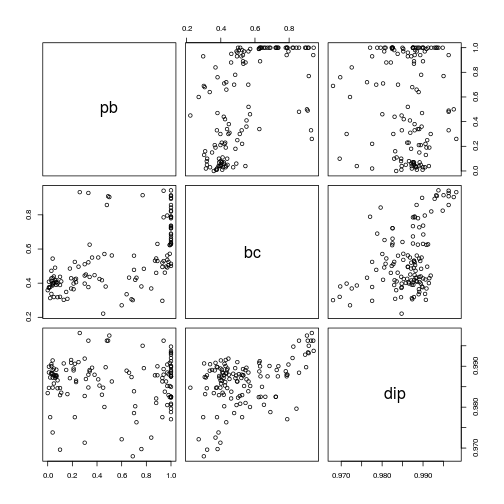

# Microbiome stability analysis

Download example data - HITChip Atlas of 130 genus-like taxa across 1006 healthy western adults from [Lahti et al. Nat. Comm. 5:4344, 2014](http://www.nature.com/ncomms/2014/140708/ncomms5344/full/ncomms5344.html). A subset of 76 subjects have also short time series for temporal stability analysis:


```r
library(microbiome)
pseq <- download_microbiome("atlas1006")
```

```
## Downloading data set from Lahti et al. Nat. Comm. 5:4344, 2014 from Data Dryad: http://doi.org/10.5061/dryad.pk75d
```


## Intermediate stability 

Quantify temporal stability across the abundance range for each taxa


```r
stability <- intermediate_stability(pseq, method = "correlation")
intermediate.stability <- sapply(stability, function (x) {x$stability})
```


## Bimodality analysis

Multiple scores are available to calculate coefficients of bimodality
for each taxonomic group. Some of the scores are more generally
quantifying multimodality, or deviation from unimodality but do not
yield estimates of the number of modes. 


```r
# Pick samples from zero time point (cross-sectional analysis)
pseq0 <- subset_samples(pseq, time == 0 & DNA_extraction_method == "r")

# Bimodality score with potential analysis + bootstrap 
bimodality <- multimodality(pseq0, method = "potential_bootstrap")

# Coefficient of bimodality. Also see the function coefficient_of_bimodality
bimodality.coef <- multimodality(pseq0, method = "coefficient_of_bimodality")
```

DIP test for multimodality:


```r
# DIP multimodality test uses the separate diptest package.
library(diptest)

# Pick OTU log10 data
otu <- otu_table(pseq0)@.Data
dip <- apply(otu, 1, function (x) dip.test(x, simulate.p.value = TRUE, B = 1000))
dip2 <- data.frame(t(sapply(dip, function (x) {c(x$statistic, x$p.value)})))
colnames(dip2) <- c("score", "p.value")
dip2$tax <- names(dip)

# Dip measures unimodality. Values range between 0 to 1. 
# Values less than 0.05 indicate significant deviation from unimodality. 
# To score multimodality, use the inverse:
multimodality.dip <- 1 - dip2$score
```


Compare the alternative bimodality scores


```r
pairs(cbind(pb = bimodality, bc = bimodality.coef, dip = multimodality.dip))
```

 


Visualize population densities for selected taxa


```r
# Pick the most and least bimodal taxa as examples
unimodal <- names(which.min(bimodality))
bimodal <- names(which.max(bimodality))

# Visualize population frequencies
p1 <- plot_density(pseq, otu.name = unimodal, log10 = TRUE) 
p2 <- plot_density(pseq, otu.name = bimodal, log10 = TRUE) 
library(gridExtra)
grid.arrange(p1, p2, nrow = 1)
```

```
## Error: could not find function "ggplotGrob"
```


## Bimodality versus intermediate stability

The analysis suggests that bimodal taxa tend to have instable intermediate abundances (following [Lahti et al. Nat. Comm. 5:4344, 2014](http://www.nature.com/ncomms/2014/140708/ncomms5344/full/ncomms5344.html) but with a different subset, parameters and model):


```r
# For clarity, visualize only the prevalent taxa seen with HITChip signal >250
# (note HITChip signal reflects read count but is conceptually different) 
# in at least 10% of the samples. 
pseqf <- filter_taxa(pseq0, function(x) sum(x > 300) > (0.2*length(x)), TRUE)

# Taxa that have bistability and bimodality estimates
s <- taxa_names(pseqf)

plot(intermediate.stability[s], bimodality[s], xlab = "Intermediate stability", ylab = "Bimodality", type = "n")
text(intermediate.stability[s], bimodality[s], label = s, cex = 0.7)
```

 


### TODO

Add examples on tipping elements.


### Version information


```r
sessionInfo()
```

```
## R version 3.2.0 (2015-04-16)
## Platform: x86_64-unknown-linux-gnu (64-bit)
## Running under: Ubuntu 15.04
## 
## locale:
##  [1] LC_CTYPE=en_US.UTF-8       LC_NUMERIC=C              
##  [3] LC_TIME=en_US.UTF-8        LC_COLLATE=en_US.UTF-8    
##  [5] LC_MONETARY=en_US.UTF-8    LC_MESSAGES=en_US.UTF-8   
##  [7] LC_PAPER=en_US.UTF-8       LC_NAME=C                 
##  [9] LC_ADDRESS=C               LC_TELEPHONE=C            
## [11] LC_MEASUREMENT=en_US.UTF-8 LC_IDENTIFICATION=C       
## 
## attached base packages:
## [1] grid      parallel  stats     graphics  grDevices utils     datasets 
## [8] methods   base     
## 
## other attached packages:
##  [1] gridExtra_0.9.1     diptest_0.75-6      microbiome_0.99.52 
##  [4] RPA_1.24.0          affy_1.46.0         Biobase_2.28.0     
##  [7] BiocGenerics_0.14.0 phyloseq_1.13.2     knitr_1.10.5       
## [10] scimapClient_0.2.1 
## 
## loaded via a namespace (and not attached):
##   [1] nlme_3.1-120              bitops_1.0-6             
##   [3] RColorBrewer_1.1-2        GenomeInfoDb_1.4.0       
##   [5] tools_3.2.0               vegan_2.2-1              
##   [7] affyio_1.36.0             rpart_4.1-9              
##   [9] KernSmooth_2.23-14        Hmisc_3.16-0             
##  [11] nortest_1.0-3             DBI_0.3.1                
##  [13] mgcv_1.8-6                colorspace_1.2-6         
##  [15] permute_0.8-4             ade4_1.7-2               
##  [17] nnet_7.3-9                DESeq2_1.8.1             
##  [19] moments_0.14              preprocessCore_1.30.0    
##  [21] chron_2.3-45              rdryad_0.1.1             
##  [23] formatR_1.2               RGCCA_2.0                
##  [25] tseries_0.10-34           scales_0.2.4             
##  [27] lmtest_0.9-33             genefilter_1.50.0        
##  [29] quadprog_1.5-5            OAIHarvester_0.1-7       
##  [31] tgp_2.4-11                stringr_1.0.0            
##  [33] digest_0.6.8              foreign_0.8-63           
##  [35] earlywarnings_1.1.19      XVector_0.8.0            
##  [37] maps_2.3-9                RSQLite_1.0.0            
##  [39] BiocInstaller_1.18.2      zoo_1.7-12               
##  [41] gtools_3.4.2              BiocParallel_1.2.1       
##  [43] dplyr_0.4.1               acepack_1.3-3.3          
##  [45] RCurl_1.95-4.6            magrittr_1.5             
##  [47] Formula_1.2-1             futile.logger_1.4.1      
##  [49] Matrix_1.2-0              Rcpp_0.11.6              
##  [51] munsell_0.4.2             S4Vectors_0.6.0          
##  [53] maptree_1.4-7             ape_3.2                  
##  [55] proto_0.3-10              stringi_0.4-1            
##  [57] MASS_7.3-40               RJSONIO_1.3-0            
##  [59] zlibbioc_1.14.0           plyr_1.8.2               
##  [61] gdata_2.16.1              lattice_0.20-31          
##  [63] Biostrings_2.36.1         splines_3.2.0            
##  [65] multtest_2.24.0           annotate_1.46.0          
##  [67] locfit_1.5-9.1            igraph_0.7.1             
##  [69] GenomicRanges_1.20.3      boot_1.3-16              
##  [71] mixOmics_5.0-4            geneplotter_1.46.0       
##  [73] reshape2_1.4.1            codetools_0.2-11         
##  [75] stats4_3.2.0              futile.options_1.0.0     
##  [77] XML_3.98-1.1              evaluate_0.7             
##  [79] RcppArmadillo_0.5.100.1.0 latticeExtra_0.6-26      
##  [81] biom_0.3.12               lambda.r_1.1.7           
##  [83] data.table_1.9.4          spam_1.0-1               
##  [85] foreach_1.4.2             gtable_0.1.2             
##  [87] assertthat_0.1            ggplot2_1.0.1            
##  [89] xtable_1.7-4              sorvi_0.7.23             
##  [91] Kendall_2.2               survival_2.38-1          
##  [93] pheatmap_1.0.2            iterators_1.0.7          
##  [95] som_0.3-5                 AnnotationDbi_1.30.1     
##  [97] IRanges_2.2.1             fields_8.2-1             
##  [99] cluster_2.0.1             rgl_0.95.1247
```

