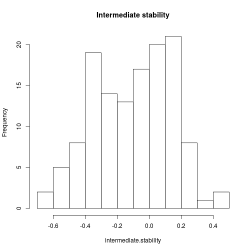
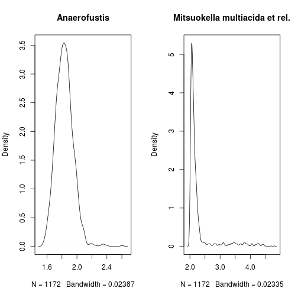
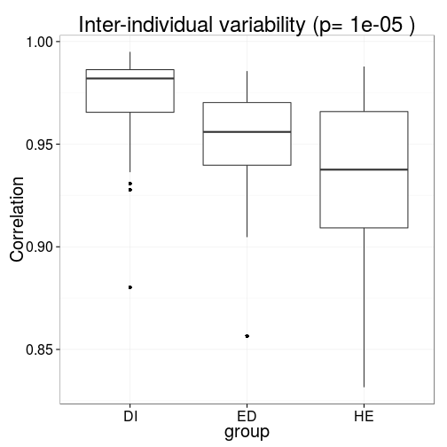

### Stability analysis 

Calculate stability as the average correlation between samples and their
mean for a given phylotypes vs. samples matrix:


```r
# Download example data (Lahti et al. Nat. Comm. 5:4344, 2014)
library(microbiome)
data.atlas1006 <- download_microbiome("atlas1006")
```

```
## Downloading data set from Lahti et al. Nat. Comm. from Data Dryad: http://doi.org/10.5061/dryad.pk75d
```

```r
# OTU matrix (absolute HITChip signal; samples x OTUs)
otu <- data.atlas1006$microbes

# Metadata (samples x features)
meta <- data.atlas1006$meta

# Convert data into phyloseq format
pseq <- hitchip2physeq(otu, meta, taxonomy = NULL)
```

```
## Reading /home/antagomir/R/x86_64-unknown-linux-gnu-library/3.2/microbiome/extdata/phylogeny.full.tab
```

```r
# Quantify temporal stability across the abundance range
stability <- intermediate_stability(pseq, method = "correlation")
intermediate.stability <- sapply(stability, function (x) {x$stability})
hist(intermediate.stability, main = "Intermediate stability")
```

 


## Bimodality quantification

Calculate coefficient of bimodality (used in [Shade et
al.](http://mbio.asm.org/content/5/4/e01371-14)) for taxa in an
example data set, and plot the taxa with the lowest and highest score:


```r
# Pick samples from zero time point (cross-sectional analysis)
pseq0 <- subset_samples(pseq, time == 0)

# Calculate coefficient of bimodality for each taxa
bimodality <- multimodality(pseq0, method = "potential.bootstrap")
# bimodality.coef <- multimodality(pseq0, method = "coefficient.of.bimodality")

# Compare the two bimodality scores
# plot(bimodality.potential, bimodality.coef)

# Pick log10 data
pseq0log <- transform_sample_counts(pseq0, function(x) log10(x) )
x <- otu_table(pseq0log)@.Data

# Pick the most and least bimodal taxa as examples
unimodal <- names(which.min(bimodality))
bimodal <- names(which.max(bimodality))

# Visualize population frequencies
par(mfrow = c(1,2))
plot(density(x[unimodal, ]), main = unimodal)
plot(density(x[bimodal, ]), main = bimodal)
```

 

## Bimodality versus intermediate stability

The analysis suggests that bimodal taxa tend to have instable intermediate abundances:


```r
s <- intersect(names(intermediate.stability), names(bimodality))
plot(intermediate.stability[s], bimodality[s], xlab = "Intermediate stability", ylab = "Bimodality")
```

 


### Variability within group of samples (inter-individual stability)

Assess 'inter-individual stability' as in [Salonen et al. ISME J 2014](http://www.nature.com/ismej/journal/v8/n11/full/ismej201463a.html). This is defined as the average correlation between samples and their mean for a given samples vs phylotypes matrix. For the illustration, calculate inter-individual stability (variability) separately for Placebo and LGG groups.


```r
# Example data
library(microbiome)
data.peerj32 <- download_microbiome("peerj32")
x <- data.peerj32$microbes
m <- data.peerj32$meta

# Estimate inter-individual variability
res <- estimate_variability(x, m, "interindividual")
library(ggplot2)
theme_set(theme_bw(20))
p <- ggplot(res$data, aes(x = group, y = correlation))
p <- p + geom_boxplot()
p <- p + ggtitle(paste("Inter-individual variability (p=", round(res$p.value, 6), ")"))
p <- p + ylab("Correlation")
print(p)
```

 


### Variability within subjects over time (intra-individual stability)

Assess 'intra-individual stability' as in [Salonen et al. ISME J 2014](http://www.nature.com/ismej/journal/v8/n11/full/ismej201463a.html). This is defined as the average correlation between two time points within subjects, calculated separately within each group. For illustration, check intra-individual stability (variability) separately for Placebo and LGG groups.


```r
res <- estimate_variability(x, m, "intraindividual")
library(ggplot2)
theme_set(theme_bw(20))
p <- ggplot(res$data, aes(x = group, y = correlation))
p <- p + geom_boxplot()
p <- p + ggtitle(paste("Intra-individual variability (p=", round(res$p.value, 6), ")"))
p <- p + ylab("Correlation")
print(p)
```

 


### Version information


```r
sessionInfo()
```

```
## R version 3.2.0 (2015-04-16)
## Platform: x86_64-unknown-linux-gnu (64-bit)
## Running under: Ubuntu 15.04
## 
## locale:
##  [1] LC_CTYPE=en_US.UTF-8       LC_NUMERIC=C              
##  [3] LC_TIME=en_US.UTF-8        LC_COLLATE=en_US.UTF-8    
##  [5] LC_MONETARY=en_US.UTF-8    LC_MESSAGES=en_US.UTF-8   
##  [7] LC_PAPER=en_US.UTF-8       LC_NAME=C                 
##  [9] LC_ADDRESS=C               LC_TELEPHONE=C            
## [11] LC_MEASUREMENT=en_US.UTF-8 LC_IDENTIFICATION=C       
## 
## attached base packages:
##  [1] tcltk     parallel  grid      stats     graphics  grDevices utils    
##  [8] datasets  methods   base     
## 
## other attached packages:
##  [1] scales_0.2.4          HITChipDB_0.5.15      RPA_1.24.0           
##  [4] affy_1.46.0           Biobase_2.28.0        BiocGenerics_0.14.0  
##  [7] RMySQL_0.10.3         DBI_0.3.1             preprocessCore_1.30.0
## [10] limma_3.24.0          gdata_2.13.3          netresponse_1.18.0   
## [13] reshape_0.8.5         mclust_5.0.0          minet_3.26.0         
## [16] Rgraphviz_2.12.0      graph_1.46.0          ggplot2_1.0.1        
## [19] microbiome_0.99.46    vegan_2.2-1           lattice_0.20-31      
## [22] permute_0.8-3         reshape2_1.4.1        phyloseq_1.11.2      
## [25] e1071_1.6-4           dplyr_0.4.1           ade4_1.7-2           
## [28] rdryad_0.1.1          knitcitations_1.0.5   knitr_1.9            
## [31] rmarkdown_0.5.1      
## 
## loaded via a namespace (and not attached):
##   [1] colorspace_1.2-6        rjson_0.2.15           
##   [3] class_7.3-12            qvalue_2.0.0           
##   [5] som_0.3-5               futile.logger_1.4.1    
##   [7] XVector_0.8.0           OAIHarvester_0.1-7     
##   [9] RcppArmadillo_0.5.000.0 GenomicRanges_1.20.2   
##  [11] affyio_1.36.0           mvtnorm_1.0-2          
##  [13] AnnotationDbi_1.30.0    lubridate_1.3.3        
##  [15] RefManageR_0.8.45       codetools_0.2-11       
##  [17] splines_3.2.0           geneplotter_1.46.0     
##  [19] mixOmics_5.0-3          tgp_2.4-11             
##  [21] spam_1.0-1              Formula_1.2-1          
##  [23] annotate_1.46.0         cluster_2.0.1          
##  [25] pheatmap_1.0.2          Kendall_2.2            
##  [27] httr_0.6.1              lazyeval_0.1.10        
##  [29] assertthat_0.1          Matrix_1.2-0           
##  [31] formatR_1.2             acepack_1.3-3.3        
##  [33] htmltools_0.2.6         tools_3.2.0            
##  [35] igraph_0.7.1            gtable_0.1.2           
##  [37] maps_2.3-9              Rcpp_0.11.5            
##  [39] df2json_0.0.2           Biostrings_2.36.0      
##  [41] RJSONIO_1.3-0           multtest_2.24.0        
##  [43] biom_0.3.12             ape_3.2                
##  [45] nlme_3.1-120            iterators_1.0.7        
##  [47] lmtest_0.9-33           fastcluster_1.1.16     
##  [49] stringr_0.6.2           proto_0.3-10           
##  [51] gtools_3.4.2            devtools_1.7.0         
##  [53] XML_3.98-1.1            zlibbioc_1.14.0        
##  [55] MASS_7.3-40             zoo_1.7-12             
##  [57] BiocInstaller_1.18.1    lambda.r_1.1.7         
##  [59] RColorBrewer_1.1-2      fields_8.2-1           
##  [61] memoise_0.2.1           rpart_4.1-9            
##  [63] latticeExtra_0.6-26     maptree_1.4-7          
##  [65] RSQLite_1.0.0           genefilter_1.50.0      
##  [67] S4Vectors_0.6.0         tseries_0.10-34        
##  [69] foreach_1.4.2           nortest_1.0-3          
##  [71] boot_1.3-16             BiocParallel_1.2.0     
##  [73] bibtex_0.4.0            chron_2.3-45           
##  [75] GenomeInfoDb_1.4.0      moments_0.14           
##  [77] bitops_1.0-6            dmt_0.8.20             
##  [79] rgl_0.95.1201           evaluate_0.7           
##  [81] labeling_0.3            plyr_1.8.2             
##  [83] magrittr_1.5            DESeq2_1.8.0           
##  [85] IRanges_2.2.1           earlywarnings_1.1.19   
##  [87] Hmisc_3.15-0            foreign_0.8-63         
##  [89] mgcv_1.8-6              survival_2.38-1        
##  [91] RCurl_1.95-4.5          nnet_7.3-9             
##  [93] futile.options_1.0.0    KernSmooth_2.23-14     
##  [95] RGCCA_2.0               locfit_1.5-9.1         
##  [97] data.table_1.9.4        digest_0.6.8           
##  [99] xtable_1.7-4            stats4_3.2.0           
## [101] munsell_0.4.2           quadprog_1.5-5
```

