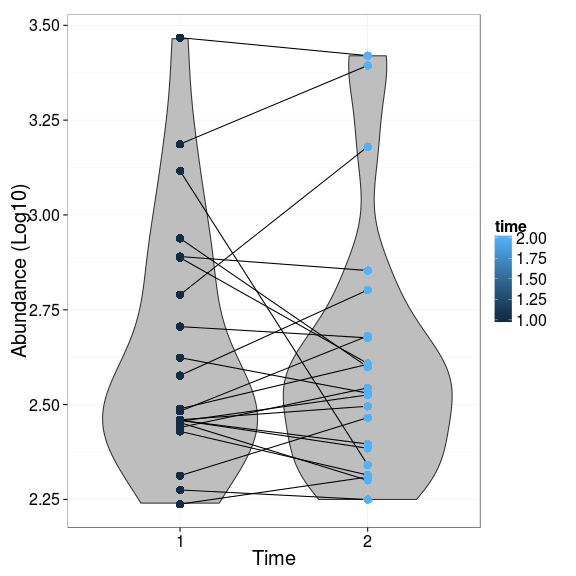

### Boxplots

The following example picks 20 random species from a species data vector and visualizes them as ordered barplot colored according to the L2 group. Here with simulated example data. See [read.profiling](reading) to use your own data files.


```r
library(microbiome, quietly = TRUE)

# Microbiota profiling data. Read as: bacteria x samples matrix
data(peerj32)  # From https://peerj.com/articles/32/

# Construct example data (df). Ensure that samples are given in same order
# in metadata and HITChip data.
df <- peerj32$meta
df$hitchip <- peerj32$microbes[rownames(df), "Akkermansia"]

# Visualize example data with a boxplot
library(ggplot2, quietly = TRUE)
theme_set(theme_bw(20))
p <- ggplot(df, aes(x = factor(time), y = hitchip))
p <- p + geom_violin(fill = "gray")
p <- p + geom_line(aes(group = subject))
p <- p + geom_point(aes(color = time), data = df, size = 4)
p <- p + xlab("Time") + ylab("Abundance (Log10)")
print(p)
```

 
