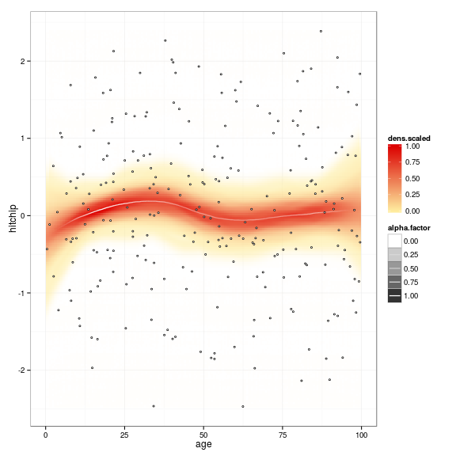

<!--
  %\VignetteEngine{knitr::rmarkdown}
  %\VignetteIndexEntry{microbiome tutorial}
  %\usepackage[utf8]{inputenc}
-->


microbiome R package
===========

The microbiome package contains general-purpose tools for
microarray-based analysis of microbiome profiling data sets. 

## Installation

### Installing and loading the release version


```r
source("http://www.bioconductor.org/biocLite.R")
biocLite("microbiome")
```

### Installing and loading the experimental development version


```r
install.packages("devtools")
library(devtools)
install_github("microbiome", "microbiome")
```

### Loading the package


```r
library(microbiome)  
```

```
## Loading required package: vegan
## Loading required package: permute
## Loading required package: lattice
## This is vegan 2.0-10
## Loading required package: reshape
## 
## microbiome R package (microbiome.github.com)
## Copyright (C) 2011-2014 Leo Lahti and Jarkko Salojarvi <microbiome-admin@googlegroups.com>
## This program comes with ABSOLUTELY NO WARRANTY.
## This is free software, and you are welcome to redistribute it under the FreeBSD open source license.
## 
## 
## Attaching package: 'microbiome'
## 
## The following object is masked from 'package:vegan':
## 
##     diversity
## 
## The following object is masked from 'package:lattice':
## 
##     densityplot
```


## Examples

### PeerJ example data set

An example data set from Lahti et al. [PeerJ 1:e32, 2013](https://peerj.com/articles/32/) concerns associations between human intestinal microbiota and blood serum lipids. Load the data in R:


```r
library(microbiome)
data(peerj32)
names(peerj32)
```

```
## [1] "lipids"   "microbes" "meta"
```

### Load example data

Load simulated example data of the human gut microbiota. Note that
with HITChip, fRPA is the recommended preprocessing method (kindly
cite [this
article](http://www.computer.org/csdl/trans/tb/2011/01/ttb2011010217-abs.html)). 


```r
# Define data path (you can replace data.directory with your own path)
data.directory <- system.file("extdata", package = "microbiome")

# Read HITChip data matrix (genus-level (L2) log10 values)
level <- "L2"
method <- "frpa"
genus.data <- read.profiling(level = level, 
	     		       method = method, 
              		       data.dir = data.directory, 
	      	       	       log10 = TRUE)  

# Read HITChip probe level data (absolute values - no log10)
oligo.data <- read.profiling(level = "oligo", 
                             data.dir = data.directory, 
			     log10 = FALSE)  

# Probe-taxon mapping table
phylogeny.info <- read.profiling(level = "phylogeny.full", 
                           	 data.dir = data.directory)
```


### Read metadata

An easy way to provide sample metadata is to create a tab-separated metadata file. You can create the file in Excel and export it to tab-separated csv format. The standard (and self-explanatory) field names include 'sampleID', 'time', 'subjectID', 'group', 'gender', 'diet', 'age'. You can leave these out or include further fields. See this [example file](https://raw.github.com/microbiome/microbiome/master/inst/extdata/metadata.xls). Read the metadata with:


```r
# Read simulated example metadata
library(gdata)
metadata.file <- paste(data.directory, "/metadata.xls", sep = "")
metadata <- read.xls(metadata.file, as.is = TRUE)
rownames(metadata) <- metadata$sampleID
```


## Usage Examples

### Diversity estimation


```r
# Determine detection threshold as the top 80 percent quantile
# of the data
det.th <- quantile(oligo.data, 0.8)

# Visualize the detection threshold (at log10 scale for clarity)
plot(density(log10(oligo.data))); abline(v = log10(det.th), main = "Detection threshold", xlab = "Abundance (Log10)", ylab = "Frequency")
```

 

```r
# Calculate richness. 
# This indicates how many oligos are present in each sample
# (exceed the detection threshold)
ri <- colSums(oligo.data > det.th)

# Diversity using the vegan package
# NOTE: data needs to be in absolute scale, not logarithmic
di <- vegan::diversity(t(oligo.data), index = "shannon")

# Pielou's evenness is S/ln(R) w.r.t. given detection threshold
oligo.data2 <- oligo.data - det.th
S <- vegan::diversity(t(oligo.data2), index = "shannon")
R <- colSums(oligo.data2 > 0)
ev <- Sd/log(Rd)
```

```
## Error: object 'Sd' not found
```

### Phylogeny

Map phylotypes between hierarchy levels:


```r
phylogeny.info <- GetPhylogeny("HITChip")
m <- levelmap(phylotypes = NULL, 
              level.from = "species", 
	      level.to = "L2", 
	      phylogeny.info = phylogeny.info)
```


### Diversity boxplot

Diversity boxplot for selected samples:


```r
group <- metadata$group
names(group) <- metadata$sampleID
my.samples <- names(group)
boxplot(di[my.samples]  ~ group[my.samples], las = 1)
```

 

### Estimating relative abundancies

Estimate relative abundance of the taxa in each sample. Note: the
input data set needs to be in absolute scale (not logarithmic).


```r
rel <- relative.abundance(oligo.data, det.th = NULL)
```

```
## Warning: Applying detection threshold at 0.8 quantile: 232.026771597465
```


### Core microbiota

Determine common core microbiota, following the [blanket
analysis](http://onlinelibrary.wiley.com/doi/10.1111/j.1469-0691.2012.03855.x/abstract):
 

```r
core <- createCore(t(peerj32$microbes))
```

Visualizing core microbiota:


```r
# Core 2D visualization
tmp <- Core2D(core)
```

 

```r
# Core heatmap
tmp <- core_heatmap(t(peerj32$microbes))
```

 

### Cross-correlation example


```r
dat1 <- peerj32$lipids # Lipids (44 samples x 389 lipids)
dat2 <- peerj32$microbes # Microbiota (44 samples x 130 bacteria)
meta <- peerj32$meta

correlations <- cross.correlate(dat1, dat2, 
                        method = "bicor", 
			mode = "matrix", 
                        n.signif = 1, 
			p.adj.threshold = 0.05, 
                        p.adj.method = "BH")
```

```
## Warning: longer object length is not a multiple of shorter object length
```

```r
correlation.table <- cmat2table(correlations)
head(correlation.table)
```

```
##              X1                               X2 Correlation    p.adj
## 1100 TG(54:5).2      Ruminococcus gnavus et rel.      0.7208 0.001738
## 1087   TG(52:5)      Ruminococcus gnavus et rel.      0.6996 0.003193
## 1082   TG(50:4)      Ruminococcus gnavus et rel.      0.6852 0.003801
## 656    PC(40:3)                     Helicobacter     -0.6838 0.003801
## 479    PC(40:3) Eubacterium cylindroides et rel.     -0.6771 0.003801
## 1099 TG(54:4).2      Ruminococcus gnavus et rel.      0.6768 0.003801
```

### Prevalence of taxonomic groups


```r
# List prevalence measure for each group using detection threshold of 2
# Sort the taxa by prevalence
head(prevalence(peerj32$microbes, 2, sort = TRUE))
```

```
## Error: could not find function "prevalence"
```

```r
# Just list the names of taxa that are present over abundance threshold 2
# in over 20 percent of the samples:
prevalent.taxa <- list_prevalent_groups(peerj32$microbes, 2, 0.2)
```

```
## Error: could not find function "list_prevalent_groups"
```

### Plotting trends

Plot subject age versus phylotype abundance with smoothed confidence intervals:


```r
library(microbiome)
N <- 250
df <- data.frame(age = sort(runif(N, 0, 100)), hitchip = rnorm(N))
p <- vwReg(hitchip~age, df, shade = TRUE, mweight = TRUE, verbose = FALSE)
p <- p + xlab("Age (y)") + ylab("HITChip Signal") 
```

```
## Error: could not find function "xlab"
```

```r
print(p)
```

 


### Licensing and Citations

This work can be freely used, modified and distributed under the 
[Two-clause FreeBSD license](http://en.wikipedia.org/wiki/BSD\_licenses).

Kindly cite the work as 'Leo Lahti and Jarkko Salojarvi
(2014). microbiome R package. URL: http://microbiome.github.com'.


### References

The package utilizes tools from a number of other CRAN and
Bioconductor extensions, including ade4, df2json, rjson, fastcluster,
ggplot2, MASS, methods, minet, mixOmics, plyr, qvalue, RCurl,
reshape2, RPA, vegan, and WGCNA. We thank all authors for these
contributions:

 * N. Caballero (2013). [df2json: Convert a dataframe to JSON](http://CRAN.R-project.org/package=df2json) 

 * A. Couture-Beil (2013). [rjson: JSON for R](http://CRAN.R-project.org/package=rjson) 

 * A. Dabney, John D. Storey and with assistance from Gregory R. Warnes. qvalue: Q-value estimation for false discovery rate control. 

 * S. Dray and A. B. Dufour, (2007): The ade4 package: implementing the duality diagram for ecologists. Journal of Statistical Software. 22(4): 1-20.

 * S. Dejean et al. (2013). [mixOmics: Omics Data Integration Project](http://CRAN.R-project.org/package=mixOmics) 

 * L. Lahti et al. A fully scalable online-preprocessing algorithm for short oligonucleotide microarray atlases. [NAR 41(10):e110, 2013](http://nar.oxfordjournals.org/content/41/10/e110) 

 * L. Lahti et al. Analysis of Probe Reliability in Differential Gene Expression Studies with Short Oligonucleotide Arrays. [TCBB/IEEE 8(1):217-225, 2011](http://www.computer.org/portal/web/csdl/doi/10.1109/TCBB.2009.38)

 * L. Lahti et al. Associations between the human intestinal microbiota, Lactobacillus rhamnosus GG and serum lipids indicated by integrated analysis of high-throughput profiling data. [PeerJ 1:e32, 2013](http://dx.doi.org/10.7717/peerj.32).

 * D. T. Lang (2013). [RCurl: General network (HTTP/FTP/...) client interface for R](http://CRAN.R-project.org/package=RCurl) 

 * P. Langfelder and S. Horvath, WGCNA: an R package for weighted correlation network analysis. BMC Bioinformatics 2008, 9:559 

 * P. Langfelder, S. Horvath (2012). Fast R Functions for Robust Correlations and Hierarchical Clustering. [Journal of Statistical Software, 46(11), 1-17](http://www.jstatsoft.org/v46/i11/)

 * P. E. Meyer, Frederic Lafitte and Gianluca Bontempi (2008). MINET: An open source R/Bioconductor Package for Mutual Information based Network Inference. [BMC Bioinformatics](http://www.biomedcentral.com/1471-2105/9/461)

 * D. Mullner (2013). fastcluster: Fast Hierarchical, Agglomerative Clustering Routines for R and Python. [Journal of Statistical Software, 53(9), 1-18](http://www.jstatsoft.org/v53/i09/)

 * Jari Oksanen et al. (2013). [vegan: Community Ecology Package](http://CRAN.R-project.org/package=vegan) 

 * R Core Team (2013). R: A language and environment for statistical computing. R Foundation for Statistical Computing, Vienna, Austria. [ISBN 3-900051-07-0](http://www.R-project.org/)

 * W. N. Venables and B. D. Ripley (2002) Modern Applied Statistics with S. Fourth Edition. Springer, New York. ISBN 0-387-95457-0

 * H. Wickham (2007). Reshaping Data with the reshape Package. [Journal of Statistical Software, 21(12), 1-20](http://www.jstatsoft.org/v21/i12/)

 * H. Wickham. ggplot2: elegant graphics for data analysis. Springer New York, 2009. 

 * H. Wickham (2011). The Split-Apply-Combine Strategy for Data Analysis. [Journal of Statistical Software, 40(1), 1-29](http://www.jstatsoft.org/v40/i01/)


### Session info

This vignette was created with


```r
sessionInfo()
```

```
## R version 3.1.1 (2014-07-10)
## Platform: x86_64-pc-linux-gnu (64-bit)
## 
## locale:
##  [1] LC_CTYPE=en_US.UTF-8       LC_NUMERIC=C              
##  [3] LC_TIME=en_US.UTF-8        LC_COLLATE=en_US.UTF-8    
##  [5] LC_MONETARY=en_US.UTF-8    LC_MESSAGES=en_US.UTF-8   
##  [7] LC_PAPER=en_US.UTF-8       LC_NAME=C                 
##  [9] LC_ADDRESS=C               LC_TELEPHONE=C            
## [11] LC_MEASUREMENT=en_US.UTF-8 LC_IDENTIFICATION=C       
## 
## attached base packages:
## [1] stats     graphics  grDevices utils     datasets  methods   base     
## 
## other attached packages:
## [1] gdata_2.13.3       microbiome_0.99.32 reshape_0.8.5     
## [4] vegan_2.0-10       lattice_0.20-29    permute_0.8-3     
## [7] knitr_1.6         
## 
## loaded via a namespace (and not attached):
##  [1] acepack_1.3-3.3     cluster_1.15.3      codetools_0.2-9    
##  [4] colorspace_1.2-4    df2json_0.0.2       digest_0.6.4       
##  [7] doParallel_1.0.8    dynamicTreeCut_1.62 evaluate_0.5.5     
## [10] flashClust_1.01-2   foreach_1.4.2       foreign_0.8-61     
## [13] formatR_1.0         Formula_1.1-2       ggplot2_1.0.0      
## [16] grid_3.1.1          gtable_0.1.2        gtools_3.4.1       
## [19] Hmisc_3.14-5        igraph_0.7.1        impute_1.38.1      
## [22] iterators_1.0.7     labeling_0.3        latticeExtra_0.6-26
## [25] MASS_7.3-34         matrixStats_0.10.0  minet_3.20.1       
## [28] mixOmics_5.0-3      munsell_0.4.2       nnet_7.3-8         
## [31] parallel_3.1.1      pheatmap_0.7.7      plyr_1.8.1         
## [34] proto_0.3-10        RColorBrewer_1.0-5  Rcpp_0.11.2        
## [37] reshape2_1.4        RGCCA_2.0           rgl_0.94.1131      
## [40] rjson_0.2.14        R.methodsS3_1.6.1   rpart_4.1-8        
## [43] scales_0.2.4        splines_3.1.1       stringr_0.6.2      
## [46] survival_2.37-7     tools_3.1.1         WGCNA_1.41-1
```


