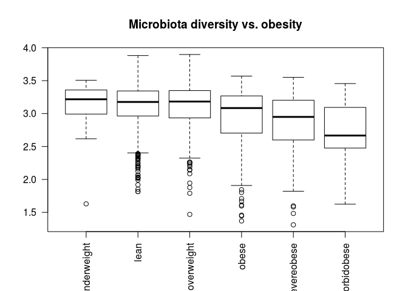

<!--
  %\VignetteEngine{knitr::rmarkdown}
  %\VignetteIndexEntry{Project Template}
  %\usepackage[utf8]{inputenc}
-->
Minimal example
===============

### Set up reproducible document generation

To test reproducible document generation:

1.  Start [RStudio](http://www.rstudio.com/)
2.  Open a new Rmarkdown (Rmd) file
3.  Convert that Rmd file with the 'knit' button
4.  Modify the Rmd file and knit again to make your own reproducible report

### Try out microbiome analysis

Start by adapting some of the following elements in your reproducible document:

1.  [Install the microbiome package and its dependencies](Installation.md)
2.  [Download example data](Data.md) (pick HITChip Atlas + metadata)
3.  [Analyse microbiota diversity](Diversity.md)
4.  [Repeat the example workflow](Atlas.md)
5.  Adapt further examples from [microbiome tutorial](https://github.com/microbiome/microbiome/blob/master/vignettes/vignette.md)

### Example visualization in R

``` r
# Load Dryad tools
library("rdryad") # Use the install.packages("rdryad") if package not available

# Download HITChip Atlas data
url <- download_url('10255/dryad.64665')
data <- as.matrix(read.table(url, sep = "\t", row.names = 1, header = TRUE))

# Download metadata
url <- download_url('10255/dryad.64666')
meta <- read.table(url, sep = "\t", row.names = 1, header = TRUE)

# Add SampleIDs as a separate column from rownames
meta$SampleID <- rownames(meta)

# Order BMI groups in correct order
# (see README at http://datadryad.org/resource/doi:10.5061/dryad.pk75d for details)
meta$BMI_group <- factor(meta$BMI_group, levels = c("underweight", "lean", "overweight", "obese", "severeobese", "morbidobese"))
meta$SubjectID <- factor(meta$SubjectID)

# Collect the atlas data and metadata into a single object:
atlas <- list(microbes = data, meta = meta)

# Compare BMI and microbiota diversity
bmi <- atlas$meta$BMI_group
div <- vegan::diversity(atlas$microbes)
boxplot(div ~ bmi, las = 2, main = "Microbiota diversity vs. obesity")
```



### Resources

Further tips:

-   [Rmarkdown tips](http://rmarkdown.rstudio.com/)
-   [R cheat sheets](http://devcheatsheet.com/tag/r/)
