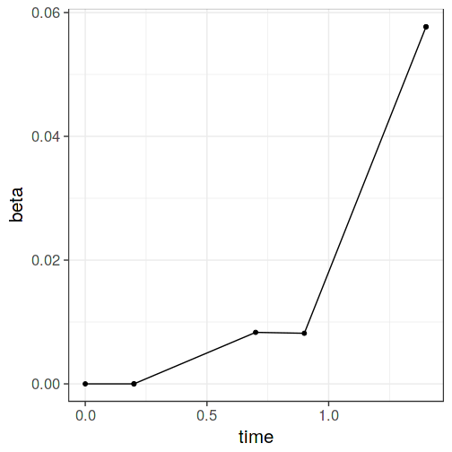
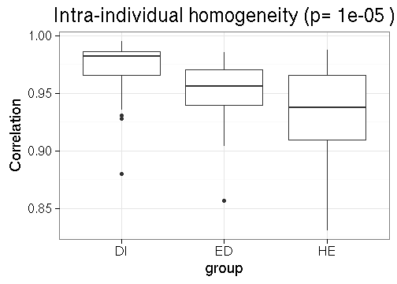

### Inter-individual heterogeneity (heterogeneity within group of samples)

Assess 'inter-individual stability' as in [Salonen et al. ISME J 2014](http://www.nature.com/ismej/journal/v8/n11/full/ismej201463a.html). This is defined as the average correlation between samples and their mean for a given samples vs phylotypes matrix. For the illustration, calculate inter-individual stability (heterogeneity) separately for Placebo and LGG groups.

Load example data


```r
library(microbiome)
data("dietswap")
x <- dietswap

# Add time field (two time points needed within each group for the 
# intraindividual method)
sample_data(x)$time <- sample_data(x)$timepoint.within.group
```


Heterogeneity across subjects within a group


```r
res <- estimate_homogeneity(x, "interindividual")
```

```
## Error in eval(expr, envir, enclos): could not find function "estimate_homogeneity"
```


Visualize


```r
library(ggplot2)
theme_set(theme_bw(20))
p <- ggplot(res$data, aes(x = group, y = correlation))
p <- p + geom_boxplot()
p <- p + ggtitle(paste("Inter-individual homogeneity (p=", round(res$p.value, 6), ")"))
```

```
## Error in round(res$p.value, 6): non-numeric argument to mathematical function
```

```r
p <- p + ylab("Correlation")
print(p)
```

```
## Error in eval(expr, envir, enclos): object 'group' not found
```




### Intra-individual stability

Homogeneity within subjects over time (intra-individual stability). Assess 'intra-individual stability' as in [Salonen et al. ISME J 2014](http://www.nature.com/ismej/journal/v8/n11/full/ismej201463a.html). This is defined as the average correlation between two time points within subjects, calculated separately within each group. For illustration, check intra-individual stability (homogeneity) separately for Placebo and LGG groups.


```r
res <- estimate_homogeneity(x, "intraindividual")
```

```
## Error in eval(expr, envir, enclos): could not find function "estimate_homogeneity"
```


Visualize


```r
library(ggplot2)
theme_set(theme_bw(20))
p <- ggplot(res$data, aes(x = group, y = correlation))
p <- p + geom_boxplot()
p <- p + ggtitle(paste("Intra-individual homogeneity (p=", round(res$p.value, 6), ")"))
```

```
## Error in round(res$p.value, 6): non-numeric argument to mathematical function
```

```r
p <- p + ylab("Correlation")
print(p)
```

```
## Error in eval(expr, envir, enclos): object 'group' not found
```




### Version information


```r
sessionInfo()
```

```
## R version 3.2.2 (2015-08-14)
## Platform: x86_64-pc-linux-gnu (64-bit)
## Running under: Ubuntu 15.10
## 
## locale:
##  [1] LC_CTYPE=en_US.UTF-8       LC_NUMERIC=C              
##  [3] LC_TIME=en_US.UTF-8        LC_COLLATE=en_US.UTF-8    
##  [5] LC_MONETARY=en_US.UTF-8    LC_MESSAGES=en_US.UTF-8   
##  [7] LC_PAPER=en_US.UTF-8       LC_NAME=C                 
##  [9] LC_ADDRESS=C               LC_TELEPHONE=C            
## [11] LC_MEASUREMENT=en_US.UTF-8 LC_IDENTIFICATION=C       
## 
## attached base packages:
## [1] grid      parallel  stats     graphics  grDevices utils     datasets 
## [8] methods   base     
## 
## other attached packages:
##  [1] vegan_2.3-3         lattice_0.20-33     permute_0.8-4      
##  [4] knitcitations_1.0.7 knitr_1.12          limma_3.26.5       
##  [7] sorvi_0.7.35        ggplot2_2.0.0       tidyr_0.3.1        
## [10] dplyr_0.4.3         MASS_7.3-45         netresponse_1.21.14
## [13] reshape2_1.4.1      mclust_5.1          minet_3.28.0       
## [16] Rgraphviz_2.14.0    graph_1.48.0        phyloseq_1.14.0    
## [19] microbiome_0.99.73  RPA_1.26.0          affy_1.48.0        
## [22] Biobase_2.30.0      BiocGenerics_0.16.1
## 
## loaded via a namespace (and not attached):
##  [1] nlme_3.1-122          bitops_1.0-6          solr_0.1.6           
##  [4] lubridate_1.5.0       oai_0.1.0             RColorBrewer_1.1-2   
##  [7] httr_1.0.0            tools_3.2.2           R6_2.1.2             
## [10] affyio_1.40.0         rpart_4.1-10          KernSmooth_2.23-15   
## [13] dmt_0.8.20            nortest_1.0-4         DBI_0.3.1            
## [16] mgcv_1.8-10           colorspace_1.2-6      ade4_1.7-3           
## [19] moments_0.14          preprocessCore_1.32.0 chron_2.3-47         
## [22] rdryad_0.2.0          formatR_1.2.1         xml2_0.1.2           
## [25] labeling_0.3          tseries_0.10-34       diptest_0.75-7       
## [28] scales_0.3.0          lmtest_0.9-34         mvtnorm_1.0-3        
## [31] quadprog_1.5-5        tgp_2.4-11            digest_0.6.9         
## [34] stringr_1.0.0         earlywarnings_1.1.22  XVector_0.10.0       
## [37] bibtex_0.4.0          highr_0.5.1           maps_3.0.2           
## [40] BiocInstaller_1.20.1  zoo_1.7-12            RCurl_1.95-4.7       
## [43] magrittr_1.5          Matrix_1.2-3          Rcpp_0.12.3          
## [46] munsell_0.4.2         S4Vectors_0.8.7       maptree_1.4-7        
## [49] ape_3.4               RefManageR_0.10.5     stringi_1.0-1        
## [52] RJSONIO_1.3-0         zlibbioc_1.16.0       plyr_1.8.3           
## [55] qvalue_2.2.2          Biostrings_2.38.3     splines_3.2.2        
## [58] multtest_2.26.0       igraph_1.0.1          boot_1.3-17          
## [61] rjson_0.2.15          codetools_0.2-14      stats4_3.2.2         
## [64] XML_3.98-1.3          evaluate_0.8          biom_0.3.12          
## [67] data.table_1.9.6      spam_1.3-0            foreach_1.4.3        
## [70] gtable_0.1.2          assertthat_0.1        Kendall_2.2          
## [73] survival_2.38-3       iterators_1.0.8       som_0.3-5            
## [76] IRanges_2.4.6         fields_8.3-6          cluster_2.0.3
```

