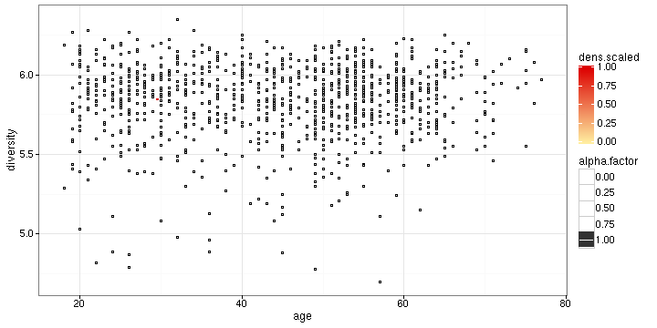

### Inter-individual homogeneity (within group of samples)

Assess 'inter-individual stability', or homogeneity, as in [Salonen et al. ISME J 2014](http://www.nature.com/ismej/journal/v8/n11/full/ismej201463a.html). This is defined as the average correlation between the samples and their mean for a given samples vs phylotypes matrix. For illustration, calculate inter-individual homogeneity separately for Placebo and LGG groups. Note that this homogeneity measure is affected by sample size.

Load example data


```r
library(microbiome)
data("dietswap")
x <- dietswap

# Add time field (two time points needed within each group for the 
# intraindividual method)
sample_data(x)$time <- sample_data(x)$timepoint.within.group
```


Heterogeneity across subjects within a group


```r
res <- estimate_homogeneity(x, "interindividual")
```


Visualize


```r
library(ggplot2)
theme_set(theme_bw(20))
p <- ggplot(res$data, aes(x = group, y = correlation))
p <- p + geom_boxplot()
p <- p + ggtitle(paste("Inter-individual homogeneity (p=", round(res$p.value, 6), ")", sep = ""))
p <- p + ylab("Correlation")
print(p)
```


### Intra-individual stability

Homogeneity within subjects over time (also called intra-individual stability in [Salonen et al. ISME J 2014](http://www.nature.com/ismej/journal/v8/n11/full/ismej201463a.html)). Defined as the average correlation between two time points within subjects within each group. For illustration, check intra-individual stability (homogeneity) separately for Placebo and LGG groups.


```r
res <- estimate_homogeneity(x, "intraindividual")
```


Visualize


```r
library(ggplot2)
theme_set(theme_bw(20))
p <- ggplot(res$data, aes(x = group, y = correlation))
p <- p + geom_boxplot()
p <- p + ggtitle(paste("Intra-individual homogeneity (p=", round(res$p.value, 6), ")"))
p <- p + ylab("Correlation")
print(p)
```


### Time series


```r
data("atlas1006")
pseq <- atlas1006
pseq <- subset_samples(pseq, DNA_extraction_method == "r")
pseq <- transform_phyloseq(pseq, "relative.abundance")
p <- plot_timeseries(pseq, "Dialister", subject = "831", tipping.point = 0.5)
print(p)
```


## Further visualization tools

Draw regression curve with smoothed error bars based on
the [Visually-Weighted Regression](http://www.fight-entropy.com/2012/07/visually-weighted-regression.html) by Solomon M. Hsiang. The sorvi implementation extends [Felix Schonbrodt's original code](http://www.nicebread.de/visually-weighted-watercolor-plots-new-variants-please-vote/).


```r
data(atlas1006)
p <- plot_regression(diversity ~ age, sample_data(atlas1006))
```

```
## Warning in class(x) <- c("tbl_df", "tbl", "data.frame"): Setting class(x)
## to multiple strings ("tbl_df", "tbl", ...); result will no longer be an S4
## object
```

```
## Error in `$<-.data.frame`(`*tmp*`, "x", value = structure(list(IV = c(18, : replacement has 200 rows, data has 200000
```

```r
print(p)
```



### Version information


```r
sessionInfo()
```

```
## R version 3.2.5 (2016-04-14)
## Platform: x86_64-pc-linux-gnu (64-bit)
## Running under: Ubuntu 16.04 LTS
## 
## locale:
##  [1] LC_CTYPE=en_US.UTF-8       LC_NUMERIC=C              
##  [3] LC_TIME=de_BE.UTF-8        LC_COLLATE=en_US.UTF-8    
##  [5] LC_MONETARY=de_BE.UTF-8    LC_MESSAGES=en_US.UTF-8   
##  [7] LC_PAPER=de_BE.UTF-8       LC_NAME=C                 
##  [9] LC_ADDRESS=C               LC_TELEPHONE=C            
## [11] LC_MEASUREMENT=de_BE.UTF-8 LC_IDENTIFICATION=C       
## 
## attached base packages:
##  [1] tcltk     parallel  grid      stats     graphics  grDevices utils    
##  [8] datasets  methods   base     
## 
## other attached packages:
##  [1] HITChipDB_0.6.30      RPA_1.27.41           affy_1.48.0          
##  [4] Biobase_2.30.0        BiocGenerics_0.16.1   RMySQL_0.10.8        
##  [7] preprocessCore_1.32.0 FD_1.0-12             geometry_0.3-6       
## [10] magic_1.5-6           abind_1.4-3           ape_3.4              
## [13] ade4_1.7-4            vegan_2.3-5           lattice_0.20-33      
## [16] permute_0.9-0         knitcitations_1.0.7   knitr_1.12.3         
## [19] intergraph_2.0-2      sna_2.3-2             network_1.13.0       
## [22] ggnet_0.1.0           GGally_1.0.1          devtools_1.11.0      
## [25] limma_3.26.9          sorvi_0.7.45          tibble_1.0           
## [28] ggplot2_2.1.0         tidyr_0.4.1           dplyr_0.4.3          
## [31] MASS_7.3-45           netresponse_1.20.15   reshape2_1.4.1       
## [34] mclust_5.2            minet_3.28.0          Rgraphviz_2.14.0     
## [37] graph_1.48.0          microbiome_0.99.81    RSQLite_1.0.0        
## [40] DBI_0.3.1             phyloseq_1.14.0      
## 
## loaded via a namespace (and not attached):
##  [1] colorspace_1.2-6      dynamicTreeCut_1.63-1 som_0.3-5            
##  [4] qvalue_2.2.2          XVector_0.10.0        affyio_1.40.0        
##  [7] AnnotationDbi_1.32.3  mvtnorm_1.0-5         lubridate_1.5.6      
## [10] RefManageR_0.10.13    codetools_0.2-14      splines_3.2.5        
## [13] doParallel_1.0.10     impute_1.44.0         tgp_2.4-14           
## [16] spam_1.3-0            Formula_1.2-1         WGCNA_1.51           
## [19] cluster_2.0.4         GO.db_3.2.2           Kendall_2.2          
## [22] httr_1.1.0            assertthat_0.1        Matrix_1.2-5         
## [25] lazyeval_0.1.10       formatR_1.3           acepack_1.3-3.3      
## [28] tools_3.2.5           igraph_1.0.1          gtable_0.2.0         
## [31] maps_3.1.0            Rcpp_0.12.4           Biostrings_2.38.4    
## [34] RJSONIO_1.3-0         multtest_2.26.0       biom_0.3.12          
## [37] nlme_3.1-127          iterators_1.0.8       lmtest_0.9-34        
## [40] fastcluster_1.1.20    stringr_1.0.0         XML_3.98-1.4         
## [43] zlibbioc_1.16.0       zoo_1.7-12            scales_0.4.0         
## [46] BiocInstaller_1.20.1  RColorBrewer_1.1-2    fields_8.3-6         
## [49] memoise_1.0.0         gridExtra_2.2.1       rpart_4.1-10         
## [52] reshape_0.8.5         latticeExtra_0.6-28   stringi_1.0-1        
## [55] maptree_1.4-7         highr_0.5.1           S4Vectors_0.8.11     
## [58] tseries_0.10-34       foreach_1.4.3         nortest_1.0-4        
## [61] boot_1.3-18           bibtex_0.4.0          chron_2.3-47         
## [64] moments_0.14          matrixStats_0.50.1    bitops_1.0-6         
## [67] dmt_0.8.20            evaluate_0.8.3        labeling_0.3         
## [70] plyr_1.8.3            magrittr_1.5          R6_2.1.2             
## [73] IRanges_2.4.8         earlywarnings_1.1.22  Hmisc_3.17-3         
## [76] foreign_0.8-66        withr_1.0.1           mgcv_1.8-12          
## [79] survival_2.39-2       RCurl_1.95-4.8        nnet_7.3-12          
## [82] KernSmooth_2.23-15    data.table_1.9.6      digest_0.6.9         
## [85] stats4_3.2.5          munsell_0.4.3         quadprog_1.5-5
```

