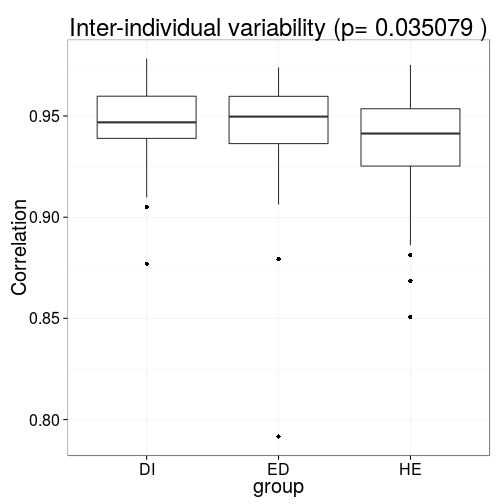
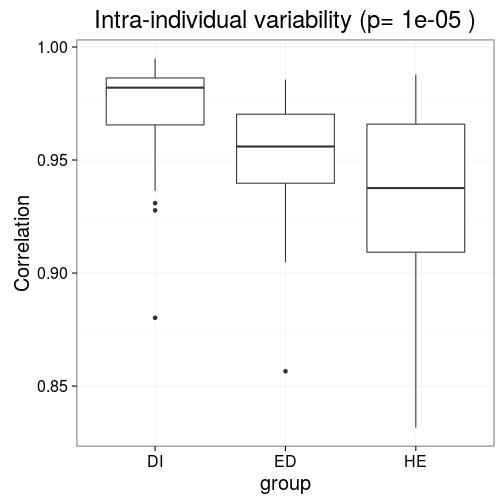

### Inter-individual variability (variability within group of samples)

Assess 'inter-individual stability' as in [Salonen et al. ISME J 2014](http://www.nature.com/ismej/journal/v8/n11/full/ismej201463a.html). This is defined as the average correlation between samples and their mean for a given samples vs phylotypes matrix. For the illustration, calculate inter-individual stability (variability) separately for Placebo and LGG groups.

Load example data


```r
library(microbiome)
x <- download_microbiome("dietswap")
# Add time field (two time points needed within each group for the 
# intraindividual method)
sample_data(x)$time <- sample_data(x)$timepoint.within.group
```


Variability across subjects within a group


```r
res <- estimate_variability(x, "interindividual")
```


Visualize


```r
library(ggplot2)
theme_set(theme_bw(20))
p <- ggplot(res$data, aes(x = group, y = correlation))
p <- p + geom_boxplot()
p <- p + ggtitle(paste("Inter-individual variability (p=", round(res$p.value, 6), ")"))
p <- p + ylab("Correlation")
print(p)
```

 


### Intra-individual variability

Variability within subjects over time (intra-individual stability). Assess 'intra-individual stability' as in [Salonen et al. ISME J 2014](http://www.nature.com/ismej/journal/v8/n11/full/ismej201463a.html). This is defined as the average correlation between two time points within subjects, calculated separately within each group. For illustration, check intra-individual stability (variability) separately for Placebo and LGG groups.


```r
res <- estimate_variability(x, "intraindividual")
```


Visualize


```r
library(ggplot2)
theme_set(theme_bw(20))
p <- ggplot(res$data, aes(x = group, y = correlation))
p <- p + geom_boxplot()
p <- p + ggtitle(paste("Intra-individual variability (p=", round(res$p.value, 6), ")"))
p <- p + ylab("Correlation")
print(p)
```

```
## Warning: Removed 6 rows containing non-finite values (stat_boxplot).
```

 


### Version information


```r
sessionInfo()
```

```
## R version 3.2.2 (2015-08-14)
## Platform: x86_64-pc-linux-gnu (64-bit)
## Running under: Ubuntu 15.04
## 
## locale:
##  [1] LC_CTYPE=en_US.UTF-8       LC_NUMERIC=C              
##  [3] LC_TIME=en_US.UTF-8        LC_COLLATE=en_US.UTF-8    
##  [5] LC_MONETARY=en_US.UTF-8    LC_MESSAGES=en_US.UTF-8   
##  [7] LC_PAPER=en_US.UTF-8       LC_NAME=C                 
##  [9] LC_ADDRESS=C               LC_TELEPHONE=C            
## [11] LC_MEASUREMENT=en_US.UTF-8 LC_IDENTIFICATION=C       
## 
## attached base packages:
## [1] grid      parallel  stats     graphics  grDevices utils     datasets 
## [8] methods   base     
## 
## other attached packages:
##  [1] googleVis_0.5.10    rdryad_0.1.1        netresponse_1.18.0 
##  [4] reshape_0.8.5       mclust_5.1          minet_3.26.0       
##  [7] Rgraphviz_2.12.0    graph_1.46.0        gridExtra_2.0.0    
## [10] sorvi_0.7.32        mgcv_1.8-8          nlme_3.1-122       
## [13] RSQLite_1.0.0       DBI_0.3.1           dplyr_0.4.3        
## [16] limma_3.24.15       ggplot2_1.0.1       microbiome_0.99.65 
## [19] RPA_1.24.0          affy_1.46.1         Biobase_2.28.0     
## [22] BiocGenerics_0.14.0 phyloseq_1.12.2     knitcitations_1.0.7
## [25] knitr_1.11         
## 
## loaded via a namespace (and not attached):
##   [1] colorspace_1.2-6          dynamicTreeCut_1.62      
##   [3] qvalue_2.0.0              som_0.3-5                
##   [5] futile.logger_1.4.1       XVector_0.8.0            
##   [7] OAIHarvester_0.1-7        RcppArmadillo_0.6.100.0.0
##   [9] GenomicRanges_1.20.8      affyio_1.36.0            
##  [11] mvtnorm_1.0-3             AnnotationDbi_1.30.1     
##  [13] lubridate_1.3.3           RefManageR_0.8.63        
##  [15] codetools_0.2-14          splines_3.2.2            
##  [17] doParallel_1.0.10         impute_1.42.0            
##  [19] geneplotter_1.46.0        mixOmics_5.1.2           
##  [21] tgp_2.4-11                ade4_1.7-2               
##  [23] spam_1.3-0                Formula_1.2-1            
##  [25] WGCNA_1.47                annotate_1.46.1          
##  [27] GO.db_3.1.2               cluster_2.0.3            
##  [29] pheatmap_1.0.7            Kendall_2.2              
##  [31] httr_1.0.0                lazyeval_0.1.10          
##  [33] assertthat_0.1            Matrix_1.2-2             
##  [35] formatR_1.2.1             acepack_1.3-3.3          
##  [37] tools_3.2.2               igraph_1.0.1             
##  [39] gtable_0.1.2              reshape2_1.4.1           
##  [41] maps_3.0.0-2              Rcpp_0.12.1              
##  [43] Biostrings_2.36.4         RJSONIO_1.3-0            
##  [45] multtest_2.24.0           biom_0.3.12              
##  [47] gdata_2.17.0              ape_3.3                  
##  [49] preprocessCore_1.30.0     iterators_1.0.8          
##  [51] lmtest_0.9-34             fastcluster_1.1.16       
##  [53] stringr_1.0.0             proto_0.3-10             
##  [55] gtools_3.5.0              XML_3.98-1.3             
##  [57] zlibbioc_1.14.0           MASS_7.3-44              
##  [59] zoo_1.7-12                scales_0.3.0             
##  [61] BiocInstaller_1.18.5      lambda.r_1.1.7           
##  [63] RColorBrewer_1.1-2        fields_8.3-5             
##  [65] memoise_0.2.1             rpart_4.1-10             
##  [67] latticeExtra_0.6-26       stringi_1.0-1            
##  [69] maptree_1.4-7             highr_0.5.1              
##  [71] genefilter_1.50.0         S4Vectors_0.6.6          
##  [73] tseries_0.10-34           foreach_1.4.3            
##  [75] nortest_1.0-4             permute_0.8-4            
##  [77] boot_1.3-17               BiocParallel_1.2.22      
##  [79] bibtex_0.4.0              chron_2.3-47             
##  [81] GenomeInfoDb_1.4.3        matrixStats_0.15.0       
##  [83] moments_0.14              bitops_1.0-6             
##  [85] dmt_0.8.20                rgl_0.95.1367            
##  [87] evaluate_0.8              lattice_0.20-33          
##  [89] labeling_0.3              plyr_1.8.3               
##  [91] magrittr_1.5              DESeq2_1.8.2             
##  [93] R6_2.1.1                  IRanges_2.2.9            
##  [95] earlywarnings_1.1.22      Hmisc_3.17-0             
##  [97] foreign_0.8-66            survival_2.38-3          
##  [99] RCurl_1.95-4.7            nnet_7.3-11              
## [101] futile.options_1.0.0      KernSmooth_2.23-15       
## [103] ellipse_0.3-8             locfit_1.5-9.1           
## [105] data.table_1.9.6          vegan_2.3-1              
## [107] digest_0.6.8              diptest_0.75-7           
## [109] xtable_1.7-4              stats4_3.2.2             
## [111] munsell_0.4.2             quadprog_1.5-5
```

