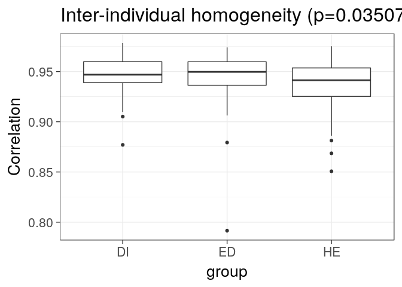
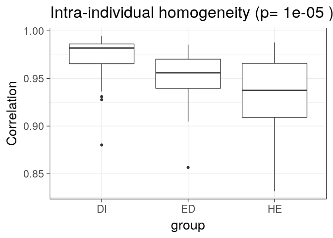
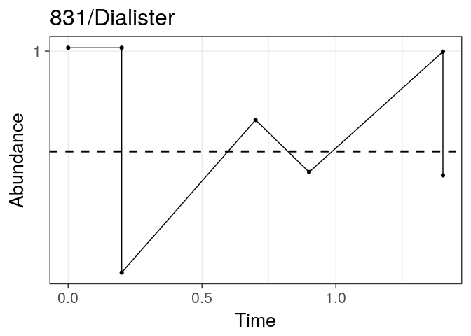
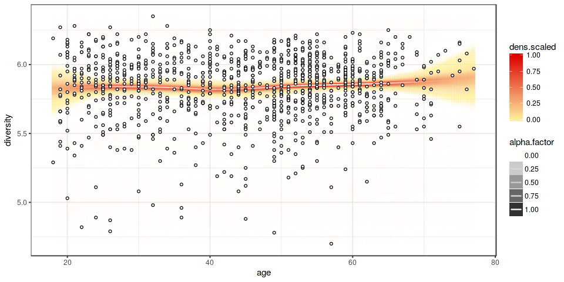

<!--
  %\VignetteEngine{knitr::rmarkdown}
  %\VignetteIndexEntry{microbiome tutorial - variability}
  %\usepackage[utf8]{inputenc}
  %\VignetteEncoding{UTF-8}  
-->
### Inter-individual homogeneity (within group of samples)

Assess 'inter-individual stability', or homogeneity, as in [Salonen et
al. ISME J
2014](http://www.nature.com/ismej/journal/v8/n11/full/ismej201463a.html).
This is defined as the average correlation between the samples and their
mean for a given samples vs phylotypes matrix. For illustration,
calculate inter-individual homogeneity separately for Placebo and LGG
groups. Note that this homogeneity measure is affected by sample size.

Load example data

    library(microbiome)
    data("dietswap")
    x <- dietswap

    # Add time field (two time points needed within each group for the 
    # intraindividual method)
    sample_data(x)$time <- sample_data(x)$timepoint.within.group

Heterogeneity across subjects within a group

    res <- estimate_homogeneity(x, "interindividual")

Visualize

    library(ggplot2)
    theme_set(theme_bw(20))
    p <- ggplot(res$data, aes(x = group, y = correlation))
    p <- p + geom_boxplot()
    p <- p + ggtitle(paste("Inter-individual homogeneity (p=", round(res$p.value, 6), ")", sep = ""))
    p <- p + ylab("Correlation")
    print(p)

### Intra-individual stability

Homogeneity within subjects over time (also called intra-individual
stability in [Salonen et al. ISME J
2014](http://www.nature.com/ismej/journal/v8/n11/full/ismej201463a.html)).
Defined as the average correlation between two time points within
subjects within each group. For illustration, check intra-individual
stability (homogeneity) separately for Placebo and LGG groups.

    res <- estimate_homogeneity(x, "intraindividual")

Visualize

    library(ggplot2)
    theme_set(theme_bw(20))
    p <- ggplot(res$data, aes(x = group, y = correlation))
    p <- p + geom_boxplot()
    p <- p + ggtitle(paste("Intra-individual homogeneity (p=", round(res$p.value, 6), ")"))
    p <- p + ylab("Correlation")
    print(p)

### Time series

    data("atlas1006")
    pseq <- atlas1006
    pseq <- subset_samples(pseq, DNA_extraction_method == "r")
    pseq <- transform_phyloseq(pseq, "compositional")
    p <- plot_timeseries(pseq, "Dialister", subject = "831", tipping.point = 0.5)
    print(p)

Pick samples at the baseline time points only:

    data("atlas1006")
    pseq0 <- pick_baseline(atlas1006)

Further visualization tools
---------------------------

Draw regression curve with smoothed error bars based on the
[Visually-Weighted
Regression](http://www.fight-entropy.com/2012/07/visually-weighted-regression.html)
by Solomon M. Hsiang. The sorvi implementation extends [Felix
Schonbrodt's original
code](http://www.nicebread.de/visually-weighted-watercolor-plots-new-variants-please-vote/).

    data(atlas1006)
    p <- plot_regression(diversity ~ age, sample_data(atlas1006))
    print(p)

### Version information

    sessionInfo()

    ## R version 3.3.1 (2016-06-21)
    ## Platform: x86_64-pc-linux-gnu (64-bit)
    ## Running under: Ubuntu 16.10
    ## 
    ## locale:
    ##  [1] LC_CTYPE=en_US.UTF-8       LC_NUMERIC=C              
    ##  [3] LC_TIME=en_US.UTF-8        LC_COLLATE=en_US.UTF-8    
    ##  [5] LC_MONETARY=en_US.UTF-8    LC_MESSAGES=en_US.UTF-8   
    ##  [7] LC_PAPER=en_US.UTF-8       LC_NAME=C                 
    ##  [9] LC_ADDRESS=C               LC_TELEPHONE=C            
    ## [11] LC_MEASUREMENT=en_US.UTF-8 LC_IDENTIFICATION=C       
    ## 
    ## attached base packages:
    ## [1] grid      parallel  stats     graphics  grDevices utils     datasets 
    ## [8] methods   base     
    ## 
    ## other attached packages:
    ##  [1] RColorBrewer_1.1-2       scales_0.4.1            
    ##  [3] igraph_1.0.1             SpiecEasi_0.1.2         
    ##  [5] earlywarnings_1.1.22     tseries_0.10-35         
    ##  [7] tgp_2.4-14               moments_0.14            
    ##  [9] ggrepel_0.6.5            gridExtra_2.2.1         
    ## [11] FD_1.0-12                vegan_2.4-2             
    ## [13] lattice_0.20-34          permute_0.9-4           
    ## [15] geometry_0.3-6           magic_1.5-6             
    ## [17] abind_1.4-5              ape_3.5                 
    ## [19] ade4_1.7-5               knitcitations_1.0.7     
    ## [21] knitr_1.15.1             microbiome_0.99.90      
    ## [23] intergraph_2.0-2         sna_2.4                 
    ## [25] statnet.common_3.3.0     network_1.13.0          
    ## [27] ggnet_0.1.0              GGally_1.3.0            
    ## [29] devtools_1.12.0          limma_3.28.21           
    ## [31] sorvi_0.7.26             ggplot2_2.2.1           
    ## [33] tidyr_0.6.1              dplyr_0.5.0             
    ## [35] MASS_7.3-45              netresponse_1.3.17.90001
    ## [37] reshape2_1.4.2           mclust_5.2              
    ## [39] minet_3.30.0             Rgraphviz_2.16.0        
    ## [41] graph_1.50.0             BiocGenerics_0.18.0     
    ## [43] phyloseq_1.16.2         
    ## 
    ## loaded via a namespace (and not attached):
    ##   [1] spam_1.4-0            backports_1.0.4       Hmisc_4.0-0          
    ##   [4] VGAM_1.0-2            plyr_1.8.4            lazyeval_0.2.0       
    ##   [7] splines_3.3.1         digest_0.6.12         foreach_1.4.3        
    ##  [10] htmltools_0.3.5       GO.db_3.3.0           magrittr_1.5         
    ##  [13] memoise_1.0.0         cluster_2.0.5         doParallel_1.0.10    
    ##  [16] fastcluster_1.1.21    Biostrings_2.40.2     bayesm_3.0-2         
    ##  [19] matrixStats_0.51.0    Kendall_2.2           colorspace_1.3-0     
    ##  [22] crayon_1.3.2          RCurl_1.95-4.8        jsonlite_1.1         
    ##  [25] roxygen2_5.0.1        impute_1.46.0         survival_2.40-1      
    ##  [28] zoo_1.7-13            iterators_1.0.8       gtable_0.2.0         
    ##  [31] zlibbioc_1.18.0       XVector_0.12.1        compositions_1.40-1  
    ##  [34] maps_3.1.1            DEoptimR_1.0-6        mvtnorm_1.0-5        
    ##  [37] DBI_0.5-1             som_0.3-5.1           bibtex_0.4.0         
    ##  [40] Rcpp_0.12.9.3         htmlTable_1.7         foreign_0.8-67       
    ##  [43] preprocessCore_1.34.0 Formula_1.2-1         stats4_3.3.1         
    ##  [46] httr_1.2.1            acepack_1.4.1         reshape_0.8.6        
    ##  [49] XML_3.98-1.5          nnet_7.3-12           RJSONIO_1.3-0        
    ##  [52] dynamicTreeCut_1.63-1 labeling_0.3          AnnotationDbi_1.34.4 
    ##  [55] munsell_0.4.3         tools_3.3.1           RSQLite_1.0.0        
    ##  [58] evaluate_0.10         biomformat_1.0.2      stringr_1.1.0        
    ##  [61] dmt_0.8.20            maptree_1.4-7         yaml_2.1.14          
    ##  [64] RefManageR_0.13.1     robustbase_0.92-6     nlme_3.1-128         
    ##  [67] testthat_1.0.2        huge_1.2.7            tibble_1.2           
    ##  [70] stringi_1.1.3         highr_0.6             fields_8.4-1         
    ##  [73] Matrix_1.2-7.1        tensorA_0.36          multtest_2.28.0      
    ##  [76] lmtest_0.9-34         data.table_1.10.0     bitops_1.0-6         
    ##  [79] qvalue_2.4.2          R6_2.2.0              latticeExtra_0.6-28  
    ##  [82] KernSmooth_2.23-15    IRanges_2.6.1         codetools_0.2-15     
    ##  [85] boot_1.3-18           energy_1.7-0          assertthat_0.1       
    ##  [88] rhdf5_2.16.0          rprojroot_1.1         withr_1.0.2          
    ##  [91] nortest_1.0-4         S4Vectors_0.10.3      mgcv_1.8-16          
    ##  [94] quadprog_1.5-5        rpart_4.1-10          rmarkdown_1.2.9000   
    ##  [97] Cairo_1.5-9           Biobase_2.32.0        WGCNA_1.51           
    ## [100] lubridate_1.6.0
