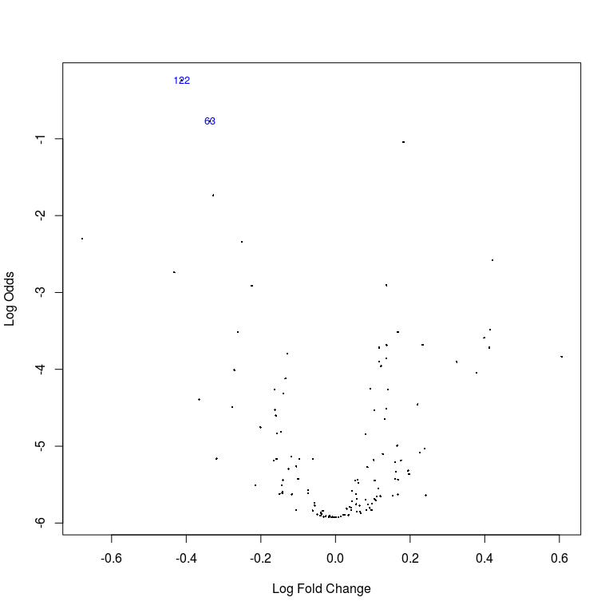

<!--
  %\VignetteEngine{knitr::rmarkdown}
  %\VignetteIndexEntry{microbiome tutorial - limma}
  %\usepackage[utf8]{inputenc}
  %\VignetteEncoding{UTF-8}  
-->
Two-group comparison at community level with limma
==================================================

Load example data:

    # Load libraries
    library(microbiome)
    library(ggplot2)
    library(dplyr)

    # Probiotics intervention example data 
    data(peerj32) # Source: https://peerj.com/articles/32/
    pseq <- peerj32$phyloseq # Rename the example data

    # Get OTU abundances and sample metadata
    otu <- abundances(transform(pseq, "log10"))
    meta <- meta(pseq)

### Linear models with limma

Identify most significantly different taxa between males and females
using the limma method. See [limma
homepage](http://bioinf.wehi.edu.au/limma/) and [limma User's
guide](http://www.lcg.unam.mx/~lcollado/R/resources/limma-usersguide.pdf)
for details. For discussion on why limma is preferred over t-test, see
[this
article](http://www.plosone.org/article/info:doi/10.1371/journal.pone.0012336).

    # Compare the two groups with limma
    library(limma)

    # Prepare the design matrix which states the groups for each sample
    # in the otu
    design <- cbind(intercept = 1, Grp2vs1 = meta[["gender"]])
    rownames(design) <- rownames(meta)
    design <- design[colnames(otu), ]

    # NOTE: results and p-values are given for all groupings in the design matrix
    # Now focus on the second grouping ie. pairwise comparison
    coef.index <- 2
         
    # Fit the limma model
    fit <- lmFit(otu, design)
    fit <- eBayes(fit)

    # Limma P-values
    pvalues.limma = fit$p.value[, 2]

    # Limma effect sizes
    efs.limma <-  fit$coefficients[, "Grp2vs1"]

    # Summarise
    library(knitr)
    kable(topTable(fit, coef = coef.index, p.value=0.1), digits = 2)

<table>
<thead>
<tr class="header">
<th align="left"></th>
<th align="right">logFC</th>
<th align="right">AveExpr</th>
<th align="right">t</th>
<th align="right">P.Value</th>
<th align="right">adj.P.Val</th>
<th align="right">B</th>
</tr>
</thead>
<tbody>
<tr class="odd">
<td align="left">Uncultured Clostridiales II</td>
<td align="right">-0.41</td>
<td align="right">1.37</td>
<td align="right">-3.72</td>
<td align="right">0</td>
<td align="right">0.06</td>
<td align="right">-0.24</td>
</tr>
<tr class="even">
<td align="left">Eubacterium siraeum et rel.</td>
<td align="right">-0.34</td>
<td align="right">1.67</td>
<td align="right">-3.52</td>
<td align="right">0</td>
<td align="right">0.06</td>
<td align="right">-0.77</td>
</tr>
<tr class="odd">
<td align="left">Clostridium nexile et rel.</td>
<td align="right">0.18</td>
<td align="right">2.84</td>
<td align="right">3.41</td>
<td align="right">0</td>
<td align="right">0.06</td>
<td align="right">-1.04</td>
</tr>
<tr class="even">
<td align="left">Sutterella wadsworthia et rel.</td>
<td align="right">-0.33</td>
<td align="right">1.50</td>
<td align="right">-3.13</td>
<td align="right">0</td>
<td align="right">0.10</td>
<td align="right">-1.74</td>
</tr>
</tbody>
</table>

Quantile-Quantile plot and volcano plot for limma

    # QQ
    qqt(fit$t[, coef.index], df = fit$df.residual + fit$df.prior); abline(0,1)

    # Volcano
    volcanoplot(fit, coef = coef.index, highlight = coef.index)

### Comparison between limma and t-test

Order the taxa with t-test for comparison and validation purposes. The
differences are small in this simulated example, but can be considerable
in real data. For discussion on why limma is preferred over t-test, see
[this
article](http://www.plosone.org/article/info:doi/10.1371/journal.pone.0012336).

    # Compare the two groups with t-test
    library(dplyr)
    pvalues.ttest <- c()
    male.samples <- dplyr::filter(meta, gender == "male")$sample
    female.samples <- dplyr::filter(meta, gender == "female")$sample
    for (tax in rownames(otu)) {
      pvalues.ttest[[tax]] <- t.test(otu[tax, male.samples], otu[tax, female.samples])$p.value
    }
    # Multiple testing correction
    pvalues.ttest <- p.adjust(pvalues.ttest, method = "fdr")

    # Compare p-values between limma and t-test
    taxa <- rownames(otu)
    plot(pvalues.ttest[taxa], pvalues.limma[taxa])
    abline(0,1,lty = 2)

### Continuous variables

Rapid quantification of continuous associations can be done with the
lm\_phyloseq wrapper function.

This uses the limma model to generate a table of P-values and effect
sizes. Note that no confounding variables taken into account in this
wrapper. See the [limma homepage](http://bioinf.wehi.edu.au/limma/) for
more detailed analyses.

    data(atlas1006)
    source(system.file("extdata/lm_phyloseq.R", package = "microbiome"))
    tab <- lm_phyloseq(atlas1006, "age")
    kable(head(tab), digits = 3)

<table>
<thead>
<tr class="header">
<th align="left"></th>
<th align="right">logFC</th>
<th align="right">AveExpr</th>
<th align="right">t</th>
<th align="right">P.Value</th>
<th align="right">adj.P.Val</th>
<th align="right">B</th>
</tr>
</thead>
<tbody>
<tr class="odd">
<td align="left">Bifidobacterium</td>
<td align="right">-0.015</td>
<td align="right">3.701</td>
<td align="right">-12.507</td>
<td align="right">0</td>
<td align="right">0</td>
<td align="right">63.548</td>
</tr>
<tr class="even">
<td align="left">Clostridium difficile et rel.</td>
<td align="right">-0.009</td>
<td align="right">3.229</td>
<td align="right">-9.890</td>
<td align="right">0</td>
<td align="right">0</td>
<td align="right">37.203</td>
</tr>
<tr class="odd">
<td align="left">Oscillospira guillermondii et rel.</td>
<td align="right">0.012</td>
<td align="right">4.535</td>
<td align="right">9.827</td>
<td align="right">0</td>
<td align="right">0</td>
<td align="right">36.635</td>
</tr>
<tr class="even">
<td align="left">Bacteroides splachnicus et rel.</td>
<td align="right">0.006</td>
<td align="right">3.219</td>
<td align="right">9.551</td>
<td align="right">0</td>
<td align="right">0</td>
<td align="right">34.167</td>
</tr>
<tr class="odd">
<td align="left">Collinsella</td>
<td align="right">-0.009</td>
<td align="right">2.827</td>
<td align="right">-9.111</td>
<td align="right">0</td>
<td align="right">0</td>
<td align="right">30.348</td>
</tr>
<tr class="even">
<td align="left">Tannerella et rel.</td>
<td align="right">0.007</td>
<td align="right">3.161</td>
<td align="right">8.975</td>
<td align="right">0</td>
<td align="right">0</td>
<td align="right">29.203</td>
</tr>
</tbody>
</table>
