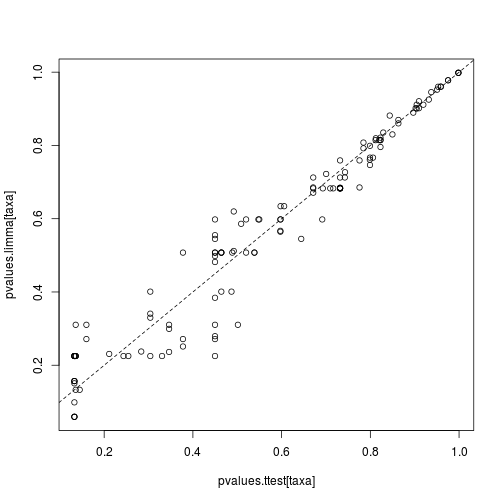

### Limma analysis

Example of limma analysis. Identify most significantly different taxa
between males and females. For further details, see [limma
homepage](http://bioinf.wehi.edu.au/limma/) and [limma User's
guide](http://www.lcg.unam.mx/~lcollado/R/resources/limma-usersguide.pdf).
For discussion on why limma is preferred over t-test, see [this
article](http://www.plosone.org/article/info:doi/10.1371/journal.pone.0012336).

    # Get example data
    library(microbiome, quietly = TRUE)
    data(peerj32)
    hitchip.matrix <- log10(t(peerj32$microbes))
    groups <- factor(peerj32$meta$gender)

    # Compare the two groups with limma
    library(limma)

    ## 
    ## Attaching package: 'limma'
    ## 
    ## The following object is masked from 'package:BiocGenerics':
    ## 
    ##     plotMA

    # Prepare the design matrix which states the groups for each sample
    # in the hitchip.matrix
    design <- cbind(intercept=1, Grp2vs1=groups)
    rownames(design) <- rownames(peerj32$meta)
    design <- design[colnames(hitchip.matrix), ]

    # NOTE: results and p-values are given for all groupings in the design matrix
    # Now focus on the second grouping ie. pairwise comparison
    coef.index <- 2
         
    # Fit the limma model
    fit <- lmFit(hitchip.matrix, design)
    fit <- eBayes(fit)

    # Summarise or plot the results
    topTable(fit, coef = coef.index)

    ##                                         logFC  AveExpr         t
    ## Clostridium nexile et rel.         0.16758644 2.880224  3.808117
    ## Eubacterium siraeum et rel.       -0.11930397 2.062410 -3.456079
    ## Uncultured Clostridiales II       -0.09837062 1.963476 -3.002288
    ## Eubacterium rectale et rel.        0.12049965 2.705183  2.995983
    ## Allistipes et rel.                -0.16649380 2.411554 -2.814072
    ## Sutterella wadsworthia et rel.    -0.08821913 2.000826 -2.583497
    ## Oxalobacter formigenes et rel.    -0.15364211 2.347171 -2.557408
    ## Aerococcus                         0.04095901 1.828605  2.480133
    ## Lachnospira pectinoschiza et rel.  0.10021120 2.596269  2.430459
    ## Dorea formicigenerans et rel.      0.10342281 2.782157  2.424539
    ##                                        P.Value  adj.P.Val           B
    ## Clostridium nexile et rel.        0.0004319395 0.05615214 -0.03277274
    ## Eubacterium siraeum et rel.       0.0012296719 0.07992867 -0.95587985
    ## Uncultured Clostridiales II       0.0044133782 0.14591236 -2.07172023
    ## Eubacterium rectale et rel.       0.0044896112 0.14591236 -2.08655384
    ## Allistipes et rel.                0.0072985192 0.18976150 -2.50572359
    ## Sutterella wadsworthia et rel.    0.0131944745 0.23067958 -3.01126420
    ## Oxalobacter formigenes et rel.    0.0140839522 0.23067958 -3.06654198
    ## Aerococcus                        0.0170489505 0.23067958 -3.22787740
    ## Lachnospira pectinoschiza et rel. 0.0192431874 0.23067958 -3.32966376
    ## Dorea formicigenerans et rel.     0.0195210534 0.23067958 -3.34169246

    # Q-Q plot
    qqt(fit$t[, coef.index], df = fit$df.residual + fit$df.prior)
    abline(0,1)

    # Volcano plot
    volcanoplot(fit, coef = coef.index, highlight = coef.index)

    # Adjusted p-values; show all significant ones
    pvalues.limma <- p.adjust(fit$p.value[, coef.index], method = "fdr")
    names(pvalues.limma) <- rownames(fit$p.value)
    print(sort(pvalues.limma[pvalues.limma < 0.1]))

    ##  Clostridium nexile et rel. Eubacterium siraeum et rel. 
    ##                  0.05615214                  0.07992867

### Comparison between limma and t-test

Order the taxa with t-test for comparison and validation purposes. The
differences are small in this simulated example, but [can be
considerable in real
data](http://www.plosone.org/article/info:doi/10.1371/journal.pone.0012336).

    # Compare the two groups with t-test
    pvalues.ttest <- c()
    male.samples <- filter(peerj32$meta, gender == "M")$sample
    female.samples <- filter(peerj32$meta, gender == "F")$sample
    for (tax in rownames(hitchip.matrix)) {
      pvalues.ttest[[tax]] <- t.test(hitchip.matrix[tax, male.samples], hitchip.matrix[tax, female.samples])$p.value
    }
    # Multiple testing correction
    pvalues.ttest <- p.adjust(pvalues.ttest, method = "fdr")

    # Compare p-values between limma and t-test
    taxa <- rownames(hitchip.matrix)
    plot(pvalues.ttest[taxa], pvalues.limma[taxa])
    abline(0,1,lty = 2)

