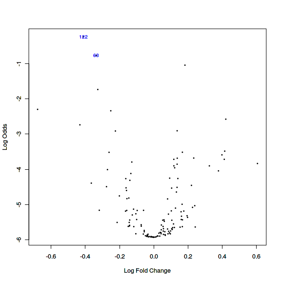

<!--
  %\VignetteEngine{knitr::rmarkdown}
  %\VignetteIndexEntry{microbiome tutorial - limma}
  %\usepackage[utf8]{inputenc}
  %\VignetteEncoding{UTF-8}  
-->


# Two-group comparison at community level with limma

Load example data:


```r
# Load libraries
library(microbiome)
library(ggplot2)
library(dplyr)

# Probiotics intervention example data 
data(peerj32) # Source: https://peerj.com/articles/32/
pseq <- peerj32$phyloseq # Rename the example data

# Get OTU abundances and sample metadata
otu <- abundances(microbiome::transform(pseq, "log10"))
meta <- meta(pseq)
```


### Linear models with limma

Identify most significantly different taxa between males and females using the limma method. See [limma homepage](http://bioinf.wehi.edu.au/limma/) and [limma User's guide](http://www.lcg.unam.mx/~lcollado/R/resources/limma-usersguide.pdf) for details. For discussion on why limma is preferred over t-test, see [this
article](http://www.plosone.org/article/info:doi/10.1371/journal.pone.0012336).


```r
# Compare the two groups with limma
library(limma)

# Prepare the design matrix which states the groups for each sample
# in the otu
design <- cbind(intercept = 1, Grp2vs1 = meta[["gender"]])
rownames(design) <- rownames(meta)
design <- design[colnames(otu), ]

# NOTE: results and p-values are given for all groupings in the design matrix
# Now focus on the second grouping ie. pairwise comparison
coef.index <- 2
     
# Fit the limma model
fit <- lmFit(otu, design)
fit <- eBayes(fit)

# Limma P-values
pvalues.limma = fit$p.value[, 2]

# Limma effect sizes
efs.limma <-  fit$coefficients[, "Grp2vs1"]

# Summarise
library(knitr)
kable(topTable(fit, coef = coef.index, p.value=0.1), digits = 2)
```


|                               | logFC| AveExpr|     t| P.Value| adj.P.Val|     B|
|:------------------------------|-----:|-------:|-----:|-------:|---------:|-----:|
|Uncultured Clostridiales II    | -0.41|    1.37| -3.72|       0|      0.06| -0.24|
|Eubacterium siraeum et rel.    | -0.34|    1.67| -3.52|       0|      0.06| -0.77|
|Clostridium nexile et rel.     |  0.18|    2.84|  3.41|       0|      0.06| -1.04|
|Sutterella wadsworthia et rel. | -0.33|    1.50| -3.13|       0|      0.10| -1.74|

Quantile-Quantile plot and volcano plot for limma


```r
# QQ
qqt(fit$t[, coef.index], df = fit$df.residual + fit$df.prior); abline(0,1)

# Volcano
volcanoplot(fit, coef = coef.index, highlight = coef.index)
```




### Comparison between limma and t-test

Order the taxa with t-test for comparison and validation purposes. The
differences are small in this simulated example, but can be
considerable in real
data. For discussion on why limma is preferred over t-test, see [this
article](http://www.plosone.org/article/info:doi/10.1371/journal.pone.0012336).


```r
# Compare the two groups with t-test
library(dplyr)
pvalues.ttest <- c()
male.samples <- dplyr::filter(meta, gender == "male")$sample
female.samples <- dplyr::filter(meta, gender == "female")$sample
for (tax in rownames(otu)) {
  pvalues.ttest[[tax]] <- t.test(otu[tax, male.samples], otu[tax, female.samples])$p.value
}
# Multiple testing correction
pvalues.ttest <- p.adjust(pvalues.ttest, method = "fdr")

# Compare p-values between limma and t-test
taxa <- rownames(otu)
plot(pvalues.ttest[taxa], pvalues.limma[taxa])
abline(0,1,lty = 2)
```


### Continuous variables

Rapid quantification of continuous associations can be done with the
lm_phyloseq wrapper function.

This uses the limma model to generate a table of P-values and effect
sizes. Note that no confounding variables taken into account in this
wrapper. See the [limma homepage](http://bioinf.wehi.edu.au/limma/)
for more detailed analyses.


```r
data(atlas1006)
source(system.file("extdata/lm_phyloseq.R", package = "microbiome"))
tab <- lm_phyloseq(atlas1006, "age")
kable(head(tab), digits = 3)
```


