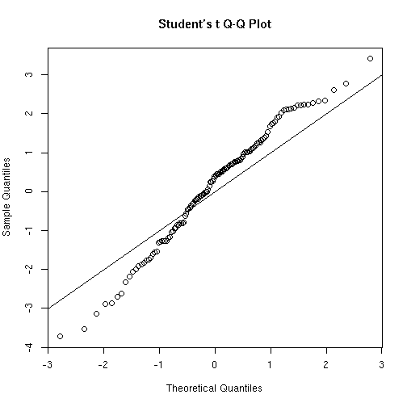
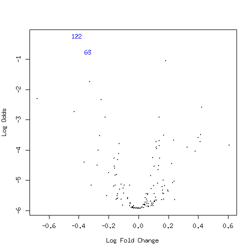

<!--
  %\VignetteEngine{knitr::rmarkdown}
  %\VignetteIndexEntry{microbiome tutorial - limma}
  %\usepackage[utf8]{inputenc}
  %\VignetteEncoding{UTF-8}  
-->


## Linear models with limma


### Discrete variables: sex

Identify most significantly different taxa between males and females.

For further details, see [limma
homepage](http://bioinf.wehi.edu.au/limma/) and [limma User's
guide](http://www.lcg.unam.mx/~lcollado/R/resources/limma-usersguide.pdf). For
discussion on why limma is preferred over t-test, see [this
article](http://www.plosone.org/article/info:doi/10.1371/journal.pone.0012336).


```r
# Get example data
library(microbiome)
data("peerj32")
pseq <- peerj32$phyloseq
otu <- taxa_abundances(transform_phyloseq(pseq, "log10"))
meta <- sample_data(pseq)
groups <- meta$gender

# Compare the two groups with limma
library(limma)

# Prepare the design matrix which states the groups for each sample
# in the otu
design <- cbind(intercept = 1, Grp2vs1 = groups)
rownames(design) <- rownames(meta)
design <- design[colnames(otu), ]

# NOTE: results and p-values are given for all groupings in the design matrix
# Now focus on the second grouping ie. pairwise comparison
coef.index <- 2
     
# Fit the limma model
fit <- lmFit(otu, design)
fit <- eBayes(fit)
pvalues.limma = fit$p.value[, 2]

# Summarise 
kable(topTable(fit, coef = coef.index, p.value=0.05), digits = 2)
```

```
## Error in kable_markdown(x = structure(character(0), .Dim = c(0L, 0L), .Dimnames = list(: the table must have a header (column names)
```


### Q-Q plot


```r
qqt(fit$t[, coef.index], df = fit$df.residual + fit$df.prior)
abline(0,1)
```



### Volcano plot


```r
volcanoplot(fit, coef = coef.index, highlight = coef.index)
```




### Comparison between limma and t-test

Order the taxa with t-test for comparison and validation purposes. The
differences are small in this simulated example, but [can be
considerable in real
data](http://www.plosone.org/article/info:doi/10.1371/journal.pone.0012336).


```r
# Compare the two groups with t-test
library(dplyr)
pvalues.ttest <- c()
male.samples <- dplyr::filter(meta, gender == "male")$sample
female.samples <- dplyr::filter(meta, gender == "female")$sample
for (tax in rownames(otu)) {
  pvalues.ttest[[tax]] <- t.test(otu[tax, male.samples], otu[tax, female.samples])$p.value
}
# Multiple testing correction
pvalues.ttest <- p.adjust(pvalues.ttest, method = "fdr")

# Compare p-values between limma and t-test
taxa <- rownames(otu)
plot(pvalues.ttest[taxa], pvalues.limma[taxa])
abline(0,1,lty = 2)
```


### Continuous variables

Quantify continuous associations with lm_phyloseq function. This uses
the limma model to generate a table of P-values and effect sizes. Note
that no confounding variables taken into account in this wrapper. See
the [limma homepage](http://bioinf.wehi.edu.au/limma/) for more
detailed analyses.


```r
data("atlas1006")
source(system.file("extdata/lm_phyloseq.R", package = "microbiome"))
tab <- lm_phyloseq(atlas1006, "age")
kable(head(tab), digits = 3)
```


|                                   |  logFC| AveExpr|       t| P.Value| adj.P.Val|      B|
|:----------------------------------|------:|-------:|-------:|-------:|---------:|------:|
|Bifidobacterium                    | -0.015|   3.701| -12.507|       0|         0| 63.548|
|Clostridium difficile et rel.      | -0.009|   3.229|  -9.890|       0|         0| 37.203|
|Oscillospira guillermondii et rel. |  0.012|   4.535|   9.827|       0|         0| 36.635|
|Bacteroides splachnicus et rel.    |  0.006|   3.219|   9.551|       0|         0| 34.167|
|Collinsella                        | -0.009|   2.827|  -9.111|       0|         0| 30.348|
|Tannerella et rel.                 |  0.007|   3.161|   8.975|       0|         0| 29.203|


