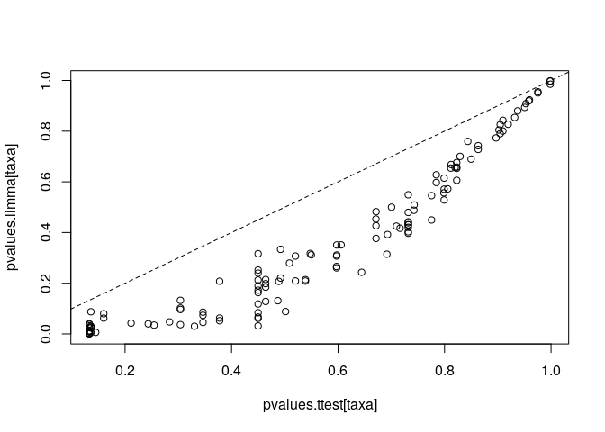

<!--
  %\VignetteEngine{knitr::rmarkdown}
  %\VignetteIndexEntry{microbiome tutorial - limma}
  %\usepackage[utf8]{inputenc}
  %\VignetteEncoding{UTF-8}  
-->
Linear models with limma
------------------------

A standard method for linear modeling of high-throughput bioinformatics
data is [limma](http://bioinf.wehi.edu.au/limma/). See also [limma
User's
guide](http://www.lcg.unam.mx/~lcollado/R/resources/limma-usersguide.pdf).
For discussion on why limma is preferred over t-test, see [this
article](http://www.plosone.org/article/info:doi/10.1371/journal.pone.0012336).

### Continuous variables

Rapid quantification of continuous associations can be done with the
lm\_phyloseq wrapper function. This uses limma model to generate a table
of P-values and effect sizes. No confounding variables taken into
account in this wrapper. See the [limma examples](limma.md) for more
info.

    library(limma)
    library(microbiome)
    data(atlas1006)

    # Pick RBB extracted samples (r) and baseline time point
    pseq <- subset_samples(atlas1006, DNA_extraction_method == "r" & time == 0)

    # Load the function
    source(system.file("extdata/lm_phyloseq.R", package = "microbiome"))

    # Analyze the association with individual taxa and age
    tab <- lm_phyloseq(pseq, "age")
    kable(head(tab), digits = 3)

<table>
<thead>
<tr class="header">
<th></th>
<th align="right">logFC</th>
<th align="right">AveExpr</th>
<th align="right">t</th>
<th align="right">P.Value</th>
<th align="right">adj.P.Val</th>
<th align="right">B</th>
</tr>
</thead>
<tbody>
<tr class="odd">
<td>Clostridium orbiscindens et rel.</td>
<td align="right">0.005</td>
<td align="right">4.122</td>
<td align="right">4.542</td>
<td align="right">0</td>
<td align="right">0.001</td>
<td align="right">0.696</td>
</tr>
<tr class="even">
<td>Eggerthella lenta et rel.</td>
<td align="right">0.003</td>
<td align="right">2.596</td>
<td align="right">4.451</td>
<td align="right">0</td>
<td align="right">0.001</td>
<td align="right">0.306</td>
</tr>
<tr class="odd">
<td>Butyrivibrio crossotus et rel.</td>
<td align="right">0.004</td>
<td align="right">4.039</td>
<td align="right">4.232</td>
<td align="right">0</td>
<td align="right">0.001</td>
<td align="right">-0.604</td>
</tr>
<tr class="even">
<td>Bifidobacterium</td>
<td align="right">-0.007</td>
<td align="right">4.034</td>
<td align="right">-4.166</td>
<td align="right">0</td>
<td align="right">0.001</td>
<td align="right">-0.872</td>
</tr>
<tr class="odd">
<td>Peptococcus niger et rel.</td>
<td align="right">0.003</td>
<td align="right">2.294</td>
<td align="right">3.872</td>
<td align="right">0</td>
<td align="right">0.003</td>
<td align="right">-2.010</td>
</tr>
<tr class="even">
<td>Eubacterium hallii et rel.</td>
<td align="right">0.004</td>
<td align="right">3.661</td>
<td align="right">3.688</td>
<td align="right">0</td>
<td align="right">0.005</td>
<td align="right">-2.682</td>
</tr>
</tbody>
</table>

### Discrete variables: sex

Identify most significantly different taxa between males and females.

For further details, see [limma
homepage](http://bioinf.wehi.edu.au/limma/) and [limma User's
guide](http://www.lcg.unam.mx/~lcollado/R/resources/limma-usersguide.pdf).
For discussion on why limma is preferred over t-test, see [this
article](http://www.plosone.org/article/info:doi/10.1371/journal.pone.0012336).

    # Get example data
    library(microbiome)
    data("peerj32")
    pseq <- peerj32$phyloseq
    otu <- abundances(transform_phyloseq(pseq, "log10"))
    meta <- sample_data(pseq)
    groups <- meta$gender

    # Compare the two groups with limma
    library(limma)

    # Prepare the design matrix which states the groups for each sample
    # in the otu
    design <- cbind(intercept = 1, Grp2vs1 = groups)
    rownames(design) <- rownames(meta)
    design <- design[colnames(otu), ]

    # NOTE: results and p-values are given for all groupings in the design matrix
    # Now focus on the second grouping ie. pairwise comparison
    coef.index <- 2
         
    # Fit the limma model
    fit <- lmFit(otu, design)
    fit <- eBayes(fit)
    pvalues.limma = fit$p.value[, 2]

    # Summarise 
    kable(topTable(fit, coef = coef.index, p.value=0.05), digits = 2)

### Q-Q plot

    qqt(fit$t[, coef.index], df = fit$df.residual + fit$df.prior)
    abline(0,1)

### Volcano plot

    volcanoplot(fit, coef = coef.index, highlight = coef.index)

### Comparison between limma and t-test

Order the taxa with t-test for comparison and validation purposes. The
differences are small in this simulated example, but [can be
considerable in real
data](http://www.plosone.org/article/info:doi/10.1371/journal.pone.0012336).

    # Compare the two groups with t-test
    library(dplyr)
    pvalues.ttest <- c()
    male.samples <- dplyr::filter(meta, gender == "male")$sample
    female.samples <- dplyr::filter(meta, gender == "female")$sample
    for (tax in rownames(otu)) {
      pvalues.ttest[[tax]] <- t.test(otu[tax, male.samples], otu[tax, female.samples])$p.value
    }
    # Multiple testing correction
    pvalues.ttest <- p.adjust(pvalues.ttest, method = "fdr")

    # Compare p-values between limma and t-test
    taxa <- rownames(otu)
    plot(pvalues.ttest[taxa], pvalues.limma[taxa])
    abline(0,1,lty = 2)

### Continuous variables

Quantify continuous associations with lm\_phyloseq function. This uses
the limma model to generate a table of P-values and effect sizes. Note
that no confounding variables taken into account in this wrapper. See
the [limma homepage](http://bioinf.wehi.edu.au/limma/) for more detailed
analyses.

    data(atlas1006)
    source(system.file("extdata/lm_phyloseq.R", package = "microbiome"))
    tab <- lm_phyloseq(atlas1006, "age")
    kable(head(tab), digits = 3)

<table>
<thead>
<tr class="header">
<th></th>
<th align="right">logFC</th>
<th align="right">AveExpr</th>
<th align="right">t</th>
<th align="right">P.Value</th>
<th align="right">adj.P.Val</th>
<th align="right">B</th>
</tr>
</thead>
<tbody>
<tr class="odd">
<td>Bifidobacterium</td>
<td align="right">-0.015</td>
<td align="right">3.701</td>
<td align="right">-12.507</td>
<td align="right">0</td>
<td align="right">0</td>
<td align="right">63.548</td>
</tr>
<tr class="even">
<td>Clostridium difficile et rel.</td>
<td align="right">-0.009</td>
<td align="right">3.229</td>
<td align="right">-9.890</td>
<td align="right">0</td>
<td align="right">0</td>
<td align="right">37.203</td>
</tr>
<tr class="odd">
<td>Oscillospira guillermondii et rel.</td>
<td align="right">0.012</td>
<td align="right">4.535</td>
<td align="right">9.827</td>
<td align="right">0</td>
<td align="right">0</td>
<td align="right">36.635</td>
</tr>
<tr class="even">
<td>Bacteroides splachnicus et rel.</td>
<td align="right">0.006</td>
<td align="right">3.219</td>
<td align="right">9.551</td>
<td align="right">0</td>
<td align="right">0</td>
<td align="right">34.167</td>
</tr>
<tr class="odd">
<td>Collinsella</td>
<td align="right">-0.009</td>
<td align="right">2.827</td>
<td align="right">-9.111</td>
<td align="right">0</td>
<td align="right">0</td>
<td align="right">30.348</td>
</tr>
<tr class="even">
<td>Tannerella et rel.</td>
<td align="right">0.007</td>
<td align="right">3.161</td>
<td align="right">8.975</td>
<td align="right">0</td>
<td align="right">0</td>
<td align="right">29.203</td>
</tr>
</tbody>
</table>
