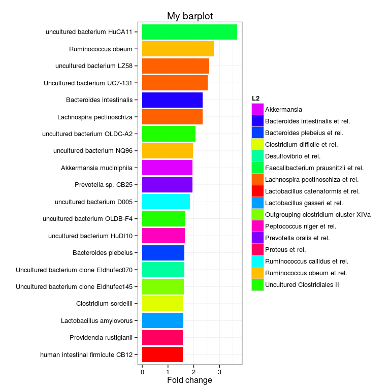

### Evenness


```r
# Pielou's evenness is S/ln(R) w.r.t. given detection threshold
# NOTE: here we use detection threshold for diversity as well because
# the exact same data has to be used for diversity and richness calculation,
# and for richness calculation the detection threshold needs to be set anyway
# Diversity can be as such calculated also without threshold (see above)
# but that gives somewhat different result.
otu2 <- otu - det.th # NOTE: absolute (not log) scale data
S <- vegan::diversity(otu2, index = "shannon")
R <- rowSums(otu2 > 0)
ev <- S/log(R)
```
### Density plot

  # note that taking relative abundances likely changes the abundance histograms
  tax <- "Bacilli"
  theme_set(theme_bw(20))
p <- ggplot(filter(dfm, Taxon == "Vibrio"), aes(x = 100*Abundance))
p <- p + geom_density(fill = "darkgray")
p <- p + scale_x_log10()
p <- p + xlab("Relative Abundance (%)")
p <- p + ggtitle(tax)
print(p)

### Bagged RDA

Calculate Bagged RDA and visualize the results:


```r
# Modify the group vector into a facor as required by Bagged RDA
y <- factor(annot$time); names(y) <- rownames(annot)

# Bagged RDA
Bag.res <- Bagged.RDA.Feature.Selection(t(l2), y, sig.thresh=0.05, nboot=100)

# Visualize
PlotBaggedRDA(Bag.res, y)
```


### Oligo heatmap

This reproduces the oligo-level heatmap from profiling script. If there are problems, try to tune ppcm, figureratio and fontsize (see help(add.heatmap) for details)


```r
library(microbiome)

# Load Phylogeny
phylogeny.info <- GetPhylogeny("HITChip")

# Load oligo-level data

# Replace data.directory here with your own profiling script output data directory
data.directory <- system.file("extdata", package = "microbiome")

oligodata <- read.profiling(level = "oligo", log10 = FALSE, data.dir = data.directory)
```

```
## Error in read.profiling(level = "oligo", log10 = FALSE, data.dir = data.directory): unused arguments (level = "oligo", log10 = FALSE)
```

```r
# Produce the plot and save it to the working directory
library(HITChipDB)
hc.params <- add.heatmap(log10(oligodata), output.dir = ".", phylogeny.info = phylogeny.info)
```

```
## Error in ncol(dat): object 'oligodata' not found
```

### A longer version with source code

The following example picks 20 random species and visualizes the HITChip signal as ordered barplot. In this example the bars are colored according to the L2 group. 


```r
# Load Phylogeny
phylogeny.info <- GetPhylogeny("HITChip")

# Get example data 
data(peerj32)
x <- log10(t(peerj32$microbes))

# Pick 20 species from first sample at random
taxa <- rownames(x)[sample(nrow(x), 20)]

# Signal of the selected taxa at first sample
signal <- x[taxa,1]

# Higher-level taxonomic groups for the taxa
l1 <- droplevels(levelmap(taxa, level.from = "L2", level.to = "L1", phylogeny.info = phylogeny.info))
```

```
## Error in levelmap(taxa, level.from = "L2", level.to = "L1", phylogeny.info = phylogeny.info): unused arguments (level.from = "L2", level.to = "L1", phylogeny.info = phylogeny.info)
```

```r
# Collect all into a data.frame
df <- list()
df$taxa <- taxa
df$L1 <- l1
df$signal <- signal
df <- data.frame(df)

# Define colors for groups
l1.colors <- rainbow(length(unique(df$L1)))
names(l1.colors) <- as.character(unique(df$L1))

# Rearrange the data.frame
m <- melt(df)

# Sort by signal (ie. change order of factors for plot)
df <- within(df, taxa <- factor(taxa, levels = taxa[order(abs(signal))]))

# Plot the image
p <- ggplot(aes(x = taxa, y = signal, fill = L1), data = df) 
p <- p + scale_fill_manual(values = l1.colors[as.character(levels(df$L1))])

p <- p + geom_bar(position="identity", stat = "identity") + theme_bw() + coord_flip()
p <- p + ylab("Fold change") + xlab("") + ggtitle("My barplot")
p <- p + theme(legend.position="right")
p <- p + theme(panel.border=element_rect())

print(p)
```

 
