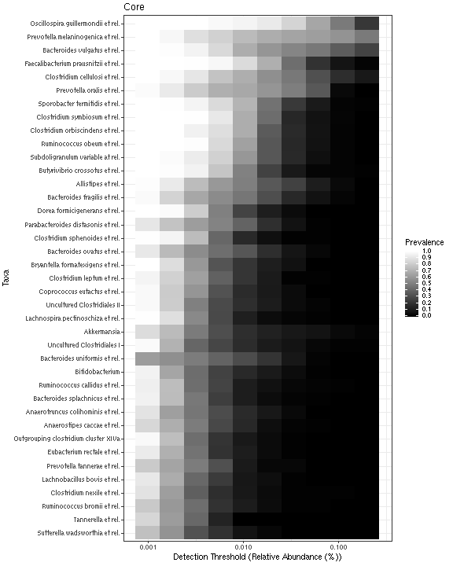
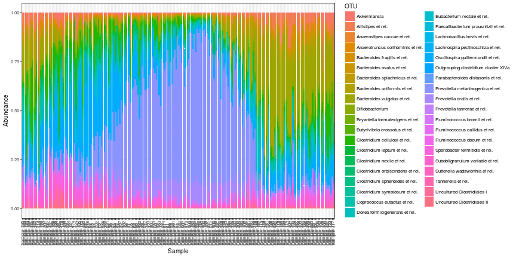
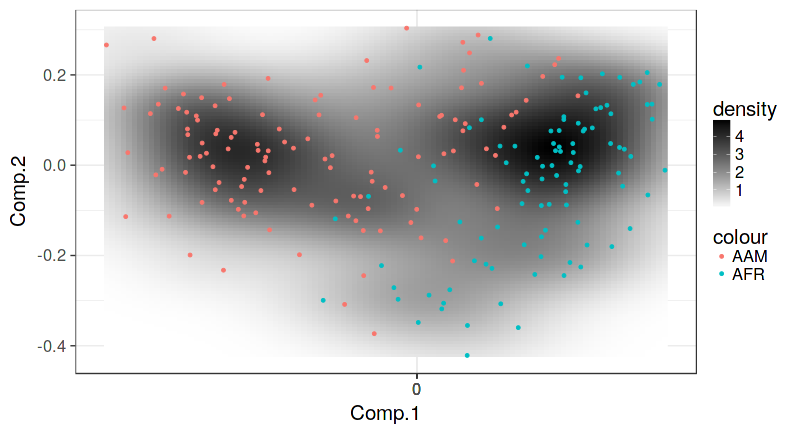

## Introduction

The [microbiome R package](http://microbiome.github.io/microbiome)
facilitates exploration and analysis of microbiome profiling data, in
particular 16S taxonomic profiling.

This vignette provides a brief overview
with example data sets from published microbiome profiling studies
[@lahti14natcomm, @Lahti13provasI, @OKeefe15].
A more comprehensive tutorial is available
[on-line](http://microbiome.github.io/microbiome).

Tools are provided for the manipulation, statistical analysis, and
visualization of taxonomic profiling data. In addition to targeted
case-control studies, the package facilitates scalable exploration of
large population cohorts [@lahti14natcomm]. Whereas sample collections
are rapidly accumulating for the human body and other environments,
few general-purpose tools for targeted microbiome analysis are available in R.
This package supports the independent
[phyloseq](http://joey711.github.io/phyloseq) data format and expands
the available toolkit in order to facilitate the standardization of
the analyses and the development of best practices. See also the
related [mare pipeline](https://github.com/katrikorpela/mare) for 16S
rRNA amplicon analysis in R. The aim is to complement the other
available packages, but in some cases alternative solutions have been
necessary in order to streamline the tools and to improve
complementarity.

We welcome feedback, bug reports, and suggestions for new features
from the user community via the [issue
tracker](https://github.com/microbiome/microbiome/issues) and [pull
requests](http://microbiome.github.io/microbiome/Contributing.html). See
the [Github site](https://github.com/microbiome/microbiome) for source
code and other details. These R tools have been utilized in recent
publications and in introductory courses [@salonen14, @Faust15,
@Shetty2017], and they are released under the [Two-clause FreeBSD
license](http://en.wikipedia.org/wiki/BSD\_licenses).

Kindly cite the work as follows: "Leo Lahti [et
al.](https://github.com/microbiome/microbiome/graphs/contributors)
(2017). Tools for microbiome analysis in R. Microbiome package version
0.99.22. URL:
(http://microbiome.github.io/microbiome)


## Installation

To install microbiome package (the latest development version) in R, use


```r
library(devtools) # Load the devtools package
install_github("microbiome/microbiome") # Install the package
```

Then load the package in R


```r
library(microbiome)  
```


## Data

The microbiome package relies on the independent
[phyloseq](http://joey711.github.io/phyloseq) data format. A
[phyloseq](http://joey711.github.io/phyloseq) data object typically
contains an OTU table (taxa abundances), sample metadata (age, BMI,
sex, ...), taxonomy table (mapping between OTUs and higher-level
taxonomic classifications), and a phylogenetic tree (relations between
the taxa).


### Example data sets

Example data sets are provided to facilitate reproducible examples and
further methods development.

The HITChip Atlas data set [Lahti et al. Nat. Comm. 5:4344,
2014](http://www.nature.com/ncomms/2014/140708/ncomms5344/full/ncomms5344.html)
contains 130 genus-level taxonomic groups across 1006 western
adults. Load the example data in R with


```r
# Data from 
# http://www.nature.com/ncomms/2014/140708/ncomms5344/full/ncomms5344.html
data(atlas1006) 
atlas1006
```

```
## phyloseq-class experiment-level object
## otu_table()   OTU Table:         [ 130 taxa and 1172 samples ]
## sample_data() Sample Data:       [ 1172 samples by 10 sample variables ]
## tax_table()   Taxonomy Table:    [ 130 taxa by 2 taxonomic ranks ]
```

The two-week diet swap study between western (USA) and traditional
(rural Africa) diets, reported in [O'Keefe et al. Nat. Comm. 6:6342,
2015](http://dx.doi.org/10.1038/ncomms7342)


```r
data(dietswap) # Data from http://dx.doi.org/10.1038/ncomms7342
dietswap
```

```
## phyloseq-class experiment-level object
## otu_table()   OTU Table:         [ 130 taxa and 222 samples ]
## sample_data() Sample Data:       [ 222 samples by 8 sample variables ]
## tax_table()   Taxonomy Table:    [ 130 taxa by 2 taxonomic ranks ]
```

A parallel profiling of gut microbiota versus blood metabolites from
[Lahti et al. PeerJ 1:e32, 2013](https://peerj.com/articles/32/) to
characterize associations between human intestinal microbiota and
blood serum lipids


```r
data(peerj32) # Data from https://peerj.com/articles/32/
```


### Data import

The [tutorial](http://microbiome.github.io/microbiome/Data.html)
describes how to import data from standard formats (Mother, BIOM, CSV,
etc.).


### Data manipulation

A phyloseq object can be subsetted, filtered, aggregated, transformed,
and otherwise manipulated. For a comprehensive list of tools, see the
[online
tutorial](http://microbiome.github.io/microbiome/Preprocessing.html).

The microbiome package provides a wrapper for many standard
transformations such as Z, centered log-ratio, hellinger, log10, and
others. To convert absolute counts to compositional (relative)
abundances, for instance, use


```r
# dietswap is a phyloseq object; see above
dietswap.compositional <- transform(dietswap, "compositional")
```


## Ecosystem indices

### Alpha diversity, richness, evenness, dominance, and rarity

Commonly used ecosystem state variables include various indices to quantify
alpha diversities, richness, evenness, dominance, and rarity (see
functions with similar names). The microbiome package provides a
comprehensive set of such indices via a standardized interface.

The function `global` calls these indicators with default parameters. 
For further options, see 
[tutorial](http://microbiome.github.io/microbiome/Diversity.html). 


```r
g <- global(atlas1006, index = "gini")
```

Visually-Weighted Regression curve with smoothed error bars is based on the
can be used to visualize sample variables
[(1)](http://www.fight-entropy.com/2012/07/visually-weighted-regression.html), 
here the relation between age and diversity. 
This function operates on standard data frames.


```r
# Pick the sample metadata from a phyloseq object
df <- meta(atlas1006)

# Estimate Shannon diversity and add it to the data frame
df$diversity <- global(atlas1006, index = "shannon")

# Compare age and microbiome diversity
plot_regression(diversity ~ age, df)
```


### Beta diversity or divergence

Also [beta
diversity](http://microbiome.github.io/microbiome/Betadiversity.html)
metrics are provided. This is also called microbiome divergence,
intra-group similarity, or group heterogeneity. We have chosen to use
the term divergence as the function name. The higher the divergence,
the more spread the group is and the more dissimilar the samples
within the group are on average.

In addition to group-wise comparisons, beta diversity can be also used
to assess the stability, or intra-individual similarity, within
subjects over time. Whereas various measures have been proposed, we
have implemented the correlation-based divergence measure as in
[@Salonen2014].

As an example, let us compare beta diversity between two treatment
groups in [@Lahti13provasI].


```r
# Pick phyloseq object containing the microbiome data in
# https://peerj.com/articles/32/
pseq <- peerj32$phyloseq

# Calculate divergence (beta diversity) for Placebo and LGG groups
b.pla <- divergence(subset_samples(pseq, group == "Placebo"))
b.lgg <- divergence(subset_samples(pseq, group == "LGG"))

# Visual comparison
boxplot(list(LGG = b.lgg, Placebo = b.pla))
```


## Core microbiota analysis

Population frequencies, or **prevalence**, of the taxonomic groups
exceeding a given detection thresholld can be calculated with


```r
p <- prevalence(dietswap, detection = 0, sort = TRUE)
```

The **core microbiota** refers to the set of taxa that are detected in
a remarkable fraction of the population above a given abundance
threshold [see e.g. @Jalanka-Tuovinen11, @Salonen12cmi]. The core
subset can be sliced from a phyloseq object as follows.


```r
# Taxa with over 50% prevance at .2% relative abundance
dietswap.core <- core(dietswap.compositional, 
                    detection = .2/100, prevalence = 50/100)
dietswap.core
```

```
## phyloseq-class experiment-level object
## otu_table()   OTU Table:         [ 39 taxa and 222 samples ]
## sample_data() Sample Data:       [ 222 samples by 8 sample variables ]
## tax_table()   Taxonomy Table:    [ 39 taxa by 2 taxonomic ranks ]
```


Similar functions are available also for rare and variable taxa, see
the microbiome
[tutorial](http://microbiome.github.io/microbiome/Core.html) for a
full description.

To visualize the core as in [@Shetty2017], use


```r
library(ggplot2, quiet = TRUE)
p <- plot_core(transform(dietswap.core, "compositional"), 
    plot.type = "heatmap", 
    colours = gray(seq(0,1,length=5)),
    prevalences = seq(.05, 1, .05), 
    detections = 10^seq(log10(1e-3), log10(.2), length = 10)) +
    xlab("Detection Threshold (Relative Abundance (%))")
print(p)    
```




## Microbiome composition

Composition heatmap: Z-transformed taxon abundances


```r
tmp <- plot_composition(dietswap.core, plot.type = "heatmap", transform = "Z", 
            mar = c(6, 13, 1, 1), sample.sort = "nationality")
```


Composition barplot
        

```r
plot_composition(transform(dietswap.core, "compositional"), 
    plot.type = "barplot", sample.sort = "neatmap")
```



Visualize sample similarities, or the microbiome landscape
[@Shetty2017] on an ordination map. A number of other [ordination
methods](http://microbiome.github.io/microbiome/Ordination.html)
(PCoA, NMDS, RDA etc) are available.


```r
# Project the samples with the given method and dissimilarity measure. 
# Ordinate the data; note that some ordinations are sensitive to random seed
# "quiet" is used to suppress intermediate outputs
set.seed(423542)

# Get ordination
x <- dietswap.core
quiet(x.ord <- ordinate(x, method = "NMDS", distance = "bray"))
# Pick the projected data (first two columns + metadata)
quiet(proj <- phyloseq::plot_ordination(x, x.ord, justDF=TRUE))
# Rename the projection axes
names(proj)[1:2] <- paste("Comp", 1:2, sep=".")

p <- plot_landscape(proj[, 1:2], col = proj$nationality, legend = TRUE)
print(p)
```




### Association heatmaps

Let us cross-correlate example data containing microbiome profiling
and blood serum lipids study [@Lahti13ProvasI].


```r
# Define data sets to cross-correlate
data(peerj32)
x <- log10(peerj32$microbes)   # OTU Log10 (44 samples x 130 genera)
y <- as.matrix(peerj32$lipids) # Lipids (44 samples x 389 lipids)

# Cross correlate data sets and return a table
correlation.table <- associate(x, y, 
    method = "spearman", mode = "table", p.adj.threshold = 0.05, n.signif = 1)

kable(head(correlation.table))
```


|     |X1                              |X2         | Correlation|     p.adj|
|:----|:-------------------------------|:----------|-----------:|---------:|
|1648 |Ruminococcus gnavus et rel.     |TG(54:5).2 |   0.7164958| 0.0022842|
|384  |Moraxellaceae                   |PC(40:3e)  |  -0.6941863| 0.0029225|
|1829 |Uncultured Bacteroidetes        |TG(56:2).1 |  -0.6987375| 0.0029225|
|349  |Lactobacillus plantarum et rel. |PC(40:3)   |  -0.6877976| 0.0031520|
|1198 |Ruminococcus gnavus et rel.     |TG(52:5)   |   0.6806216| 0.0037518|
|264  |Moraxellaceae                   |PC(38:4).1 |  -0.6700504| 0.0038414|

Let us rearrange the data and plot the heatmap and highlight
significant correlations with stars as in [@Lahti13provasI].


```r
heat(correlation.table, "X1", "X2", fill = "Correlation", 
    star = "p.adj", p.adj.threshold = 0.05) 
```


## Bistability and tipping elements

The microbiome package provides tools to [quantify stability and
bimodality](http://microbiome.github.io/microbiome/Stability.html) in
abundance data, following [@lahti14natcomm]. Let use Dialister as an
example. The tipping point is here set manually but it can also be
[estimated from the
data](http://microbiome.github.io/microbiome/Stability.html).


```r
# Use relative abundances and plot subject variation 
# during the follow-up period
pseq <- transform(atlas1006, "compositional")
plot_tipping(pseq, "Dialister", tipping.point = 0.004)

# Show the bimodal population distribution
hotplot(pseq, "Dialister", tipping.point = 0.004)
```


## Further reading

The [on-line tutorial](http://microbiome.github.io/microbiome)
provides many additional examples and more thorough descriptions of
the tools. This vignette intentionally omits many details in order to
provide a compact overview.


## Acknowledgements

Thanks to all
[contributors](https://github.com/microbiome/microbiome/graphs/contributors). 
Financial support has been provided by Academy of Finland (grants 256950 and
295741), [University of Turku](http://www.utu.fi/en/Pages/home.aspx),
Department of Mathematics and Statistics, [VIB lab for Bioinformatics
and (eco-)systems
biology](http://www.vib.be/en/research/scientists/Pages/Jeroen-Raes-Lab.aspx),
VIB/KULeuven, Belgium, [Molecular Ecology
group](http://www.mib.wur.nl/UK/), Laboratory of Microbiology,
Wageningen University, Netherlands, and [Department of Veterinary
Bioscience](http://www.vetmed.helsinki.fi/apalva/index.htm),
University of Helsinki, Finland. This work relies on the independent
[phyloseq](https://github.com/joey711/phyloseq) package and data
structures for R-based microbiome analysis developed by Paul McMurdie
and Susan Holmes. This work also utilizes a number of independent R
extensions, including ade4 [@Chessel_2004], dplyr [@dplyr], ggplot2
[@Wickham_2009], MASS [@MASS], phyloseq [@McMurdie2013], RColorBrewer
[@RColorBrewer], tidyr [@tidyr], and vegan [@Oksanen_2015].


# References


