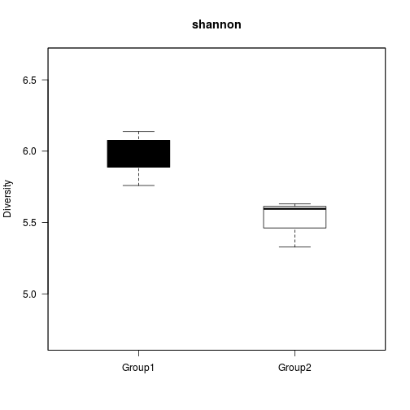

<!--
%vignette: 
%\VignetteEngine{knitr::knitr}
%\VignetteIndexEntry{An R Markdown Vignette made with knitr}
%\usepackage[utf8]{inputenc}
-->

microbiome R package
===========

The microbiome package contains general-purpose tools for
microarray-based analysis of microbiome profiling data sets. 

## Installation

### Installing and loading the release version


```r
source("http://www.bioconductor.org/biocLite.R")
biocLite("microbiome")
library(microbiome)
```

### Installing and loading the experimental development version


```r
install.packages("devtools")
library(devtools)
install_github("microbiome", "microbiome")
```

## Examples

### Load example data

Load simulated example data of the human gut microbiota from the
microbiome package (you can replace the final data matrices with your
own). We use here microbiota profiling data from the HITChip
phylogenetic microarray. Most methods are applicable also for
analogous sequencing data matrices.

Note that with HITChip, fRPA is the recommended default method (kindly
cite [this
article](http://www.computer.org/csdl/trans/tb/2011/01/ttb2011010217-abs.html)).


```r
# Load the package
library(microbiome)  
```

```
## Loading required package: e1071
## Loading required package: vegan
## Loading required package: permute
## Loading required package: lattice
## This is vegan 2.0-10
## Loading required package: reshape
## 
## microbiome R package (microbiome.github.com)
##           
## 
## 
##  Copyright (C) 2011-2014 
##           Leo Lahti and Jarkko Salojarvi 
## 
##         
##           <microbiome-admin@googlegroups.com>
## 
## 
## Attaching package: 'microbiome'
## 
## The following object is masked from 'package:vegan':
## 
##     diversity
## 
## The following object is masked from 'package:lattice':
## 
##     densityplot
## 
## The following object is masked from 'package:e1071':
## 
##     impute
```

```r
# Define data path (here we retrieve data from R package itself)
data.directory <- system.file("extdata", package = "microbiome")

# Read HITChip data matrix (genus-level (L2) log10 values)
level <- "L2"
method <- "frpa"
genus.data <- read.profiling(level = level, 
	     		       method = method, 
              		       data.dir = data.directory, 
	      	       	       log10 = TRUE)  
```

```
## Reading /home/lei/R/x86_64-pc-linux-gnu-library/3.1/microbiome/extdata/L2-frpa.tab
## Logarithmizing the data
```

```r
# Read HITChip probe level data (absolute values - no log10)
oligo.data <- read.profiling(level = "oligo", 
                             data.dir = data.directory, 
			     log10 = FALSE)  
```

```
## Reading /home/lei/R/x86_64-pc-linux-gnu-library/3.1/microbiome/extdata/oligoprofile.tab
```

```r
# Probe-taxon mapping table
phylogeny.info <- read.profiling(level = "phylogeny.full", 
                           	 data.dir = data.directory)
```

```
## Reading /home/lei/R/x86_64-pc-linux-gnu-library/3.1/microbiome/extdata/phylogeny.full.tab
```


### Read metadata

An easy way to provide sample metadata is to create a tab-separated metadata file. You can create the file in Excel and export it to tab-separated csv format. The standard (and self-explanatory) field names include 'sampleID', 'time', 'subjectID', 'group', 'gender', 'diet', 'age'. You can leave these out or include further fields. See this [example file](https://raw.github.com/microbiome/microbiome/master/inst/extdata/metadata.xls). Read the metadata with:


```r
# Read simulated example metadata
library(gdata)
```

```
## gdata: read.xls support for 'XLS' (Excel 97-2004) files ENABLED.
## 
## gdata: read.xls support for 'XLSX' (Excel 2007+) files ENABLED.
## 
## Attaching package: 'gdata'
## 
## The following object is masked from 'package:stats':
## 
##     nobs
## 
## The following object is masked from 'package:utils':
## 
##     object.size
```

```r
metadata.file <- paste(data.directory, "/metadata.xls", sep = "")
metadata <- read.xls(metadata.file, as.is = TRUE)
rownames(metadata) <- metadata$sampleID
```


### PeerJ example data set

The microbiome package contains also an example data set from Lahti et al. [PeerJ 1:e32, 2013](https://peerj.com/articles/32/) concerning associations between human intestinal microbiota and blood serum lipids. Load the data in R as follows:


```r
library(microbiome)
data(peerj32)
names(peerj32)
```

```
## [1] "lipids"   "microbes" "meta"
```


## Usage Examples

Examples on determining the common core microbiota for the given profiling data set, following [Salonen et al. CMI 18(s4):16-20, 2012](http://onlinelibrary.wiley.com/doi/10.1111/j.1469-0691.2012.03855.x/abstract), Clinical Microbiology and Infection 18:16–20. 

### Diversity estimation


```r
# This will return a samples x indices table with 
# richness, evenness and diversity collected in one table
div.table <- estimate.diversity(oligo.data, diversity.index = "shannon")  

# Estimate richness, evenness, and diversity separately
di <- diversity(oligo.data, diversity.index = "shannon")
ri <- richness(oligo.data, det.th = NULL)
ev <- evenness(oligo.data, det.th = NULL)
```


### Diversity boxplot

Produce diversity boxplot for your selected sample groups. NOTE: colors and sample groups are specified before function call. To tune y-axis limits, use 'ylim' argument. For other options, see help(diversity.boxplot).


```r
# Define sample groups 
# Alternatively, read metadata from file. See
# https://github.com/microbiome/microbiome/wiki/reading for details
# sample.groups <- metadata$group
sample.groups <- list()
sample.groups$Group1 <- colnames(oligo.data)[1:3]
sample.groups$Group2 <- colnames(oligo.data)[4:6]

# Plot diversity boxplots
res <- diversity.boxplot(oligo.data, sample.groups, diversity.index = "shannon")
```

 

```r
# The function also returns the sample groups and diversity values 
# used for the plot
sample.groups <- res$sample.groups
div.table <- res$diversity.table 
```

Writing diversity table into file:


```r
output.dir <- "./"
write.table(div.table, file = "DiversityTable.tab", sep = "\t")
```


### Phylotype-specific diversity tables

Retrieve phylotypes x samples table which presents diversity within
each higher-level taxonomic category for each sample.


```r
divtab <- diversity.table(oligo.data, phylogeny.info, level.from = "L1", level.to = "oligo", diversity.index = "shannon") 
```

### Estimating relative abundancies


```r
# NOTE: estimate relative abundancies for phylotypes based on 
# absolute-scale data for diversity calculations (no logarithm!)
rel <- relative.abundance(oligo.data, det.th = NULL)
```

```
## Warning: Applying detection threshold at 0.8 quantile: 232.026771597465
```


### Core microbiota

Determine the core microbiota [(blanket analysis)](http://onlinelibrary.wiley.com/doi/10.1111/j.1469-0691.2012.03855.x/abstract):


```r
mydata <- t(peerj32$microbes)
core <- createCore(mydata)
```

Visualizing core microbiota:


```r
# Core 2D visualization
tmp <- Core2D(core)
```

 

```r
# Core heatmap
tmp <- core_heatmap(mydata)
```

 


### Cross-correlation example


```r
dat1 <- peerj32$lipids # Lipids (44 samples x 389 lipids)
dat2 <- peerj32$microbes # Microbiota (44 samples x 130 bacteria)
meta <- peerj32$meta

correlations <- cross.correlate(dat1, dat2, 
                        method = "bicor", 
			mode = "matrix", 
                        n.signif = 1, 
			p.adj.threshold = 0.05, 
                        p.adj.method = "BH")
```

```
## Warning: longer object length is not a multiple of shorter object length
```

```r
correlation.table <- cmat2table(correlations)
head(correlation.table)
```

```
##              X1                               X2 Correlation    p.adj
## 1100 TG(54:5).2      Ruminococcus gnavus et rel.      0.7208 0.001738
## 1087   TG(52:5)      Ruminococcus gnavus et rel.      0.6996 0.003193
## 479    PC(40:3) Eubacterium cylindroides et rel.     -0.6771 0.003801
## 656    PC(40:3)                     Helicobacter     -0.6838 0.003801
## 1082   TG(50:4)      Ruminococcus gnavus et rel.      0.6852 0.003801
## 1086 TG(52:4).1      Ruminococcus gnavus et rel.      0.6716 0.003801
```

### Licensing and Citations

This work can be freely used, modified and distributed under the 
[Two-clause FreeBSD license](http://en.wikipedia.org/wiki/BSD\_licenses).

Kindly cite the work, if appropriate, as 'Leo Lahti and Jarkko
Salojarvi (2014). microbiome R package. URL: http://microbiome.github.com'. 


### References

The package utilizes tools from a number of other CRAN and
Bioconductor extensions, including ade4, df2json, rjson, fastcluster,
ggplot2, MASS, methods, minet, mixOmics, plyr, qvalue, RCurl,
reshape2, RPA, vegan, and WGCNA. We thank all authors for these
contributions:

 * N. Caballero (2013). [df2json: Convert a dataframe to JSON](http://CRAN.R-project.org/package=df2json) 

 * A. Couture-Beil (2013). [rjson: JSON for R](http://CRAN.R-project.org/package=rjson) 

 * A. Dabney, John D. Storey and with assistance from Gregory R. Warnes. qvalue: Q-value estimation for false discovery rate control. 

 * S. Dray and A. B. Dufour, (2007): The ade4 package: implementing the duality diagram for ecologists. Journal of Statistical Software. 22(4): 1-20.

 * S. Dejean et al. (2013). [mixOmics: Omics Data Integration Project](http://CRAN.R-project.org/package=mixOmics) 

 * L. Lahti et al. A fully scalable online-preprocessing algorithm for short oligonucleotide microarray atlases. [NAR 41(10):e110, 2013](http://nar.oxfordjournals.org/content/41/10/e110) 

 * L. Lahti et al. Analysis of Probe Reliability in Differential Gene Expression Studies with Short Oligonucleotide Arrays. [TCBB/IEEE 8(1):217-225, 2011](http://www.computer.org/portal/web/csdl/doi/10.1109/TCBB.2009.38)

 * L. Lahti et al. Associations between the human intestinal microbiota, Lactobacillus rhamnosus GG and serum lipids indicated by integrated analysis of high-throughput profiling data. [PeerJ 1:e32, 2013](http://dx.doi.org/10.7717/peerj.32).

 * D. T. Lang (2013). [RCurl: General network (HTTP/FTP/...) client interface for R](http://CRAN.R-project.org/package=RCurl) 

 * P. Langfelder and S. Horvath, WGCNA: an R package for weighted correlation network analysis. BMC Bioinformatics 2008, 9:559 

 * P. Langfelder, S. Horvath (2012). Fast R Functions for Robust Correlations and Hierarchical Clustering. [Journal of Statistical Software, 46(11), 1-17](http://www.jstatsoft.org/v46/i11/)

 * P. E. Meyer, Frederic Lafitte and Gianluca Bontempi (2008). MINET: An open source R/Bioconductor Package for Mutual Information based Network Inference. [BMC Bioinformatics](http://www.biomedcentral.com/1471-2105/9/461)

 * D. Mullner (2013). fastcluster: Fast Hierarchical, Agglomerative Clustering Routines for R and Python. [Journal of Statistical Software, 53(9), 1-18](http://www.jstatsoft.org/v53/i09/)

 * Jari Oksanen et al. (2013). [vegan: Community Ecology Package](http://CRAN.R-project.org/package=vegan) 

 * R Core Team (2013). R: A language and environment for statistical computing. R Foundation for Statistical Computing, Vienna, Austria. [ISBN 3-900051-07-0](http://www.R-project.org/)

 * W. N. Venables and B. D. Ripley (2002) Modern Applied Statistics with S. Fourth Edition. Springer, New York. ISBN 0-387-95457-0

 * H. Wickham (2007). Reshaping Data with the reshape Package. [Journal of Statistical Software, 21(12), 1-20](http://www.jstatsoft.org/v21/i12/)

 * H. Wickham. ggplot2: elegant graphics for data analysis. Springer New York, 2009. 

 * H. Wickham (2011). The Split-Apply-Combine Strategy for Data Analysis. [Journal of Statistical Software, 40(1), 1-29](http://www.jstatsoft.org/v40/i01/)


### Session info

This vignette was created with


```r
sessionInfo()
```

```
## R version 3.1.1 (2014-07-10)
## Platform: x86_64-pc-linux-gnu (64-bit)
## 
## locale:
##  [1] LC_CTYPE=en_US.UTF-8       LC_NUMERIC=C              
##  [3] LC_TIME=en_US.UTF-8        LC_COLLATE=en_US.UTF-8    
##  [5] LC_MONETARY=en_US.UTF-8    LC_MESSAGES=en_US.UTF-8   
##  [7] LC_PAPER=en_US.UTF-8       LC_NAME=C                 
##  [9] LC_ADDRESS=C               LC_TELEPHONE=C            
## [11] LC_MEASUREMENT=en_US.UTF-8 LC_IDENTIFICATION=C       
## 
## attached base packages:
## [1] stats     graphics  grDevices utils     datasets  methods   base     
## 
## other attached packages:
## [1] gdata_2.13.3       microbiome_0.99.23 reshape_0.8.5     
## [4] vegan_2.0-10       lattice_0.20-29    permute_0.8-3     
## [7] e1071_1.6-4        knitr_1.6         
## 
## loaded via a namespace (and not attached):
##  [1] acepack_1.3-3.3     class_7.3-11        cluster_1.15.3     
##  [4] codetools_0.2-9     colorspace_1.2-4    df2json_0.0.2      
##  [7] digest_0.6.4        doParallel_1.0.8    dynamicTreeCut_1.62
## [10] evaluate_0.5.5      fastcluster_1.1.13  flashClust_1.01-2  
## [13] foreach_1.4.2       foreign_0.8-61      formatR_1.0        
## [16] Formula_1.1-2       ggplot2_1.0.0       grid_3.1.1         
## [19] gtable_0.1.2        gtools_3.4.1        Hmisc_3.14-5       
## [22] igraph_0.7.1        impute_1.39.0       iterators_1.0.7    
## [25] labeling_0.3        latticeExtra_0.6-26 MASS_7.3-34        
## [28] matrixStats_0.10.0  mixOmics_5.0-3      munsell_0.4.2      
## [31] nnet_7.3-8          parallel_3.1.1      pheatmap_0.7.7     
## [34] plyr_1.8.1          proto_0.3-10        RColorBrewer_1.0-5 
## [37] Rcpp_0.11.2         reshape2_1.4        RGCCA_2.0          
## [40] rgl_0.94.1131       rjson_0.2.14        R.methodsS3_1.6.1  
## [43] rpart_4.1-8         scales_0.2.4        splines_3.1.1      
## [46] stringr_0.6.2       survival_2.37-7     tools_3.1.1        
## [49] WGCNA_1.41-1
```


