## Introduction

The [microbiome R package](http://microbiome.github.io/microbiome) provides tools for the exploration and analysis of microbiome profiling data, with a focus on large-scale population studies and 16S taxonomic profiling. This package is based on the [phyloseq](http://joey711.github.io/phyloseq/import-data) class structure and extends the generic [phyloseq](https://github.com/joey711/phyloseq) framework for R based microbiome analysis, but it is independent work.

This tutorial provides a brief overview on the package functionality with example data sets from published studies (Lahti, Salojarvi, Salonen, et al., 2014; Lahti, Salonen, Kekkonen, et al., 2013; O'Keefe, Li, Lahti, et al., 2015). For a complete description of the package functionality, see the [on-line tutorial](http://microbiome.github.io/microbiome). Other useful on-line resources for starters include [R cheat sheets](http://devcheatsheet.com/tag/r/), [Rmarkdown tips](http://rmarkdown.rstudio.com/), [instructions on using Github with R and RStudio](http://www.molecularecologist.com/2013/11/using-github-with-r-and-rstudio/). The [molecular ecologist's view on code sharing](http://www.molecularecologist.com/2013/08/want-to-share-your-code/) is also worth reading.

The package utilizes tools from a number of other R extensions, including ade4 (Dray and Dufour, 2007; Chessel, Dufour, and Thioulouse, 2004; Dray, Dufour, and Chessel, 2007), dplyr (Wickham and Francois, 2016), ggplot2 (Wickham, 2009), MASS (Venables and Ripley, 2002), moments (Komsta and Novomestky, 2015), phyloseq (McMurdie and Holmes, 2013), RColorBrewer (Neuwirth, 2014), scales (Wickham, 2016), stats (R Core Team, 2017), tidyr (Wickham, 2017), vegan (Oksanen, Blanchet, Friendly, et al., 2017).

The microbiome R package has been utilized in our recent publications (Salonen, Lahti, Salojärvi, et al., 2014; Faust, Lahti, Gonze, et al., 2015; Shetty, Hugenholtz, Lahti, et al., 2017). Kindly cite the work as follows: "Leo Lahti [et al.](https://github.com/microbiome/microbiome/graphs/contributors) (2017). Tools for microbiome analysis in R. Microbiome package version 0.99.1. URL: [http://microbiome.github.com/microbiome](http://microbiome.github.com/microbiome). The microbiome package and examples can be openly used, modified and distributed under the [Two-clause FreeBSD license](http://en.wikipedia.org/wiki/BSD\_licenses).

We welcome input from the user community. Kindly use the [issue tracker](https://github.com/microbiome/microbiome/issues) to report problems, bugs, feature suggestions or other feedback. You can also make [pull requests](Contributing.html) for new package functionality, or examples in the vignette and tutorial pages. See the [Github site](https://github.com/microbiome/microbiome) for further details. 


## Getting started

To install microbiome package (the latest development version) in R, use


```r
library(devtools) # Load the devtools package
install_github("microbiome/microbiome") # Install the package
```

Then load the package in R


```r
library(microbiome)  
```


## Microbiome data

The R tools are designed to operate on the phyloseq standard data format for 16S microbiome profiling data. A phyloseq data object typically contains an OTU table (taxa abundances), sample metadata, taxonomy table (mapping between OTUs and higher-level taxonomic classifications), and a phylogenetic tree (relations between the taxa). Some of these are optional. For a full description, see the phyloseq package. 

**Importing standard data formats** The microbiome package has import functions for standard 16S data formats (Simple CSV, Mothur, biom). For details, see the function help. Additional [import functions](http://joey711.github.io/phyloseq/import-data) in the phyloseq R package. To import BIOM files, for instance, use


```r
pseq <- read_phyloseq(otu.file, taxonomy.file, metadata.file, type = "biom")
```

**Preparing phyloseq data in R** Alternatively, you can read data from any format in R (for instance with read.table, read.csv or other standard functions) and convert into phyloseq format manually. The procedure is well explained in the [phyloseq tutorial](http://joey711.github.io/phyloseq/import-data). 


To pick metadata, taxonomy table, and OTU abundances from a phyloseq object, you can use


```r
# Load example data
data(dietswap)
pseq <- dietswap

meta <- meta(pseq)
taxonomy <- tax_table(pseq)
otu <- abundances(pseq)
```

You can also add new metadata (df is your data.frame) to a phyloseq object


```r
pseq2 <- merge_phyloseq(pseq, sample_data(df))
```


### Example data sets

The package provides several [example data sets](http://microbiome.github.io/microbiome/Data.html), including the HITChip Atlas data set ([Lahti et al. Nat. Comm. 5:4344, 2014](http://www.nature.com/ncomms/2014/140708/ncomms5344/full/ncomms5344.html)), which contains 130 genus-like taxonomic groups across 1006 western adults with no reported health complications. Some subjects have also short time series. Other example data sets include a diet swap study between Rural and Western populations. This is a two-week diet swap study between western (USA) and traditional (rural Africa) diets, reported in [O'Keefe et al. Nat. Comm. 6:6342, 2015](http://dx.doi.org/10.1038/ncomms7342), and parallel profiling of intestinal microbiota versus blood metabolites from [Lahti et al. PeerJ 1:e32, 2013](https://peerj.com/articles/32/) characterizes associations between human intestinal microbiota and blood serum lipids. You can load these example data sets in R 


```r
data(atlas1006) 
data(dietswap) 
data(peerj32) # Data from https://peerj.com/articles/32/
```


## Processing taxonomic profiling data

The phyloseq data can be subsetted, filtered, aggregated, transformed, and otherwise manipulated with functions in the [phyloseq](http://joey711.github.io/phyloseq/) and [microbiome](http://microbiome.github.io/microbiome/Preprocessing.html) R packages.

The microbiome package provides a wrapper for standard transformations, including "Z", "clr", "hellinger", and "shift". The Log10 transform uses log(1+x) if the data contains zeroes. For arbitrary transforms, use the transform_sample_counts function in the phyloseq package. To convert absolute counts to compositional (relative) abundances, for instance, use


```r
pseq.compositional <- microbiome::transform(pseq, "compositional")
```


Conversions between taxonomic levels can be done with the map_levels function, for instance to map Genus (Akkermansia) to Phylum level (Verrucomicrobia)


```r
m <- map_levels("Akkermansia", "Genus", "Phylum", tax_table(pseq))
print(m)
```

```
## [1] "Verrucomicrobia"
```


## Global Ecosystem State Variables 

A comprehensive list of global indicators of the ecosystem state includes various measures for richness, evenness, diversities, dominance, and rarity. The function `global` calls these indicators with standard default parameters. See the function help pages for further options


```r
g <- global(pseq, index = "all")
head(kable(g))
```

```
## [1] "|           | richness_0| richness_20| richness_50| richness_80| diversities_inverse_simpson| diversities_gini_simpson| diversities_shannon| diversities_fisher| diversities_coverage| evenness_camargo| evenness_pielou| evenness_simpson| evenness_evar| evenness_bulla| dominance_DBP| dominance_DMN| dominance_absolute| dominance_relative| dominance_simpson| dominance_core_abundance| dominance_gini| rarity_log_modulo_skewness| rarity_low_abundance| rarity_noncore_abundance| rarity_rare_abundance|"
## [2] "|:----------|----------:|-----------:|-----------:|-----------:|---------------------------:|------------------------:|-------------------:|------------------:|--------------------:|----------------:|---------------:|----------------:|-------------:|--------------:|-------------:|-------------:|------------------:|------------------:|-----------------:|------------------------:|--------------:|--------------------------:|--------------------:|------------------------:|---------------------:|"
## [3] "|Sample-1   |        112|         104|          61|          27|                    7.562984|                0.8677771|            2.942723|           12.16148|                    4|        0.1378045|       0.6045614|        0.0581768|     0.0736465|      0.2925991|     0.3279166|     0.4296966|             175035|          0.3279166|         0.1322229|                0.9274756|      0.8621955|                   2.059086|            0.0291825|                0.0150193|                     0|"
## [4] "|Sample-2   |        118|         110|          68|          39|                    8.105283|                0.8766237|            2.824184|           11.11824|                    3|        0.1159349|       0.5802083|        0.0623483|     0.0722394|      0.2506029|     0.2428268|     0.4655585|             323085|          0.2428268|         0.1233763|                0.9328351|      0.8840651|                   2.058747|            0.0302304|                0.0350443|                     0|"
## [5] "|Sample-3   |        113|         104|          71|          37|                    4.292701|                0.7670464|            2.409584|           10.80073|                    2|        0.0919433|       0.4950318|        0.0330208|     0.0608332|      0.2233591|     0.4593873|     0.5602856|             837328|          0.4593873|         0.2329536|                0.9513098|      0.9080567|                   2.056009|            0.0341229|                0.0095056|                     0|"
## [6] "|Sample-4   |        114|         106|          73|          30|                    7.937365|                0.8740136|            2.994672|           11.62450|                    4|        0.1433967|       0.6152338|        0.0610567|     0.0692447|      0.2829995|     0.3229230|     0.3956421|             269963|          0.3229230|         0.1259864|                0.8617545|      0.8566033|                   2.054981|            0.0349690|                0.0370659|                     0|"
```

You can also call the individual indicator functions for more options


```r
# Diversity indicators. 
d <- diversities(pseq, index = "all")

# Richness with given detection threshold(s).
r <- richness(pseq)

# Dominance index refers to the abundance of the most abundant species
do <- dominance(pseq, index = "all")

# Rarity indices quantify the concentration of rare or low abundance taxa
ra <- rarity(pseq, index = "all")

# Coverage index 
ci <- coverage(pseq, threshold = 0.5)
```


## Beta diversity 


### Quantifying group divergence / spread 

Divergence of a given sample set can be quantified as the average dissimilarity of each sample from the group mean; the dissimilarity can be quantified by beta diversity, for instance. This was applied in group-level comparisons for instance in [Salonen et al. ISME J 2014](http://www.nature.com/ismej/journal/v8/n11/full/ismej201463a.html) (they focused on homogeneity using inverse correlation, whereas here we focus on divergence using correlation but the measure is essentially the same). 

The **inter- and intra-invididual stability** (or homogeneity) measures are obtained as 1-b where b is the group divergence with the anticorrelation method ([Salonen et al. ISME J 2014](http://www.nature.com/ismej/journal/v8/n11/full/ismej201463a.html)). 

Calculate group divergences within the LGG (probiotic) and Placebo groups


```r
pseq <- peerj32$phyloseq
b.pla <- divergence(subset_samples(pseq, group == "Placebo"))
b.lgg <- divergence(subset_samples(pseq, group == "LGG"))
```

Use these to compare microbiota divergence within each group. The LGG group tends to have smaller values, indicating that the samples are more similar to the group mean, and the LGG group is less heterogeneous (has smaller spread / is more homogeneous):


```r
boxplot(list(LGG = b.lgg, Placebo = b.pla))
```

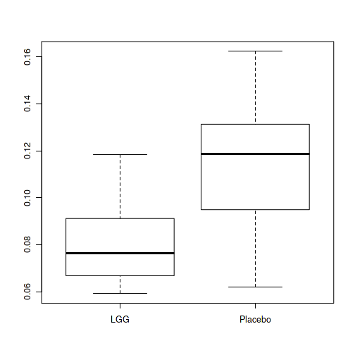


  
## Microbiota composition
  
Read example data from a [diet swap study](http://dx.doi.org/10.1038/ncomms7342):
  

```r
# Read and Pick sample subset
pseq <- core(dietswap, detection = 10^3, prevalence = 95/100)
pseq2 <- subset_samples(pseq, group == "DI" & nationality == "AFR" & timepoint.within.group == 1)
```


### Composition barplots

Microbiota composition with relative abundances, averaged per BMI group
 

```r
# Try another theme
# from https://github.com/hrbrmstr/hrbrthemes
library(hrbrthemes)
library(gcookbook)
library(tidyverse)

# Limit the analysis on core taxa and specific sample group
p <- plot_composition(pseq2,
		      average_by = "bmi_group", 
		      taxonomic.level = "OTU",
                      sample.sort = "nationality",
                      x.label = "nationality",
                      transform = "compositional") +
     guides(fill = guide_legend(ncol = 1)) +
     scale_y_percent() +
     labs(x = "Samples", y = "Relative abundance (%)",
                                   title = "Relative abundance data",
                                   subtitle = "Subtitle",
                                   caption = "Caption text.") + 
     theme_ipsum(grid="Y")
print(p)  
```


Heatmap for CLR-transformed abundances, with samples and OTUs sorted with the neatmap method:
  

```r
p <- plot_composition(pseq2, plot.type = "heatmap", transform = "clr",
                      sample.sort = "neatmap", otu.sort = "neatmap",
                      mar = c(6, 13, 1, 1))
```

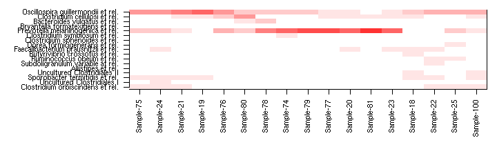

```r
print(p)
```

```
## $colors
##  [1] "#0000FF" "#1919FF" "#3333FF" "#4C4CFF" "#6666FF" "#7F7FFF" "#9999FF"
##  [8] "#B2B2FF" "#CCCCFF" "#E5E5FF" "#FFFFFF" "#FFE5E5" "#FFCBCB" "#FFB2B2"
## [15] "#FF9898" "#FF7F7F" "#FF6565" "#FF4C4C" "#FF3232" "#FF1919" "#FF0000"
## 
## $breaks
##  [1] -1000000.90       -0.95       -0.85       -0.75       -0.65
##  [6]       -0.55       -0.45       -0.35       -0.25       -0.15
## [11]       -0.05        0.05        0.15        0.25        0.35
## [16]        0.45        0.55        0.65        0.75        0.85
## [21]        0.95  1000000.90
## 
## $palette.function
## function (n) 
## {
##     x <- ramp(seq.int(0, 1, length.out = n))
##     if (ncol(x) == 4L) 
##         rgb(x[, 1L], x[, 2L], x[, 3L], x[, 4L], maxColorValue = 255)
##     else rgb(x[, 1L], x[, 2L], x[, 3L], maxColorValue = 255)
## }
## <bytecode: 0x55842bc04388>
## <environment: 0x5584286111d8>
```


## Core microbiota analysis

### Core abundance

Core papers: (Jalanka-Tuovinen, Salonen, ä, et al., 2011; Salonen, Salojärvi, Lahti, et al., 2012), 

The core_abundance function refers to the relative proportion of the core species. Non-core abundance provides the complement (1-x; see noncore_abundance).


```r
co <- core_abundance(pseq, detection = .1/100, prevalence = 50/100)
```


See also related functions for the analysis of rare and variable taxa (noncore_members; noncore_abundance; rare_members; rare_abundance; low_abundance).


```r
pseq <- peerj32$phyloseq
# Calculate compositional version of the data
# (relative abundances)
pseq.rel <- microbiome::transform(pseq, "compositional")
```


### Prevalence of taxonomic groups

Relative population frequencies; at 1% compositional abundance threshold:


```r
head(prevalence(pseq.rel, detection = 1, sort = TRUE))
```

```
##  Yersinia et rel.  Xanthomonadaceae  Wissella et rel.            Vibrio 
##                 0                 0                 0                 0 
## Weissella et rel.       Veillonella 
##                 0                 0
```

### Core microbiota analysis

If you only need the names of the core taxa, do as follows. This returns the taxa that exceed the given prevalence and detection thresholds. 


```r
core.taxa.standard <- core_members(pseq.rel, detection = 0, prevalence = 50/100)
```

A full phyloseq object of the core microbiota is obtained as follows:


```r
pseq.core <- core(pseq.rel, detection = 0, prevalence = .5)
```


## Core visualization

### Core heatmaps

This visualization method has been used for instance in [Intestinal microbiome landscaping: Insight in community assemblage and implications for microbial modulation strategies](https://academic.oup.com/femsre/article/doi/10.1093/femsre/fuw045/2979411/Intestinal-microbiome-landscaping-insight-in#58802539). Shetty et al. _FEMS Microbiology Reviews_ fuw045, 2017.

Note that you can order the taxa on the heatmap with the order.taxa argument.


```r
# Core with compositionals:
prevalences <- seq(.05, 1, .05)
detections <- 10^seq(log10(1e-3), log10(.2), length = 10)

# Also define gray color palette
gray <- gray(seq(0,1,length=5))
p <- plot_core(pseq.rel, plot.type = "heatmap", colours = gray,
    prevalences = prevalences, detections = detections) +
    xlab("Detection Threshold (Relative Abundance (%))")
print(p)    


# Same with the viridis color palette
# color-blind friendly and uniform
# options: viridis, magma, plasma, inferno
# https://cran.r-project.org/web/packages/viridis/vignettes/intro-to-viridis.html
# Also discrete=TRUE versions available
library(viridis)
print(p + scale_fill_viridis())
```

```
## Scale for 'fill' is already present. Adding another scale for 'fill',
## which will replace the existing scale.
```

```r
# Core with absolute counts and horizontal view:
# and minimum population prevalence (given as percentage)
detections <- 10^seq(log10(1), log10(max(abundances(pseq))/10), length = 10)

library(RColorBrewer)
p <- plot_core(pseq, plot.type = "heatmap", 
       		 prevalences = prevalences,
       		 detections = detections,
		 colours = rev(brewer.pal(5, "Spectral")),
		 min.prevalence = .2, horizontal = TRUE)
print(p)
```

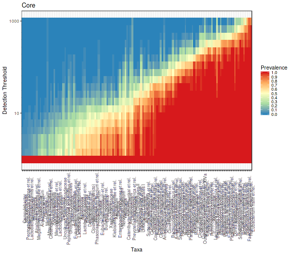


## Microbiome Landscaping

[Microbiome Landscaping](https://academic.oup.com/femsre/article/doi/10.1093/femsre/fuw045/2979411/Intestinal-microbiome-landscaping-insight-in#58802539) refers to the analysis and illustration of population frequencies. Typically, these are wrappers based on standard ordination methods (for more examples, see [ordination examples](Ordination.html))


### Two-dimensional microbiome landscape

Load example data:


```r
library(phyloseq)
library(ggplot2)

data(dietswap)
pseq <- dietswap

# Convert to compositional data
pseq.rel <- microbiome::transform(pseq, "compositional")

# Pick core taxa
pseq.core <- core(pseq.rel, detection = 5/100, prevalence = 50/100)
pseq.core <- subset_samples(pseq.core, sex == "Female" &
	                               bmi_group == "overweight")
```


Visualize the microbiome landscape (sample similarities on two-dimensional projection). For direct access to the ordination coordinates, use the following:


```r
# Project the samples with the given method and dissimilarity measure. 
# Ordinate the data; note that some ordinations are sensitive to random seed
# "quiet" is used to suppress intermediate outputs
set.seed(423542)
quiet(proj <- get_ordination(pseq.core, "NMDS", "bray"))

# Same with a generic data.frame
# (note that random seed will affect the exact ordination)
p <- plot_landscape(proj[, 1:2], col = proj$nationality, legend = T)
print(p)

# Visualize sample names:
ax1 <- names(proj)[[1]]
ax2 <- names(proj)[[2]]
p <- ggplot(aes_string(x = ax1, y = ax2, label = "sample"), data = proj) +
       geom_text(size = 2)
print(p)
```

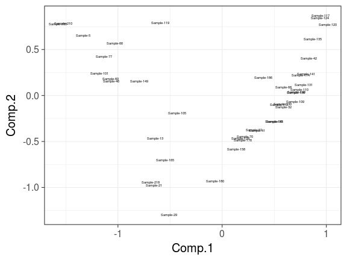


* [Networks](Networks.html)


## Microbiome stability analysis

Get example data - [HITChip Atlas of 130 genus-like taxa across 1006 healthy western adults](http://www.nature.com/ncomms/2014/140708/ncomms5344/full/ncomms5344.html). A subset of 76 subjects have also short time series available for temporal stability analysis:


```r
# Load the example data
set.seed(134)

# Rename the example data
pseq <- atlas1006

# Focus on specific subset
pseq <- pseq %>% subset_samples(DNA_extraction_method == "r")

# Use relative abundances
pseq <- microbiome::transform(pseq, "compositional")

# Keep only the prevalent taxa to speed up examples
pseq <- core(pseq, detection = .1/100, prevalence = 99/100)

# For cross-sectional analysis, use only the baseline time point:
pseq0 <- baseline(pseq)
```


### Intermediate stability quantification

It has been reported that certain microbial groups exhibit bi-stable
abundance distributions with distinct peaks at low and high
abundances, and an instable intermediate abundance range. Instability
at the intermediate abundance range is hence one indicator of
bi-stability. [Lahti et al. 2014](http://www.nature.com/ncomms/2014/140708/ncomms5344/full/ncomms5344.html) used straightforward correlation analysis to quantify how the distance from the intermediate abundance region (50% quantile) is associated with the observed shifts between consecutive time points. 


```r
intermediate.stability <- intermediate_stability(pseq, output = "scores")
```


### Bimodality quantification

Check the [bimodality page](Bimodality.html) for more examples on bimodality indicators.

Bimodality of the abundance distribution provides another (indirect)
indicator of bistability, although other explanations such as sampling
biases etc. should be controlled. Multiple bimodality scores are
available.

Multimodality score using [potential analysis with bootstrap](http://www.nature.com/ncomms/2014/140708/ncomms5344/full/ncomms5344.html)


```r
# Bimodality is better estimated from log10 abundances
pseq0.log10 <- microbiome::transform(pseq0, "log10")

set.seed(4433)
# In practice, it is recommended to use more bootstrap iterations than in this example
bimodality.score <- bimodality(pseq0.log10, method = "potential_analysis",
                               bs.iter = 10, peak.threshold = 10,
			       min.density = 10)
```


### Comparing bimodality and intermediate stability

The analysis suggests that bimodal population distribution across individuals is often associated with instable intermediate abundances within individuals. The specific bi-stable groups in the upper left corner were suggested to constitute bistable tipping elements of the human intestinal microbiota in [Lahti et al. Nat. Comm. 5:4344, 2014](http://www.nature.com/ncomms/2014/140708/ncomms5344/full/ncomms5344.html):


```r
taxa <- taxa(pseq0)
df <- data.frame(group = taxa,
                 intermediate.stability = intermediate.stability[taxa],
		 bimodality = bimodality.score[taxa])

theme_set(theme_bw(20))
p <- ggplot(df,
       aes(x = intermediate.stability, y = bimodality, label = group)) +
       geom_text() +
       geom_point() 
print(p)
```


### Tipping point detection

Identify potential minima in cross-section population data as
tipping point candidates. 


```r
# Log10 abundance for a selected taxonomic group
# Pick the most bimodal taxa as an example
tax  <- names(which.max(bimodality.score))

# Detect tipping points detection at log10 abundances 
x <- abundances(microbiome::transform(pseq, "log10"))[tax,]

# Bootstrapped potential analysis to identify potential minima
# in practice, use more bootstrap iterations
potential.minima <- potential_analysis(x, bs.iter = 10)$minima

# Same with earlywarnings package (without bootstrap ie. less robust)
# library(earlywarnings)
# res <- livpotential_ews(x)$min.points

# Identify the potential minimum location as a tipping point candidate
# and cast the tipping back to the original (non-log) space:
tipping.point <- 10^potential.minima

print(tipping.point)
```

```
## [1] 0.004831929
```


### Visualization with variation lineplot and bimodality hotplot

Pick subset of the [HITChip Atlas data set](http://doi.org/10.5061/dryad.pk75d) and plot the subject abundance variation lineplot (**Variation lineplot**) and **Bimodality hotplot** for a given taxon as in [Lahti et al. 2014](http://www.nature.com/ncomms/2014/140708/ncomms5344/full/ncomms5344.html). The bi-stable Dialister has bimodal population distribution and reduced temporal stability within subjects at intermediate abundances.


Variation plot:


```r
# Indicates the abundance variation range for subjects with multiple time points
pv <- plot_tipping(pseq, tax, tipping.point = tipping.point)
print(pv)
```


Bimodality hotplot:


```r
# Consider a unique sample from each subject: the baseline time point 
ph <- hotplot(pseq0, tax, tipping.point = tipping.point)
print(ph)
```


### Time series for individual subjects


```r
# Experimental function 
source(system.file("extdata/plot_longitudinal.R", package = "microbiome"))
p <- plot_longitudinal(pseq, "Dialister", subject = "831", tipping.point = 0.5)
print(p)
```


## Heatmaps for microbiome analysis

See [Composition](Composition.html) page for further microbiota composition heatmaps, as well as the [phyloseq tutorial](http://joey711.github.io/phyloseq/plot_heatmap-examples.html) and [Neatmaps](http://www.biomedcentral.com/1471-2105/11/45). Moreover, the [aheatmap](http://nmf.r-forge.r-project.org/aheatmap.html) function of the NMF package provides further high quality heatmap plotting capabilities with row and column annotation color bars, clustering trees and other useful features that are often missing from standard heatmap tools in R.

Load some example data:


```r
 # Load libraries
library(phyloseq)
data(peerj32)
pseq <- peerj32$phyloseq    # Rename data

# Pick data subset (DI samples from Phylum Bacteroidetes)
pseq2 <- pseq %>%
         subset_taxa(Phylum == "Bacteroidetes") %>%
         subset_samples(group == "LGG")

# Z transformed abundance data
pseqz <- microbiome::transform(pseq2, "Z")
```


### Matrix heatmaps

Pick abundance matrix separately and use matrix visualization
tools. Z-transforming OTUs ie. visualize deviation of all bacteria
from their population mean (smaller: blue; higher: red):


```r
# Pick OTU table
x <- abundances(pseqz)

# Find visually appealing order for rows and columns with the Neatmap approach:
# Sort the matrix rows and cols directly
xo <- neat(x, method = "NMDS", distance = "euclidean") # Sorted matrix
tmp <- plot_matrix(xo, type = "twoway", mar = c(5, 12, 1, 1))
```

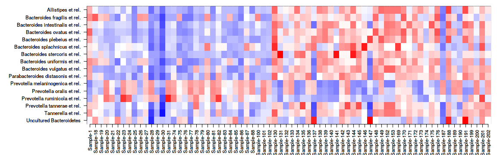

```r
# or use a shortcut to sorting rows (or columns) if just the order was needed 
sorted.rows <- neatsort(x, "rows", method = "NMDS", distance = "euclidean") 
```


### Cross-correlating data sets

Cross-correlate columns of two data sets from related to microbiome and blood serum lipids associations ([PeerJ 1:e32](https://peerj.com/articles/32/)).

The function returns correlations, raw p-values, and fdr estimates (not strictly proper as the comparisons are not independent). Here robust biweight midcorrelation ('bicor') from the [WGCNA package](http://labs.genetics.ucla.edu/horvath/CoexpressionNetwork/Rpackages/WGCNA/). Keep only those elements that have at least only one significant correlation (n.signif):


```r
# Load example data 
otu <- peerj32$microbes 
lipids <- peerj32$lipids 

# Define data sets to cross-correlate
x <- log10(otu) # OTU Log10 (44 samples x 130 genera)
y <- as.matrix(lipids) # Lipids (44 samples x 389 lipids)

# Cross correlate data sets
correlations <- associate(x, y, method = "bicor", mode = "matrix", p.adj.threshold = 0.05, n.signif = 1)

# Or, alternatively, the same output is also available in a handy table format
correlation.table <- associate(x, y, method = "bicor", mode = "table", p.adj.threshold = 0.05, n.signif = 1)

kable(head(correlation.table))
```


|    |X1                               |X2         | Correlation|     p.adj|
|:---|:--------------------------------|:----------|-----------:|---------:|
|833 |Ruminococcus gnavus et rel.      |TG(54:5).2 |   0.7207818| 0.0017385|
|547 |Ruminococcus gnavus et rel.      |TG(52:5)   |   0.6996301| 0.0031929|
|141 |Eubacterium cylindroides et rel. |PC(40:3)   |  -0.6771286| 0.0038006|
|144 |Helicobacter                     |PC(40:3)   |  -0.6838424| 0.0038006|
|437 |Ruminococcus gnavus et rel.      |TG(50:4)   |   0.6852226| 0.0038006|
|525 |Ruminococcus gnavus et rel.      |TG(52:4).1 |   0.6716223| 0.0038006|

### Association heatmaps

Rearrange the data and plot the heatmap and mark significant correlations with stars to reproduce microbiota-lipidome heatmap from [Lahti et al. PeerJ (2013)](https://peerj.com/articles/32/) (the ordering of rows and columns may be different): 


```r
p <- heat(correlation.table, "X1", "X2", fill = "Correlation", star = "p.adj", p.adj.threshold = 0.05) 
```

```r
print(p)
```

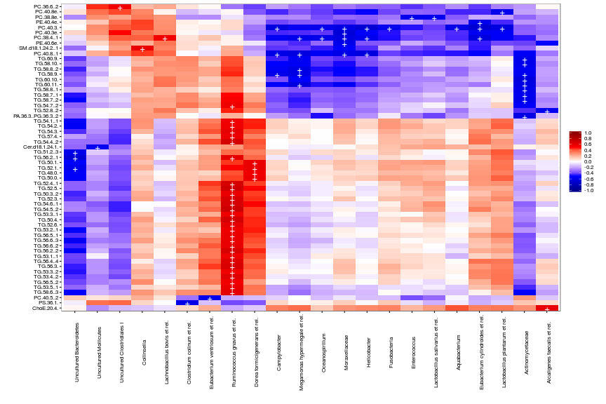


## Ordination examples

Full examples for standard ordination techniques applied to phyloseq data, based on the [phyloseq ordination tutorial](http://joey711.github.io/phyloseq/plot_ordination-examples.html). For handy wrappers for some common ordination tasks in microbiome analysis, see [landscaping examples](Landscaping.html)


```r
pseq <- dietswap

# Convert to compositional data
pseq.rel <- microbiome::transform(pseq, "compositional")

# Pick core taxa with with the given prevalence and detection limits
pseq.core <- core(pseq.rel, detection = .1/100, prevalence = 90/100)

# Use relative abundances for the core
pseq.core <- microbiome::transform(pseq.core, "compositional")
```


### Sample ordination

Project the samples with the given method and dissimilarity measure. 


```r
# Ordinate the data
set.seed(4235421)
# proj <- get_ordination(pseq, "MDS", "bray")
ord <- ordinate(pseq, "MDS", "bray")
```


### Multidimensional scaling (MDS / PCoA)


```r
plot_ordination(pseq, ord, color = "nationality") +
                geom_point(size = 5)
```

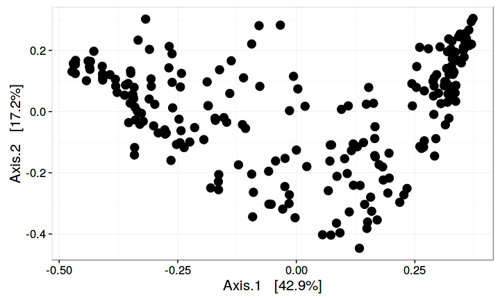


### RDA

Load the package and example data:


```r
pseq <- peerj32$phyloseq # phyloseq data

# Only check the core taxa to speed up examples
pseq <- core(pseq, detection = 10^2, prevalence = 95/100)

pseq.trans <- microbiome::transform(pseq, "hell") # Hellinger transform
```


### Bagged RDA

Bagged RDA provides added robustness in the analysis compared to the standard RDA. Fit bagged (bootstrap aggregated) RDA on a phyloseq object (alternatively you could apply it to the abundance matrix and covariates directly):


```r
# In any real study, use bs.iter = 100 or higher
# to achieve meaningful benefits from the bagged version.
# In this example we use bs.iter = 2 just to speed up the
# example code for educational purposes
res <- rda_bagged(pseq.trans, "group", bs.iter=2)
```

Visualizing bagged RDA:


```r
plot_rda_bagged(res)
```


## Regression plots

Regression curve with smoothed error bars based on the [Visually-Weighted Regression](http://www.fight-entropy.com/2012/07/visually-weighted-regression.html) by Solomon M. Hsiang. The sorvi implementation extends [Felix Schonbrodt's original code](http://www.nicebread.de/visually-weighted-watercolor-plots-new-variants-please-vote/). See also [potential analysis](Potential.html).


```r
pseq <- atlas1006
p <- plot_regression(diversity ~ age, meta(pseq))
print(p)
```

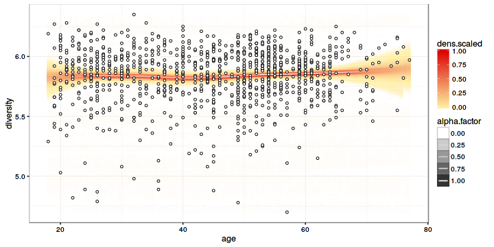


## Bimodality analysis

Get example data - [HITChip Atlas of 130 genus-like taxa across 1006 healthy western adults](http://www.nature.com/ncomms/2014/140708/ncomms5344/full/ncomms5344.html). A subset of 76 subjects have also short time series available for temporal stability analysis:


```r
# Rename the example data
pseq <- atlas1006

# Focus on specific DNA extraction method
pseq <- pseq %>% subset_samples(DNA_extraction_method == "r")

# Keep prevalent taxa (HITChip signal >3 in >20 percent of the samples)
pseq <- core(pseq, detection = 10^3, prevalence = .2)

# Use relative abundances
pseq <- microbiome::transform(pseq, "compositional")

# For cross-sectional analysis, include
# only the zero time point:
pseq0 <- subset_samples(pseq, time == 0)
```


### Bimodality indicators

Bimodality of the abundance distribution provides an indirect
indicator of bistability, although other explanations such as sampling
biases etc. should be controlled. Multiple bimodality scores are
available.


Multimodality score using [potential analysis with bootstrap](http://www.nature.com/ncomms/2014/140708/ncomms5344/full/ncomms5344.html). Sarle's bimodality coefficient is available as well; and for classical test of unimodality, see the DIP test.


```r
# Bimodality is better estimated from log10 abundances
pseq0.log10 <- microbiome::transform(pseq0, "log10")
bimodality <- bimodality(pseq0.log10, method = "potential_analysis", bs.iter = 20)
```

### Visualize population densities for unimodal and bimodal groups


```r
# Pick the most and least bimodal taxa as examples
unimodal  <- names(sort(bimodality))[[1]]
bimodal  <- rev(names(sort(bimodality)))[[1]]

# Visualize population frequencies
theme_set(theme_bw(20))
p1 <- plot_density(pseq, variable = unimodal, log10 = TRUE) 
p2 <- plot_density(pseq, variable = bimodal,  log10 = TRUE) 
library(gridExtra)
grid.arrange(p1, p2, nrow = 1)
```

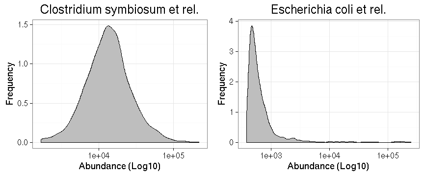


## Tipping point detection

Identify potential minima in cross-section population data as tipping
point candidates (note that [longitudinal analysis](Stability.html)
would be necessary to establish bistability).


```r
# Log10 abundance for a selected taxonomic group
tax <- bimodal

# Detect tipping points detection at log10 abundances 
x <- log10(abundances(pseq)[tax,])

# Bootstrapped potential analysis to identify potential minima
set.seed(3432)
potential.minima <- potential_analysis(log10(abundances(pseq)[tax,]), bs.iter = 50)$minima

# Identify the potential minimum location as a tipping point candidate
# and cast the tipping back to the original (non-log) space:
tipping.point <- 10^potential.minima
print(tipping.point)
```

```
## [1] 0.009474153
```


## Variation lineplot and bimodality hotplot

Pick subset of the [HITChip Atlas data set](http://doi.org/10.5061/dryad.pk75d) and plot the subject abundance variation lineplot (**Variation tip plot**) and **Bimodality hotplot** for a given taxon as in [Lahti et al. 2014](http://www.nature.com/ncomms/2014/140708/ncomms5344/full/ncomms5344.html). The bi-stable Dialister has bimodal population distribution and reduced temporal stability within subjects at intermediate abundances.


```r
# Bimodality hotplot:
# Consider a unique sample from each subject: the baseline time point 
p <- hotplot(pseq0, tax, tipping.point = tipping.point)
print(p)

pv <- plot_tipping(pseq, tax, tipping.point = tipping.point)
print(pv)
```

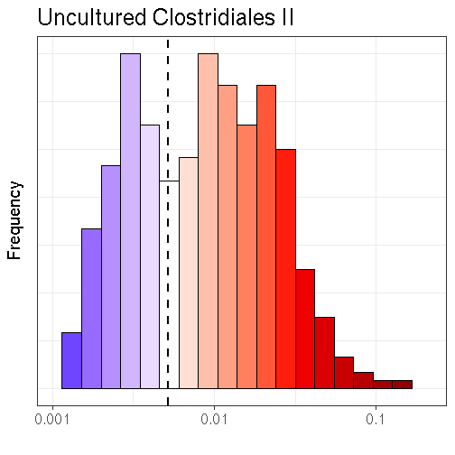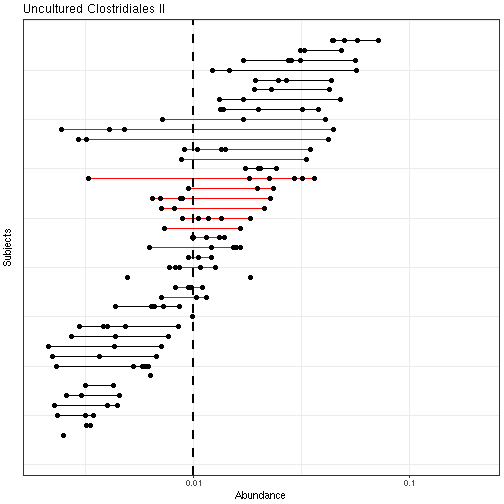


## Group-wise comparisons

A number of methods for microbiota community comparisons have been proposed. For a recent benchmarking study, see [Weiss et al. (2017)](http://doi.org/10.1186/s40168-017-0237-y). For a comprehensive example workflow, see [Callahan et al. F1000 (2017)](https://f1000research.com/articles/5-1492/v2). Other methods, not implemented here (see [Weiss et al. (2017)](http://microbiomejournal.biomedcentral.com/articles/10.1186/s40168-017-0237-y) for a recent survey):

 * [Zero-inflated Gaussians (ZIGs)](https://www.ncbi.nlm.nih.gov/pubmed/24076764/) (see [metagenomeSeq](https://bioconductor.org/packages/release/bioc/html/metagenomeSeq.html) Bioconductor package)
 * [DESeq2](deseq2.Rmd) and other advanced methods based on negative binomial


For community-level multivariate comparisons

 * [Multivariate linear models (limma)](limma.html)


## PERMANOVA for community-level multivariate comparisons

PERMANOVA quantifies multivariate community-level differences between
groups.


```r
# Use the probiotics intervention example data 
pseq <- peerj32$phyloseq # Rename the example data

# Pick relative abundances (compositional) and sample metadata 
pseq.rel <- microbiome::transform(pseq, "compositional")
otu <- abundances(pseq.rel)
meta <- meta(pseq.rel)
```

Now let us evaluate whether the group (probiotics vs. placebo) has a
significant effect on overall gut microbiota composition. Perform PERMANOVA: 


```r
# samples x species as input
library(vegan)
permanova <- adonis(t(otu) ~ group,
               data = meta, permutations=99, method = "bray")

# P-value
print(as.data.frame(permanova$aov.tab)["group", "Pr(>F)"])
```

```
## [1] 0.2
```


### Acknowledgements

The main developer is [Leo Lahti](https://github.com/antagomir/). Package co-authors include Jarkko Salojärvi and Sudarshan Shetty, and contributor Tineka Blake and [others](https://github.com/microbiome/microbiome/graphs/contributors). Financial support has been provided by Academy of Finland (grants 256950 and 295741), [University of Turku](http://www.utu.fi/en/Pages/home.aspx), Department of Mathematics and Statistics, [VIB lab for Bioinformatics and (eco-)systems biology](http://www.vib.be/en/research/scientists/Pages/Jeroen-Raes-Lab.aspx), VIB/KULeuven, Belgium, [Molecular Ecology group](http://www.mib.wur.nl/UK/), Laboratory of Microbiology, Wageningen University, Netherlands, and [Department of Veterinary Bioscience](http://www.vetmed.helsinki.fi/apalva/index.htm), University of Helsinki, Finland. This work relies on the independent [phyloseq](https://github.com/joey711/phyloseq) package and data structures for R-based microbiome analysis developed by Paul McMurdie and Susan Holmes. 


# References

[Intestinal microbiome landscaping: Insight in community assemblage and implications for microbial modulation strategies](https://academic.oup.com/femsre/article/doi/10.1093/femsre/fuw045/2979411/Intestinal-microbiome-landscaping-insight-in#58802539). Shetty S, Hugenholtz F, Lahti L, Smidt H, de Vos WM, Danchin A. _FEMS Microbiology Reviews_ fuw045, 2017.

[Metagenomics meets time series analysis: unraveling microbial community dynamics](http://dx.doi.org/10.1016/j.mib.2015.04.004) Faust K, Lahti L, Gonze D, de Vos WM, Raes J. _Current Opinion in Microbiology_ 15:56-66 2015.

[Tipping elements in the human intestinal ecosystem](http://www.nature.com/ncomms/2014/140708/ncomms5344/full/ncomms5344.html) Lahti L, Salojärvi J, Salonen A, Scheffer M, de Vos WM. _Nature Communications_ 5:4344, 2014. 

[Fat, Fiber and Cancer Risk in African, Americans and Rural Africans](http://www.nature.com/ncomms/2015/150428/ncomms7342/full/ncomms7342.html)  O’Keefe S, Li JV, Lahti L, Ou J, Carbonero F, Mohammed K, Posma JM, Kinross J, Wahl E, Ruder E, Vipperla K, Naidoo V, Mtshali L, Tims S, Puylaert PGB, DeLany J, Krasinskas A, Benefiel AC, Kaseb HO, Newton K, Nicholson JK, de Vos WM, Gaskins HR, Zoetendal EG. _Nature Communications_ 6:6342, 2015.

[Associations between the human intestinal microbiota, Lactobacillus rhamnosus GG and serum lipids indicated by integrated analysis of high-throughput profiling data](http://dx.doi.org/10.7717/peerj.32) Lahti L, Salonen A, Kekkonen RA, Salojärvi J, Jalanka-Tuovinen J, Palva A, Orešič M, de Vos WM. _PeerJ_ 1:e32, 2013.

[The adult intestinal core microbiota is determined by analysis depth and health status](http://onlinelibrary.wiley.com/doi/10.1111/j.1469-0691.2012.03855.x/abstract) Salonen A, Salojärvi J, Lahti L, and de Vos WM. _Clinical Microbiology and Infection_ 18(S4):16 20, 2012. 


[1] D. Chessel, A. Dufour and J. Thioulouse. "The ade4 package-I-
One-table methods". In: _R News_ 4 (2004), pp. 5-10.
[1] S. Dray and A. Dufour. "The ade4 package: implementing the
duality diagram for ecologists". In: _Journal of Statistical
Software_ 22.4 (2007), pp. 1-20.
[1] S. Dray, A. Dufour and D. Chessel. "The ade4 package-II:
Two-table and K-table methods." In: _R News_ 7.2 (2007), pp.
47-52.
[1] J. Jalanka-Tuovinen, A. Salonen, J. N. ä, et al. "Intestinal
microbiota in healthy adults: Temporal analysis reveals individual
and common core and relation to intestinal symptoms". In: _PLoS
One_ 6.7 (2011), p. e23035.
[1] L. Komsta and F. Novomestky. _moments: Moments, cumulants,
skewness, kurtosis and related tests_. R package version 0.14.
2015. <URL: https://CRAN.R-project.org/package=moments>.

```
## Warning in parse_Rd(Rd, encoding = encoding, fragment = fragment, ...):
## <connection>:4: unknown macro '\itLactobacillus'
```

[1] L. Lahti, A. Salonen, R. A. Kekkonen, et al. "Associations
between the human intestinal microbiota, \itLactobacillus
rhamnosus GG and serum lipids indicated by integrated analysis of
high-throughput profiling data". In: _PeerJ_ 1 (2013), p. e32.
<URL: http://dx.doi.org/10.7717/peerj.32>.
[1] P. J. McMurdie and S. Holmes. "phyloseq: An R package for
reproducible interactive analysis and graphics of microbiome
census data". In: _PLoS ONE_ 8.4 (2013), p. e61217. <URL:
http://dx.plos.org/10.1371/journal.pone.0061217>.
[1] E. Neuwirth. _RColorBrewer: ColorBrewer Palettes_. R package
version 1.1-2. 2014. <URL:
https://CRAN.R-project.org/package=RColorBrewer>.
[1] J. Oksanen, F. G. Blanchet, M. Friendly, et al. _vegan:
Community Ecology Package_. R package version 2.4-3. 2017. <URL:
https://CRAN.R-project.org/package=vegan>.
[1] R Core Team. _R: A Language and Environment for Statistical
Computing_. R Foundation for Statistical Computing. Vienna,
Austria, 2017. <URL: https://www.R-project.org/>.
[1] A. Salonen, J. Salojärvi, L. Lahti, et al. "The adult
intestinal core microbiota is determined by analysis depth and
health status". In: _Clinical Microbiology and Infection_
18.Suppl. 4 (2012), p. 16–20. <URL:
http://onlinelibrary.wiley.com/doi/10.1111/j.1469-0691.2012.03855.x/abstract>.
[1] W. N. Venables and B. D. Ripley. _Modern Applied Statistics
with S_. Fourth. ISBN 0-387-95457-0. New York: Springer, 2002.
<URL: http://www.stats.ox.ac.uk/pub/MASS4>.
[1] H. Wickham. _ggplot2: Elegant Graphics for Data Analysis_.
Springer-Verlag New York, 2009. ISBN: 978-0-387-98140-6. <URL:
http://ggplot2.org>.
[1] H. Wickham. _scales: Scale Functions for Visualization_. R
package version 0.4.1. 2016. <URL:
https://CRAN.R-project.org/package=scales>.
[1] H. Wickham. _tidyr: Easily Tidy Data with 'spread()' and
'gather()' Functions_. R package version 0.6.3. 2017. <URL:
https://CRAN.R-project.org/package=tidyr>.
[1] H. Wickham and R. Francois. _dplyr: A Grammar of Data
Manipulation_. R package version 0.5.0. 2016. <URL:
https://CRAN.R-project.org/package=dplyr>.


