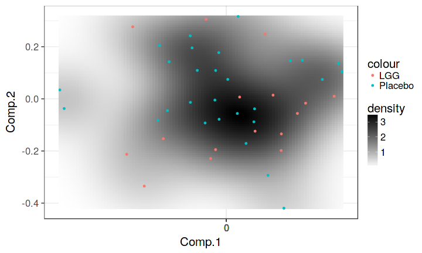
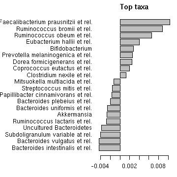

## Introduction

Tools for common analysis tasks in microbiome profiling studies; illustrated with multiple example data sets from published studies; extending the [phyloseq](http://joey711.github.io/phyloseq/import-data) class.

See [microbiome tutorial](http://microbiome.github.io/microbiome) for a full set of online examples on using the microbiome package tools.


Further tips:

 * [Rmarkdown tips](http://rmarkdown.rstudio.com/)
 * [R cheat sheets](http://devcheatsheet.com/tag/r/)
 * [Using Github with R and RStudio](http://www.molecularecologist.com/2013/11/using-github-with-r-and-rstudio/)
 * [Molecular ecologist's view on code sharing](http://www.molecularecologist.com/2013/08/want-to-share-your-code/)


This work can be freely used, modified and distributed under the
[Two-clause FreeBSD license](http://en.wikipedia.org/wiki/BSD\_licenses).

Kindly cite this work as follows:


```r
citation('microbiome')
```

```
## 
## Please cite the package as follows:
## 
##   Leo Lahti et al.  microbiome R package.  URL:
##   http://microbiome.github.io
## 
## A BibTeX entry for LaTeX users is
## 
##   @Misc{,
##     title = {microbiome R package},
##     author = {Leo Lahti and Sudarshan Shetty and Tineka Blake and Jarkko Salojarvi},
##     year = {2012-2017},
##   }
```

## Developers

New examples and tutorial pages from the user community are welcome: [Contributing](Contributing.html)


The package utilizes tools from a number of other R extensions, including ade4 (Dray and Dufour, 2007; Chessel, Dufour, and Thioulouse, 2004; Dray, Dufour, and Chessel, 2007), dplyr (Wickham and Francois, 2016), ggplot2 (Wickham, 2009), MASS (Venables and Ripley, 2002), moments (Komsta and Novomestky, 2015), phyloseq (McMurdie and Holmes, 2013), RColorBrewer (Neuwirth, 2014), scales (Wickham, 2016), stats (R Core Team, 2017), tidyr (Wickham, 2017), vegan (Oksanen, Blanchet, Friendly, et al., 2017).


## Getting started


### Install the microbiome package

To install microbiome package in R:


```r
library(devtools) # Load the devtools package
install_github("microbiome/microbiome") # Install the package
```

### Loading the package

Once the package has been installed, load it in R (also to test successful installation):


```r
library(microbiome)  
```


## Microbiome data

* [Networks](Networks.html)


### Importing standard formats (CSV, Mothur, BIOM)

The microbiome package has import functions for certain standard data formats for 16S profiling (Simple CSV, Mothur, biom). For details, see the function help. To import these, use:


```r
# Import output CSV files generated by write_phyloseq
pseq1 <- read_phyloseq(otu.file, taxonomy.file, metadata.file, type = "simple")

# Import mother .shared and .taxonomy and metadata files
pseq2 <- read_phyloseq(otu.file, taxonomy.file, metadata.file, type = "mothur")

# Import BIOM files
pseq3 <- read_phyloseq(otu.file, taxonomy.file, metadata.file, type = "biom")
```

You can also use additional [import functions](http://joey711.github.io/phyloseq/import-data) from the independent phyloseq R package. 


### Converting data to phyloseq format in R

Alternatively, you can read your data in R (read.table, read.csv or other standard functions) and convert into phyloseq format. The procedure is well explained in the [phyloseq tutorial](http://joey711.github.io/phyloseq/import-data) from the independent phyloseq R package. 

See also examples on [filtering, subsetting and other data processing](Preprocessing.html) for phyloseq objects.


### Adding metadata to phyloseq 

This shows how to add metadata to a phyloseq object. For reproducibility, we just put use the existing metadata, but this could be replaced by another data.frame (samples x fields). 


```r
# Example data
data(dietswap)
pseq <- dietswap

# Pick the existing metadata from a phyloseq object
# (or retrieve this from another source)
df <- meta(pseq)

# Merge the metadata back in the phyloseq object
pseq2 <- merge_phyloseq(pseq, sample_data(df))
```


## Microbiome example data sets

### Intestinal microbiota profiling of 1006 Western adults

[The HITChip Atlas](Atlas.html) data set is available via the microbiome R package in phyloseq format, and via [Data Dryad](http://doi.org/10.5061/dryad.pk75d) in tabular format. This data set from [Lahti et al. Nat. Comm. 5:4344, 2014](http://www.nature.com/ncomms/2014/140708/ncomms5344/full/ncomms5344.html) comes with 130 genus-like taxonomic groups across 1006 western adults with no reported health complications. Some subjects have also short time series. Load the data in R with:


```r
library(microbiome)
data(atlas1006) 
print(atlas1006)
```

```
## phyloseq-class experiment-level object
## otu_table()   OTU Table:         [ 130 taxa and 1172 samples ]
## sample_data() Sample Data:       [ 1172 samples by 10 sample variables ]
## tax_table()   Taxonomy Table:    [ 130 taxa by 2 taxonomic ranks ]
```


### Diet swap between Rural and Western populations

A two-week diet swap study between western (USA) and traditional
(rural Africa) diets, reported in [O'Keefe et al. Nat. Comm. 6:6342,
2015](http://dx.doi.org/10.1038/ncomms7342). The data is also
available for download from [Data
Dryad](http://dx.doi.org/10.5061/dryad.1mn1n). Load in R with:


```r
data(dietswap)
print(dietswap)
```

```
## phyloseq-class experiment-level object
## otu_table()   OTU Table:         [ 130 taxa and 222 samples ]
## sample_data() Sample Data:       [ 222 samples by 8 sample variables ]
## tax_table()   Taxonomy Table:    [ 130 taxa by 2 taxonomic ranks ]
```


### Intestinal microbiota versus blood metabolites

Data set from [Lahti et al. PeerJ 1:e32,
2013](https://peerj.com/articles/32/) characterizes associations
between human intestinal microbiota and blood serum lipids. Note that
this data set contains an additional data matrix of lipid
species. Load the data in R with:


```r
data(peerj32)
print(names(peerj32))
```

```
## [1] "lipids"   "microbes" "meta"     "phyloseq"
```


## Processing taxonomic profiling data

Instructions to manipulate microbiome data sets using tools from the [phyloseq package](http://joey711.github.io/phyloseq/) and some extensions from the [microbiome package](https://github.com/microbiome/microbiome), including subsetting, aggregating and filtering.


```r
library(phyloseq)
library(microbiome)

data(atlas1006)   # Load the data
pseq <- core(subset_samples(atlas1006, nationality == "EasternEurope"), detection = 10^2, prevalence = 50/100) # Rename the data and pick subset for faster examples
```


### Retrieving data elements from a phyloseq object  

A phyloseq object contains OTU table (taxa abundances), sample
metadata, taxonomy table (mapping between OTUs and higher-level
taxonomic classifications), and phylogenetic tree (relations between
the taxa). Some of these are optional.


Pick metadata as data.frame:


```r
meta <- meta(pseq)
```

Taxonomy table:


```r
taxonomy <- tax_table(pseq)
```


Abundances for taxonomic groups ('OTU table') as a TaxaxSamples matrix:


```r
# Absolute abundances
otu.absolute <- abundances(pseq)

# Relative abundances
otu.relative <- abundances(pseq, "compositional")
```


### Data transformations

The microbiome package provides a wrapper for standard sample/OTU transforms. For arbitrary transforms, use the transform_sample_counts function in the phyloseq package. Log10 transform is log(1+x) if the data contains zeroes. Also "Z",
"clr", "hellinger", and "shift" are available as common
transformations. Relative abundances (note that the input data needs
to be in absolute scale, not logarithmic!):


```r
pseq.compositional <- microbiome::transform(pseq, "compositional")
```


### Taxonomy 

Convert between taxonomic levels (here from Genus (Akkermansia) to
Phylum (Verrucomicrobia):


```r
m <- map_levels("Akkermansia", "Genus", "Phylum", tax_table(pseq))
print(m)
```

```
## [1] "Verrucomicrobia"
```


### Metadata

Visualize frequencies of given factor (sex) levels within the
indicated groups (group):


```r
res <- plot_frequencies(sample_data(pseq), "bmi_group", "gender")
print(res$plot)
```


```r
# Retrieving the actual data values:
kable(head(res$data), digits = 2)
```


|Groups |Factor |  n|    pct|
|:------|:------|--:|------:|
|lean   |female |  1| 100.00|
|NA     |female |  6|  42.86|
|NA     |male   |  8|  57.14|


## Intestinal microbiota diversity in 1006 western adults

The data set from [Lahti et al. Nat. Comm. 5:4344, 2014](http://www.nature.com/ncomms/2014/140708/ncomms5344/full/ncomms5344.html) has microbiota profiling of 130 genus-like taxa across 1006 normal western adults from [Data Dryad](http://doi.org/10.5061/dryad.pk75d). Load the data in R:


```r
# Download the required R packages and then the HITChip Atlas data set
library(microbiome)
data(atlas1006)
```

Estimate global ecosystem indicators for this data set: 


```r
tab <- global(atlas1006, index = c("shannon", "invsimpson"))

library(knitr)
kable(head(tab))
```

```
## Error in kable_markdown(x = structure(c("Sample-1", "Sample-2", "Sample-3", : the table must have a header (column names)
```


## Microbiota composition
  
Read example data from a [diet swap study](http://dx.doi.org/10.1038/ncomms7342):
  

```r
# Just use prevalent taxa to speed up examples
# (not absolute counts used in this example)
pseq <- core(dietswap, detection = 10^3, prevalence = 95/100)

# Pick sample subset
library(phyloseq)
pseq2 <- subset_samples(pseq, group == "DI" & nationality == "AFR" & timepoint.within.group == 1)
```

### Barplots for composition

Same with compositional (relative) abundances:
  

```r
# Try another theme
# from https://github.com/hrbrmstr/hrbrthemes
library(hrbrthemes)
library(gcookbook)
library(tidyverse)

# Limit the analysis on core taxa and specific sample group
p <- plot_composition(pseq2,
		      taxonomic.level = "OTU",
                      sample.sort = "nationality",
                      x.label = "nationality",
                      transform = "compositional") +
     guides(fill = guide_legend(ncol = 1)) +
     scale_y_percent() +
     labs(x = "Samples", y = "Relative abundance (%)",
                                   title = "Relative abundance data",
                                   subtitle = "Subtitle",
                                   caption = "Caption text.") + 
     theme_ipsum(grid="Y")
print(p)  
```

```
## Warning in grid.Call(C_textBounds, as.graphicsAnnot(x$label), x$x, x$y, :
## font family not found in X11 font database

## Warning in grid.Call(C_textBounds, as.graphicsAnnot(x$label), x$x, x$y, :
## font family not found in X11 font database

## Warning in grid.Call(C_textBounds, as.graphicsAnnot(x$label), x$x, x$y, :
## font family not found in X11 font database

## Warning in grid.Call(C_textBounds, as.graphicsAnnot(x$label), x$x, x$y, :
## font family not found in X11 font database

## Warning in grid.Call(C_textBounds, as.graphicsAnnot(x$label), x$x, x$y, :
## font family not found in X11 font database

## Warning in grid.Call(C_textBounds, as.graphicsAnnot(x$label), x$x, x$y, :
## font family not found in X11 font database

## Warning in grid.Call(C_textBounds, as.graphicsAnnot(x$label), x$x, x$y, :
## font family not found in X11 font database

## Warning in grid.Call(C_textBounds, as.graphicsAnnot(x$label), x$x, x$y, :
## font family not found in X11 font database

## Warning in grid.Call(C_textBounds, as.graphicsAnnot(x$label), x$x, x$y, :
## font family not found in X11 font database

## Warning in grid.Call(C_textBounds, as.graphicsAnnot(x$label), x$x, x$y, :
## font family not found in X11 font database

## Warning in grid.Call(C_textBounds, as.graphicsAnnot(x$label), x$x, x$y, :
## font family not found in X11 font database

## Warning in grid.Call(C_textBounds, as.graphicsAnnot(x$label), x$x, x$y, :
## font family not found in X11 font database

## Warning in grid.Call(C_textBounds, as.graphicsAnnot(x$label), x$x, x$y, :
## font family not found in X11 font database

## Warning in grid.Call(C_textBounds, as.graphicsAnnot(x$label), x$x, x$y, :
## font family not found in X11 font database

## Warning in grid.Call(C_textBounds, as.graphicsAnnot(x$label), x$x, x$y, :
## font family not found in X11 font database

## Warning in grid.Call(C_textBounds, as.graphicsAnnot(x$label), x$x, x$y, :
## font family not found in X11 font database

## Warning in grid.Call(C_textBounds, as.graphicsAnnot(x$label), x$x, x$y, :
## font family not found in X11 font database

## Warning in grid.Call(C_textBounds, as.graphicsAnnot(x$label), x$x, x$y, :
## font family not found in X11 font database

## Warning in grid.Call(C_textBounds, as.graphicsAnnot(x$label), x$x, x$y, :
## font family not found in X11 font database

## Warning in grid.Call(C_textBounds, as.graphicsAnnot(x$label), x$x, x$y, :
## font family not found in X11 font database

## Warning in grid.Call(C_textBounds, as.graphicsAnnot(x$label), x$x, x$y, :
## font family not found in X11 font database

## Warning in grid.Call(C_textBounds, as.graphicsAnnot(x$label), x$x, x$y, :
## font family not found in X11 font database

## Warning in grid.Call(C_textBounds, as.graphicsAnnot(x$label), x$x, x$y, :
## font family not found in X11 font database

## Warning in grid.Call(C_textBounds, as.graphicsAnnot(x$label), x$x, x$y, :
## font family not found in X11 font database

## Warning in grid.Call(C_textBounds, as.graphicsAnnot(x$label), x$x, x$y, :
## font family not found in X11 font database

## Warning in grid.Call(C_textBounds, as.graphicsAnnot(x$label), x$x, x$y, :
## font family not found in X11 font database

## Warning in grid.Call(C_textBounds, as.graphicsAnnot(x$label), x$x, x$y, :
## font family not found in X11 font database

## Warning in grid.Call(C_textBounds, as.graphicsAnnot(x$label), x$x, x$y, :
## font family not found in X11 font database

## Warning in grid.Call(C_textBounds, as.graphicsAnnot(x$label), x$x, x$y, :
## font family not found in X11 font database

## Warning in grid.Call(C_textBounds, as.graphicsAnnot(x$label), x$x, x$y, :
## font family not found in X11 font database

## Warning in grid.Call(C_textBounds, as.graphicsAnnot(x$label), x$x, x$y, :
## font family not found in X11 font database

## Warning in grid.Call(C_textBounds, as.graphicsAnnot(x$label), x$x, x$y, :
## font family not found in X11 font database

## Warning in grid.Call(C_textBounds, as.graphicsAnnot(x$label), x$x, x$y, :
## font family not found in X11 font database

## Warning in grid.Call(C_textBounds, as.graphicsAnnot(x$label), x$x, x$y, :
## font family not found in X11 font database

## Warning in grid.Call(C_textBounds, as.graphicsAnnot(x$label), x$x, x$y, :
## font family not found in X11 font database

## Warning in grid.Call(C_textBounds, as.graphicsAnnot(x$label), x$x, x$y, :
## font family not found in X11 font database

## Warning in grid.Call(C_textBounds, as.graphicsAnnot(x$label), x$x, x$y, :
## font family not found in X11 font database

## Warning in grid.Call(C_textBounds, as.graphicsAnnot(x$label), x$x, x$y, :
## font family not found in X11 font database

## Warning in grid.Call(C_textBounds, as.graphicsAnnot(x$label), x$x, x$y, :
## font family not found in X11 font database

## Warning in grid.Call(C_textBounds, as.graphicsAnnot(x$label), x$x, x$y, :
## font family not found in X11 font database

## Warning in grid.Call(C_textBounds, as.graphicsAnnot(x$label), x$x, x$y, :
## font family not found in X11 font database

## Warning in grid.Call(C_textBounds, as.graphicsAnnot(x$label), x$x, x$y, :
## font family not found in X11 font database

## Warning in grid.Call(C_textBounds, as.graphicsAnnot(x$label), x$x, x$y, :
## font family not found in X11 font database

## Warning in grid.Call(C_textBounds, as.graphicsAnnot(x$label), x$x, x$y, :
## font family not found in X11 font database

## Warning in grid.Call(C_textBounds, as.graphicsAnnot(x$label), x$x, x$y, :
## font family not found in X11 font database

## Warning in grid.Call(C_textBounds, as.graphicsAnnot(x$label), x$x, x$y, :
## font family not found in X11 font database

## Warning in grid.Call(C_textBounds, as.graphicsAnnot(x$label), x$x, x$y, :
## font family not found in X11 font database

## Warning in grid.Call(C_textBounds, as.graphicsAnnot(x$label), x$x, x$y, :
## font family not found in X11 font database

## Warning in grid.Call(C_textBounds, as.graphicsAnnot(x$label), x$x, x$y, :
## font family not found in X11 font database

## Warning in grid.Call(C_textBounds, as.graphicsAnnot(x$label), x$x, x$y, :
## font family not found in X11 font database

## Warning in grid.Call(C_textBounds, as.graphicsAnnot(x$label), x$x, x$y, :
## font family not found in X11 font database

## Warning in grid.Call(C_textBounds, as.graphicsAnnot(x$label), x$x, x$y, :
## font family not found in X11 font database

## Warning in grid.Call(C_textBounds, as.graphicsAnnot(x$label), x$x, x$y, :
## font family not found in X11 font database

## Warning in grid.Call(C_textBounds, as.graphicsAnnot(x$label), x$x, x$y, :
## font family not found in X11 font database

## Warning in grid.Call(C_textBounds, as.graphicsAnnot(x$label), x$x, x$y, :
## font family not found in X11 font database

## Warning in grid.Call(C_textBounds, as.graphicsAnnot(x$label), x$x, x$y, :
## font family not found in X11 font database

## Warning in grid.Call(C_textBounds, as.graphicsAnnot(x$label), x$x, x$y, :
## font family not found in X11 font database

## Warning in grid.Call(C_textBounds, as.graphicsAnnot(x$label), x$x, x$y, :
## font family not found in X11 font database

## Warning in grid.Call(C_textBounds, as.graphicsAnnot(x$label), x$x, x$y, :
## font family not found in X11 font database

## Warning in grid.Call(C_textBounds, as.graphicsAnnot(x$label), x$x, x$y, :
## font family not found in X11 font database

## Warning in grid.Call(C_textBounds, as.graphicsAnnot(x$label), x$x, x$y, :
## font family not found in X11 font database

## Warning in grid.Call(C_textBounds, as.graphicsAnnot(x$label), x$x, x$y, :
## font family not found in X11 font database

## Warning in grid.Call(C_textBounds, as.graphicsAnnot(x$label), x$x, x$y, :
## font family not found in X11 font database

## Warning in grid.Call(C_textBounds, as.graphicsAnnot(x$label), x$x, x$y, :
## font family not found in X11 font database

## Warning in grid.Call(C_textBounds, as.graphicsAnnot(x$label), x$x, x$y, :
## font family not found in X11 font database

## Warning in grid.Call(C_textBounds, as.graphicsAnnot(x$label), x$x, x$y, :
## font family not found in X11 font database

## Warning in grid.Call(C_textBounds, as.graphicsAnnot(x$label), x$x, x$y, :
## font family not found in X11 font database

## Warning in grid.Call(C_textBounds, as.graphicsAnnot(x$label), x$x, x$y, :
## font family not found in X11 font database

## Warning in grid.Call(C_textBounds, as.graphicsAnnot(x$label), x$x, x$y, :
## font family not found in X11 font database

## Warning in grid.Call(C_textBounds, as.graphicsAnnot(x$label), x$x, x$y, :
## font family not found in X11 font database

## Warning in grid.Call(C_textBounds, as.graphicsAnnot(x$label), x$x, x$y, :
## font family not found in X11 font database

## Warning in grid.Call(C_textBounds, as.graphicsAnnot(x$label), x$x, x$y, :
## font family not found in X11 font database

## Warning in grid.Call(C_textBounds, as.graphicsAnnot(x$label), x$x, x$y, :
## font family not found in X11 font database

## Warning in grid.Call(C_textBounds, as.graphicsAnnot(x$label), x$x, x$y, :
## font family not found in X11 font database

## Warning in grid.Call(C_textBounds, as.graphicsAnnot(x$label), x$x, x$y, :
## font family not found in X11 font database

## Warning in grid.Call(C_textBounds, as.graphicsAnnot(x$label), x$x, x$y, :
## font family not found in X11 font database

## Warning in grid.Call(C_textBounds, as.graphicsAnnot(x$label), x$x, x$y, :
## font family not found in X11 font database

## Warning in grid.Call(C_textBounds, as.graphicsAnnot(x$label), x$x, x$y, :
## font family not found in X11 font database

## Warning in grid.Call(C_textBounds, as.graphicsAnnot(x$label), x$x, x$y, :
## font family not found in X11 font database

## Warning in grid.Call(C_textBounds, as.graphicsAnnot(x$label), x$x, x$y, :
## font family not found in X11 font database

## Warning in grid.Call(C_textBounds, as.graphicsAnnot(x$label), x$x, x$y, :
## font family not found in X11 font database

## Warning in grid.Call(C_textBounds, as.graphicsAnnot(x$label), x$x, x$y, :
## font family not found in X11 font database

## Warning in grid.Call(C_textBounds, as.graphicsAnnot(x$label), x$x, x$y, :
## font family not found in X11 font database

## Warning in grid.Call(C_textBounds, as.graphicsAnnot(x$label), x$x, x$y, :
## font family not found in X11 font database

## Warning in grid.Call(C_textBounds, as.graphicsAnnot(x$label), x$x, x$y, :
## font family not found in X11 font database

## Warning in grid.Call(C_textBounds, as.graphicsAnnot(x$label), x$x, x$y, :
## font family not found in X11 font database

## Warning in grid.Call(C_textBounds, as.graphicsAnnot(x$label), x$x, x$y, :
## font family not found in X11 font database

## Warning in grid.Call(C_textBounds, as.graphicsAnnot(x$label), x$x, x$y, :
## font family not found in X11 font database

## Warning in grid.Call(C_textBounds, as.graphicsAnnot(x$label), x$x, x$y, :
## font family not found in X11 font database

## Warning in grid.Call(C_textBounds, as.graphicsAnnot(x$label), x$x, x$y, :
## font family not found in X11 font database

## Warning in grid.Call(C_textBounds, as.graphicsAnnot(x$label), x$x, x$y, :
## font family not found in X11 font database

## Warning in grid.Call(C_textBounds, as.graphicsAnnot(x$label), x$x, x$y, :
## font family not found in X11 font database

## Warning in grid.Call(C_textBounds, as.graphicsAnnot(x$label), x$x, x$y, :
## font family not found in X11 font database

## Warning in grid.Call(C_textBounds, as.graphicsAnnot(x$label), x$x, x$y, :
## font family not found in X11 font database

## Warning in grid.Call(C_textBounds, as.graphicsAnnot(x$label), x$x, x$y, :
## font family not found in X11 font database

## Warning in grid.Call(C_textBounds, as.graphicsAnnot(x$label), x$x, x$y, :
## font family not found in X11 font database

## Warning in grid.Call(C_textBounds, as.graphicsAnnot(x$label), x$x, x$y, :
## font family not found in X11 font database

## Warning in grid.Call(C_textBounds, as.graphicsAnnot(x$label), x$x, x$y, :
## font family not found in X11 font database

## Warning in grid.Call(C_textBounds, as.graphicsAnnot(x$label), x$x, x$y, :
## font family not found in X11 font database

## Warning in grid.Call(C_textBounds, as.graphicsAnnot(x$label), x$x, x$y, :
## font family not found in X11 font database

## Warning in grid.Call(C_textBounds, as.graphicsAnnot(x$label), x$x, x$y, :
## font family not found in X11 font database

## Warning in grid.Call(C_textBounds, as.graphicsAnnot(x$label), x$x, x$y, :
## font family not found in X11 font database

## Warning in grid.Call(C_textBounds, as.graphicsAnnot(x$label), x$x, x$y, :
## font family not found in X11 font database

## Warning in grid.Call(C_textBounds, as.graphicsAnnot(x$label), x$x, x$y, :
## font family not found in X11 font database

## Warning in grid.Call(C_textBounds, as.graphicsAnnot(x$label), x$x, x$y, :
## font family not found in X11 font database

## Warning in grid.Call(C_textBounds, as.graphicsAnnot(x$label), x$x, x$y, :
## font family not found in X11 font database

## Warning in grid.Call(C_textBounds, as.graphicsAnnot(x$label), x$x, x$y, :
## font family not found in X11 font database

## Warning in grid.Call(C_textBounds, as.graphicsAnnot(x$label), x$x, x$y, :
## font family not found in X11 font database

## Warning in grid.Call(C_textBounds, as.graphicsAnnot(x$label), x$x, x$y, :
## font family not found in X11 font database

## Warning in grid.Call(C_textBounds, as.graphicsAnnot(x$label), x$x, x$y, :
## font family not found in X11 font database

## Warning in grid.Call(C_textBounds, as.graphicsAnnot(x$label), x$x, x$y, :
## font family not found in X11 font database

## Warning in grid.Call(C_textBounds, as.graphicsAnnot(x$label), x$x, x$y, :
## font family not found in X11 font database

## Warning in grid.Call(C_textBounds, as.graphicsAnnot(x$label), x$x, x$y, :
## font family not found in X11 font database

## Warning in grid.Call(C_textBounds, as.graphicsAnnot(x$label), x$x, x$y, :
## font family not found in X11 font database

## Warning in grid.Call(C_textBounds, as.graphicsAnnot(x$label), x$x, x$y, :
## font family not found in X11 font database

## Warning in grid.Call(C_textBounds, as.graphicsAnnot(x$label), x$x, x$y, :
## font family not found in X11 font database

## Warning in grid.Call(C_textBounds, as.graphicsAnnot(x$label), x$x, x$y, :
## font family not found in X11 font database

## Warning in grid.Call(C_textBounds, as.graphicsAnnot(x$label), x$x, x$y, :
## font family not found in X11 font database

## Warning in grid.Call(C_textBounds, as.graphicsAnnot(x$label), x$x, x$y, :
## font family not found in X11 font database

## Warning in grid.Call(C_textBounds, as.graphicsAnnot(x$label), x$x, x$y, :
## font family not found in X11 font database

## Warning in grid.Call(C_textBounds, as.graphicsAnnot(x$label), x$x, x$y, :
## font family not found in X11 font database

## Warning in grid.Call(C_textBounds, as.graphicsAnnot(x$label), x$x, x$y, :
## font family not found in X11 font database

## Warning in grid.Call(C_textBounds, as.graphicsAnnot(x$label), x$x, x$y, :
## font family not found in X11 font database

## Warning in grid.Call(C_textBounds, as.graphicsAnnot(x$label), x$x, x$y, :
## font family not found in X11 font database

## Warning in grid.Call(C_textBounds, as.graphicsAnnot(x$label), x$x, x$y, :
## font family not found in X11 font database

## Warning in grid.Call(C_textBounds, as.graphicsAnnot(x$label), x$x, x$y, :
## font family not found in X11 font database

## Warning in grid.Call(C_textBounds, as.graphicsAnnot(x$label), x$x, x$y, :
## font family not found in X11 font database

## Warning in grid.Call(C_textBounds, as.graphicsAnnot(x$label), x$x, x$y, :
## font family not found in X11 font database

## Warning in grid.Call(C_textBounds, as.graphicsAnnot(x$label), x$x, x$y, :
## font family not found in X11 font database

## Warning in grid.Call(C_textBounds, as.graphicsAnnot(x$label), x$x, x$y, :
## font family not found in X11 font database

## Warning in grid.Call(C_textBounds, as.graphicsAnnot(x$label), x$x, x$y, :
## font family not found in X11 font database

## Warning in grid.Call(C_textBounds, as.graphicsAnnot(x$label), x$x, x$y, :
## font family not found in X11 font database

## Warning in grid.Call(C_textBounds, as.graphicsAnnot(x$label), x$x, x$y, :
## font family not found in X11 font database

## Warning in grid.Call(C_textBounds, as.graphicsAnnot(x$label), x$x, x$y, :
## font family not found in X11 font database

## Warning in grid.Call(C_textBounds, as.graphicsAnnot(x$label), x$x, x$y, :
## font family not found in X11 font database

## Warning in grid.Call(C_textBounds, as.graphicsAnnot(x$label), x$x, x$y, :
## font family not found in X11 font database

## Warning in grid.Call(C_textBounds, as.graphicsAnnot(x$label), x$x, x$y, :
## font family not found in X11 font database

## Warning in grid.Call(C_textBounds, as.graphicsAnnot(x$label), x$x, x$y, :
## font family not found in X11 font database

## Warning in grid.Call(C_textBounds, as.graphicsAnnot(x$label), x$x, x$y, :
## font family not found in X11 font database

## Warning in grid.Call(C_textBounds, as.graphicsAnnot(x$label), x$x, x$y, :
## font family not found in X11 font database

## Warning in grid.Call(C_textBounds, as.graphicsAnnot(x$label), x$x, x$y, :
## font family not found in X11 font database

## Warning in grid.Call(C_textBounds, as.graphicsAnnot(x$label), x$x, x$y, :
## font family not found in X11 font database

## Warning in grid.Call(C_textBounds, as.graphicsAnnot(x$label), x$x, x$y, :
## font family not found in X11 font database

## Warning in grid.Call(C_textBounds, as.graphicsAnnot(x$label), x$x, x$y, :
## font family not found in X11 font database

## Warning in grid.Call(C_textBounds, as.graphicsAnnot(x$label), x$x, x$y, :
## font family not found in X11 font database

## Warning in grid.Call(C_textBounds, as.graphicsAnnot(x$label), x$x, x$y, :
## font family not found in X11 font database

## Warning in grid.Call(C_textBounds, as.graphicsAnnot(x$label), x$x, x$y, :
## font family not found in X11 font database

## Warning in grid.Call(C_textBounds, as.graphicsAnnot(x$label), x$x, x$y, :
## font family not found in X11 font database

## Warning in grid.Call(C_textBounds, as.graphicsAnnot(x$label), x$x, x$y, :
## font family not found in X11 font database

## Warning in grid.Call(C_textBounds, as.graphicsAnnot(x$label), x$x, x$y, :
## font family not found in X11 font database

## Warning in grid.Call(C_textBounds, as.graphicsAnnot(x$label), x$x, x$y, :
## font family not found in X11 font database

## Warning in grid.Call(C_textBounds, as.graphicsAnnot(x$label), x$x, x$y, :
## font family not found in X11 font database
```

```
## Warning in grid.Call.graphics(C_lines, x$x, x$y, index, x$arrow): semi-
## transparency is not supported on this device: reported only once per page
```

```
## Warning in grid.Call(C_textBounds, as.graphicsAnnot(x$label), x$x, x$y, :
## font family not found in X11 font database

## Warning in grid.Call(C_textBounds, as.graphicsAnnot(x$label), x$x, x$y, :
## font family not found in X11 font database

## Warning in grid.Call(C_textBounds, as.graphicsAnnot(x$label), x$x, x$y, :
## font family not found in X11 font database

## Warning in grid.Call(C_textBounds, as.graphicsAnnot(x$label), x$x, x$y, :
## font family not found in X11 font database

## Warning in grid.Call(C_textBounds, as.graphicsAnnot(x$label), x$x, x$y, :
## font family not found in X11 font database

## Warning in grid.Call(C_textBounds, as.graphicsAnnot(x$label), x$x, x$y, :
## font family not found in X11 font database

## Warning in grid.Call(C_textBounds, as.graphicsAnnot(x$label), x$x, x$y, :
## font family not found in X11 font database

## Warning in grid.Call(C_textBounds, as.graphicsAnnot(x$label), x$x, x$y, :
## font family not found in X11 font database

## Warning in grid.Call(C_textBounds, as.graphicsAnnot(x$label), x$x, x$y, :
## font family not found in X11 font database

## Warning in grid.Call(C_textBounds, as.graphicsAnnot(x$label), x$x, x$y, :
## font family not found in X11 font database

## Warning in grid.Call(C_textBounds, as.graphicsAnnot(x$label), x$x, x$y, :
## font family not found in X11 font database

## Warning in grid.Call(C_textBounds, as.graphicsAnnot(x$label), x$x, x$y, :
## font family not found in X11 font database

## Warning in grid.Call(C_textBounds, as.graphicsAnnot(x$label), x$x, x$y, :
## font family not found in X11 font database

## Warning in grid.Call(C_textBounds, as.graphicsAnnot(x$label), x$x, x$y, :
## font family not found in X11 font database

## Warning in grid.Call(C_textBounds, as.graphicsAnnot(x$label), x$x, x$y, :
## font family not found in X11 font database

## Warning in grid.Call(C_textBounds, as.graphicsAnnot(x$label), x$x, x$y, :
## font family not found in X11 font database

## Warning in grid.Call(C_textBounds, as.graphicsAnnot(x$label), x$x, x$y, :
## font family not found in X11 font database

## Warning in grid.Call(C_textBounds, as.graphicsAnnot(x$label), x$x, x$y, :
## font family not found in X11 font database

## Warning in grid.Call(C_textBounds, as.graphicsAnnot(x$label), x$x, x$y, :
## font family not found in X11 font database

## Warning in grid.Call(C_textBounds, as.graphicsAnnot(x$label), x$x, x$y, :
## font family not found in X11 font database

## Warning in grid.Call(C_textBounds, as.graphicsAnnot(x$label), x$x, x$y, :
## font family not found in X11 font database

## Warning in grid.Call(C_textBounds, as.graphicsAnnot(x$label), x$x, x$y, :
## font family not found in X11 font database

## Warning in grid.Call(C_textBounds, as.graphicsAnnot(x$label), x$x, x$y, :
## font family not found in X11 font database

## Warning in grid.Call(C_textBounds, as.graphicsAnnot(x$label), x$x, x$y, :
## font family not found in X11 font database

## Warning in grid.Call(C_textBounds, as.graphicsAnnot(x$label), x$x, x$y, :
## font family not found in X11 font database

## Warning in grid.Call(C_textBounds, as.graphicsAnnot(x$label), x$x, x$y, :
## font family not found in X11 font database

## Warning in grid.Call(C_textBounds, as.graphicsAnnot(x$label), x$x, x$y, :
## font family not found in X11 font database

## Warning in grid.Call(C_textBounds, as.graphicsAnnot(x$label), x$x, x$y, :
## font family not found in X11 font database

## Warning in grid.Call(C_textBounds, as.graphicsAnnot(x$label), x$x, x$y, :
## font family not found in X11 font database

## Warning in grid.Call(C_textBounds, as.graphicsAnnot(x$label), x$x, x$y, :
## font family not found in X11 font database

## Warning in grid.Call(C_textBounds, as.graphicsAnnot(x$label), x$x, x$y, :
## font family not found in X11 font database

## Warning in grid.Call(C_textBounds, as.graphicsAnnot(x$label), x$x, x$y, :
## font family not found in X11 font database

## Warning in grid.Call(C_textBounds, as.graphicsAnnot(x$label), x$x, x$y, :
## font family not found in X11 font database

## Warning in grid.Call(C_textBounds, as.graphicsAnnot(x$label), x$x, x$y, :
## font family not found in X11 font database

## Warning in grid.Call(C_textBounds, as.graphicsAnnot(x$label), x$x, x$y, :
## font family not found in X11 font database

## Warning in grid.Call(C_textBounds, as.graphicsAnnot(x$label), x$x, x$y, :
## font family not found in X11 font database

## Warning in grid.Call(C_textBounds, as.graphicsAnnot(x$label), x$x, x$y, :
## font family not found in X11 font database

## Warning in grid.Call(C_textBounds, as.graphicsAnnot(x$label), x$x, x$y, :
## font family not found in X11 font database

## Warning in grid.Call(C_textBounds, as.graphicsAnnot(x$label), x$x, x$y, :
## font family not found in X11 font database

## Warning in grid.Call(C_textBounds, as.graphicsAnnot(x$label), x$x, x$y, :
## font family not found in X11 font database

## Warning in grid.Call(C_textBounds, as.graphicsAnnot(x$label), x$x, x$y, :
## font family not found in X11 font database

## Warning in grid.Call(C_textBounds, as.graphicsAnnot(x$label), x$x, x$y, :
## font family not found in X11 font database

## Warning in grid.Call(C_textBounds, as.graphicsAnnot(x$label), x$x, x$y, :
## font family not found in X11 font database

## Warning in grid.Call(C_textBounds, as.graphicsAnnot(x$label), x$x, x$y, :
## font family not found in X11 font database

## Warning in grid.Call(C_textBounds, as.graphicsAnnot(x$label), x$x, x$y, :
## font family not found in X11 font database

## Warning in grid.Call(C_textBounds, as.graphicsAnnot(x$label), x$x, x$y, :
## font family not found in X11 font database

## Warning in grid.Call(C_textBounds, as.graphicsAnnot(x$label), x$x, x$y, :
## font family not found in X11 font database

## Warning in grid.Call(C_textBounds, as.graphicsAnnot(x$label), x$x, x$y, :
## font family not found in X11 font database

## Warning in grid.Call(C_textBounds, as.graphicsAnnot(x$label), x$x, x$y, :
## font family not found in X11 font database

## Warning in grid.Call(C_textBounds, as.graphicsAnnot(x$label), x$x, x$y, :
## font family not found in X11 font database

## Warning in grid.Call(C_textBounds, as.graphicsAnnot(x$label), x$x, x$y, :
## font family not found in X11 font database
```

```
## Warning in grid.Call.graphics(C_text, as.graphicsAnnot(x$label), x$x, x
## $y, : font family not found in X11 font database

## Warning in grid.Call.graphics(C_text, as.graphicsAnnot(x$label), x$x, x
## $y, : font family not found in X11 font database

## Warning in grid.Call.graphics(C_text, as.graphicsAnnot(x$label), x$x, x
## $y, : font family not found in X11 font database

## Warning in grid.Call.graphics(C_text, as.graphicsAnnot(x$label), x$x, x
## $y, : font family not found in X11 font database

## Warning in grid.Call.graphics(C_text, as.graphicsAnnot(x$label), x$x, x
## $y, : font family not found in X11 font database

## Warning in grid.Call.graphics(C_text, as.graphicsAnnot(x$label), x$x, x
## $y, : font family not found in X11 font database

## Warning in grid.Call.graphics(C_text, as.graphicsAnnot(x$label), x$x, x
## $y, : font family not found in X11 font database

## Warning in grid.Call.graphics(C_text, as.graphicsAnnot(x$label), x$x, x
## $y, : font family not found in X11 font database

## Warning in grid.Call.graphics(C_text, as.graphicsAnnot(x$label), x$x, x
## $y, : font family not found in X11 font database

## Warning in grid.Call.graphics(C_text, as.graphicsAnnot(x$label), x$x, x
## $y, : font family not found in X11 font database
```

```
## Warning in grid.Call(C_textBounds, as.graphicsAnnot(x$label), x$x, x$y, :
## font family not found in X11 font database

## Warning in grid.Call(C_textBounds, as.graphicsAnnot(x$label), x$x, x$y, :
## font family not found in X11 font database

## Warning in grid.Call(C_textBounds, as.graphicsAnnot(x$label), x$x, x$y, :
## font family not found in X11 font database

## Warning in grid.Call(C_textBounds, as.graphicsAnnot(x$label), x$x, x$y, :
## font family not found in X11 font database

## Warning in grid.Call(C_textBounds, as.graphicsAnnot(x$label), x$x, x$y, :
## font family not found in X11 font database

## Warning in grid.Call(C_textBounds, as.graphicsAnnot(x$label), x$x, x$y, :
## font family not found in X11 font database

## Warning in grid.Call(C_textBounds, as.graphicsAnnot(x$label), x$x, x$y, :
## font family not found in X11 font database

## Warning in grid.Call(C_textBounds, as.graphicsAnnot(x$label), x$x, x$y, :
## font family not found in X11 font database

## Warning in grid.Call(C_textBounds, as.graphicsAnnot(x$label), x$x, x$y, :
## font family not found in X11 font database

## Warning in grid.Call(C_textBounds, as.graphicsAnnot(x$label), x$x, x$y, :
## font family not found in X11 font database

## Warning in grid.Call(C_textBounds, as.graphicsAnnot(x$label), x$x, x$y, :
## font family not found in X11 font database

## Warning in grid.Call(C_textBounds, as.graphicsAnnot(x$label), x$x, x$y, :
## font family not found in X11 font database

## Warning in grid.Call(C_textBounds, as.graphicsAnnot(x$label), x$x, x$y, :
## font family not found in X11 font database

## Warning in grid.Call(C_textBounds, as.graphicsAnnot(x$label), x$x, x$y, :
## font family not found in X11 font database

## Warning in grid.Call(C_textBounds, as.graphicsAnnot(x$label), x$x, x$y, :
## font family not found in X11 font database

## Warning in grid.Call(C_textBounds, as.graphicsAnnot(x$label), x$x, x$y, :
## font family not found in X11 font database

## Warning in grid.Call(C_textBounds, as.graphicsAnnot(x$label), x$x, x$y, :
## font family not found in X11 font database

## Warning in grid.Call(C_textBounds, as.graphicsAnnot(x$label), x$x, x$y, :
## font family not found in X11 font database

## Warning in grid.Call(C_textBounds, as.graphicsAnnot(x$label), x$x, x$y, :
## font family not found in X11 font database

## Warning in grid.Call(C_textBounds, as.graphicsAnnot(x$label), x$x, x$y, :
## font family not found in X11 font database

## Warning in grid.Call(C_textBounds, as.graphicsAnnot(x$label), x$x, x$y, :
## font family not found in X11 font database

## Warning in grid.Call(C_textBounds, as.graphicsAnnot(x$label), x$x, x$y, :
## font family not found in X11 font database

## Warning in grid.Call(C_textBounds, as.graphicsAnnot(x$label), x$x, x$y, :
## font family not found in X11 font database

## Warning in grid.Call(C_textBounds, as.graphicsAnnot(x$label), x$x, x$y, :
## font family not found in X11 font database

## Warning in grid.Call(C_textBounds, as.graphicsAnnot(x$label), x$x, x$y, :
## font family not found in X11 font database

## Warning in grid.Call(C_textBounds, as.graphicsAnnot(x$label), x$x, x$y, :
## font family not found in X11 font database

## Warning in grid.Call(C_textBounds, as.graphicsAnnot(x$label), x$x, x$y, :
## font family not found in X11 font database

## Warning in grid.Call(C_textBounds, as.graphicsAnnot(x$label), x$x, x$y, :
## font family not found in X11 font database

## Warning in grid.Call(C_textBounds, as.graphicsAnnot(x$label), x$x, x$y, :
## font family not found in X11 font database

## Warning in grid.Call(C_textBounds, as.graphicsAnnot(x$label), x$x, x$y, :
## font family not found in X11 font database

## Warning in grid.Call(C_textBounds, as.graphicsAnnot(x$label), x$x, x$y, :
## font family not found in X11 font database

## Warning in grid.Call(C_textBounds, as.graphicsAnnot(x$label), x$x, x$y, :
## font family not found in X11 font database

## Warning in grid.Call(C_textBounds, as.graphicsAnnot(x$label), x$x, x$y, :
## font family not found in X11 font database

## Warning in grid.Call(C_textBounds, as.graphicsAnnot(x$label), x$x, x$y, :
## font family not found in X11 font database

## Warning in grid.Call(C_textBounds, as.graphicsAnnot(x$label), x$x, x$y, :
## font family not found in X11 font database

## Warning in grid.Call(C_textBounds, as.graphicsAnnot(x$label), x$x, x$y, :
## font family not found in X11 font database

## Warning in grid.Call(C_textBounds, as.graphicsAnnot(x$label), x$x, x$y, :
## font family not found in X11 font database

## Warning in grid.Call(C_textBounds, as.graphicsAnnot(x$label), x$x, x$y, :
## font family not found in X11 font database

## Warning in grid.Call(C_textBounds, as.graphicsAnnot(x$label), x$x, x$y, :
## font family not found in X11 font database

## Warning in grid.Call(C_textBounds, as.graphicsAnnot(x$label), x$x, x$y, :
## font family not found in X11 font database

## Warning in grid.Call(C_textBounds, as.graphicsAnnot(x$label), x$x, x$y, :
## font family not found in X11 font database

## Warning in grid.Call(C_textBounds, as.graphicsAnnot(x$label), x$x, x$y, :
## font family not found in X11 font database

## Warning in grid.Call(C_textBounds, as.graphicsAnnot(x$label), x$x, x$y, :
## font family not found in X11 font database

## Warning in grid.Call(C_textBounds, as.graphicsAnnot(x$label), x$x, x$y, :
## font family not found in X11 font database

## Warning in grid.Call(C_textBounds, as.graphicsAnnot(x$label), x$x, x$y, :
## font family not found in X11 font database

## Warning in grid.Call(C_textBounds, as.graphicsAnnot(x$label), x$x, x$y, :
## font family not found in X11 font database

## Warning in grid.Call(C_textBounds, as.graphicsAnnot(x$label), x$x, x$y, :
## font family not found in X11 font database

## Warning in grid.Call(C_textBounds, as.graphicsAnnot(x$label), x$x, x$y, :
## font family not found in X11 font database

## Warning in grid.Call(C_textBounds, as.graphicsAnnot(x$label), x$x, x$y, :
## font family not found in X11 font database

## Warning in grid.Call(C_textBounds, as.graphicsAnnot(x$label), x$x, x$y, :
## font family not found in X11 font database

## Warning in grid.Call(C_textBounds, as.graphicsAnnot(x$label), x$x, x$y, :
## font family not found in X11 font database

## Warning in grid.Call(C_textBounds, as.graphicsAnnot(x$label), x$x, x$y, :
## font family not found in X11 font database

## Warning in grid.Call(C_textBounds, as.graphicsAnnot(x$label), x$x, x$y, :
## font family not found in X11 font database

## Warning in grid.Call(C_textBounds, as.graphicsAnnot(x$label), x$x, x$y, :
## font family not found in X11 font database

## Warning in grid.Call(C_textBounds, as.graphicsAnnot(x$label), x$x, x$y, :
## font family not found in X11 font database

## Warning in grid.Call(C_textBounds, as.graphicsAnnot(x$label), x$x, x$y, :
## font family not found in X11 font database

## Warning in grid.Call(C_textBounds, as.graphicsAnnot(x$label), x$x, x$y, :
## font family not found in X11 font database

## Warning in grid.Call(C_textBounds, as.graphicsAnnot(x$label), x$x, x$y, :
## font family not found in X11 font database

## Warning in grid.Call(C_textBounds, as.graphicsAnnot(x$label), x$x, x$y, :
## font family not found in X11 font database

## Warning in grid.Call(C_textBounds, as.graphicsAnnot(x$label), x$x, x$y, :
## font family not found in X11 font database

## Warning in grid.Call(C_textBounds, as.graphicsAnnot(x$label), x$x, x$y, :
## font family not found in X11 font database

## Warning in grid.Call(C_textBounds, as.graphicsAnnot(x$label), x$x, x$y, :
## font family not found in X11 font database

## Warning in grid.Call(C_textBounds, as.graphicsAnnot(x$label), x$x, x$y, :
## font family not found in X11 font database

## Warning in grid.Call(C_textBounds, as.graphicsAnnot(x$label), x$x, x$y, :
## font family not found in X11 font database

## Warning in grid.Call(C_textBounds, as.graphicsAnnot(x$label), x$x, x$y, :
## font family not found in X11 font database

## Warning in grid.Call(C_textBounds, as.graphicsAnnot(x$label), x$x, x$y, :
## font family not found in X11 font database

## Warning in grid.Call(C_textBounds, as.graphicsAnnot(x$label), x$x, x$y, :
## font family not found in X11 font database

## Warning in grid.Call(C_textBounds, as.graphicsAnnot(x$label), x$x, x$y, :
## font family not found in X11 font database

## Warning in grid.Call(C_textBounds, as.graphicsAnnot(x$label), x$x, x$y, :
## font family not found in X11 font database

## Warning in grid.Call(C_textBounds, as.graphicsAnnot(x$label), x$x, x$y, :
## font family not found in X11 font database

## Warning in grid.Call(C_textBounds, as.graphicsAnnot(x$label), x$x, x$y, :
## font family not found in X11 font database

## Warning in grid.Call(C_textBounds, as.graphicsAnnot(x$label), x$x, x$y, :
## font family not found in X11 font database

## Warning in grid.Call(C_textBounds, as.graphicsAnnot(x$label), x$x, x$y, :
## font family not found in X11 font database

## Warning in grid.Call(C_textBounds, as.graphicsAnnot(x$label), x$x, x$y, :
## font family not found in X11 font database

## Warning in grid.Call(C_textBounds, as.graphicsAnnot(x$label), x$x, x$y, :
## font family not found in X11 font database

## Warning in grid.Call(C_textBounds, as.graphicsAnnot(x$label), x$x, x$y, :
## font family not found in X11 font database

## Warning in grid.Call(C_textBounds, as.graphicsAnnot(x$label), x$x, x$y, :
## font family not found in X11 font database

## Warning in grid.Call(C_textBounds, as.graphicsAnnot(x$label), x$x, x$y, :
## font family not found in X11 font database

## Warning in grid.Call(C_textBounds, as.graphicsAnnot(x$label), x$x, x$y, :
## font family not found in X11 font database

## Warning in grid.Call(C_textBounds, as.graphicsAnnot(x$label), x$x, x$y, :
## font family not found in X11 font database

## Warning in grid.Call(C_textBounds, as.graphicsAnnot(x$label), x$x, x$y, :
## font family not found in X11 font database

## Warning in grid.Call(C_textBounds, as.graphicsAnnot(x$label), x$x, x$y, :
## font family not found in X11 font database

## Warning in grid.Call(C_textBounds, as.graphicsAnnot(x$label), x$x, x$y, :
## font family not found in X11 font database

## Warning in grid.Call(C_textBounds, as.graphicsAnnot(x$label), x$x, x$y, :
## font family not found in X11 font database

## Warning in grid.Call(C_textBounds, as.graphicsAnnot(x$label), x$x, x$y, :
## font family not found in X11 font database

## Warning in grid.Call(C_textBounds, as.graphicsAnnot(x$label), x$x, x$y, :
## font family not found in X11 font database

## Warning in grid.Call(C_textBounds, as.graphicsAnnot(x$label), x$x, x$y, :
## font family not found in X11 font database

## Warning in grid.Call(C_textBounds, as.graphicsAnnot(x$label), x$x, x$y, :
## font family not found in X11 font database

## Warning in grid.Call(C_textBounds, as.graphicsAnnot(x$label), x$x, x$y, :
## font family not found in X11 font database

## Warning in grid.Call(C_textBounds, as.graphicsAnnot(x$label), x$x, x$y, :
## font family not found in X11 font database

## Warning in grid.Call(C_textBounds, as.graphicsAnnot(x$label), x$x, x$y, :
## font family not found in X11 font database

## Warning in grid.Call(C_textBounds, as.graphicsAnnot(x$label), x$x, x$y, :
## font family not found in X11 font database

## Warning in grid.Call(C_textBounds, as.graphicsAnnot(x$label), x$x, x$y, :
## font family not found in X11 font database

## Warning in grid.Call(C_textBounds, as.graphicsAnnot(x$label), x$x, x$y, :
## font family not found in X11 font database

## Warning in grid.Call(C_textBounds, as.graphicsAnnot(x$label), x$x, x$y, :
## font family not found in X11 font database

## Warning in grid.Call(C_textBounds, as.graphicsAnnot(x$label), x$x, x$y, :
## font family not found in X11 font database

## Warning in grid.Call(C_textBounds, as.graphicsAnnot(x$label), x$x, x$y, :
## font family not found in X11 font database

## Warning in grid.Call(C_textBounds, as.graphicsAnnot(x$label), x$x, x$y, :
## font family not found in X11 font database

## Warning in grid.Call(C_textBounds, as.graphicsAnnot(x$label), x$x, x$y, :
## font family not found in X11 font database

## Warning in grid.Call(C_textBounds, as.graphicsAnnot(x$label), x$x, x$y, :
## font family not found in X11 font database

## Warning in grid.Call(C_textBounds, as.graphicsAnnot(x$label), x$x, x$y, :
## font family not found in X11 font database

## Warning in grid.Call(C_textBounds, as.graphicsAnnot(x$label), x$x, x$y, :
## font family not found in X11 font database

## Warning in grid.Call(C_textBounds, as.graphicsAnnot(x$label), x$x, x$y, :
## font family not found in X11 font database

## Warning in grid.Call(C_textBounds, as.graphicsAnnot(x$label), x$x, x$y, :
## font family not found in X11 font database

## Warning in grid.Call(C_textBounds, as.graphicsAnnot(x$label), x$x, x$y, :
## font family not found in X11 font database

## Warning in grid.Call(C_textBounds, as.graphicsAnnot(x$label), x$x, x$y, :
## font family not found in X11 font database

## Warning in grid.Call(C_textBounds, as.graphicsAnnot(x$label), x$x, x$y, :
## font family not found in X11 font database

## Warning in grid.Call(C_textBounds, as.graphicsAnnot(x$label), x$x, x$y, :
## font family not found in X11 font database

## Warning in grid.Call(C_textBounds, as.graphicsAnnot(x$label), x$x, x$y, :
## font family not found in X11 font database

## Warning in grid.Call(C_textBounds, as.graphicsAnnot(x$label), x$x, x$y, :
## font family not found in X11 font database

## Warning in grid.Call(C_textBounds, as.graphicsAnnot(x$label), x$x, x$y, :
## font family not found in X11 font database

## Warning in grid.Call(C_textBounds, as.graphicsAnnot(x$label), x$x, x$y, :
## font family not found in X11 font database

## Warning in grid.Call(C_textBounds, as.graphicsAnnot(x$label), x$x, x$y, :
## font family not found in X11 font database

## Warning in grid.Call(C_textBounds, as.graphicsAnnot(x$label), x$x, x$y, :
## font family not found in X11 font database

## Warning in grid.Call(C_textBounds, as.graphicsAnnot(x$label), x$x, x$y, :
## font family not found in X11 font database

## Warning in grid.Call(C_textBounds, as.graphicsAnnot(x$label), x$x, x$y, :
## font family not found in X11 font database

## Warning in grid.Call(C_textBounds, as.graphicsAnnot(x$label), x$x, x$y, :
## font family not found in X11 font database

## Warning in grid.Call(C_textBounds, as.graphicsAnnot(x$label), x$x, x$y, :
## font family not found in X11 font database

## Warning in grid.Call(C_textBounds, as.graphicsAnnot(x$label), x$x, x$y, :
## font family not found in X11 font database

## Warning in grid.Call(C_textBounds, as.graphicsAnnot(x$label), x$x, x$y, :
## font family not found in X11 font database

## Warning in grid.Call(C_textBounds, as.graphicsAnnot(x$label), x$x, x$y, :
## font family not found in X11 font database

## Warning in grid.Call(C_textBounds, as.graphicsAnnot(x$label), x$x, x$y, :
## font family not found in X11 font database

## Warning in grid.Call(C_textBounds, as.graphicsAnnot(x$label), x$x, x$y, :
## font family not found in X11 font database

## Warning in grid.Call(C_textBounds, as.graphicsAnnot(x$label), x$x, x$y, :
## font family not found in X11 font database

## Warning in grid.Call(C_textBounds, as.graphicsAnnot(x$label), x$x, x$y, :
## font family not found in X11 font database

## Warning in grid.Call(C_textBounds, as.graphicsAnnot(x$label), x$x, x$y, :
## font family not found in X11 font database

## Warning in grid.Call(C_textBounds, as.graphicsAnnot(x$label), x$x, x$y, :
## font family not found in X11 font database

## Warning in grid.Call(C_textBounds, as.graphicsAnnot(x$label), x$x, x$y, :
## font family not found in X11 font database

## Warning in grid.Call(C_textBounds, as.graphicsAnnot(x$label), x$x, x$y, :
## font family not found in X11 font database

## Warning in grid.Call(C_textBounds, as.graphicsAnnot(x$label), x$x, x$y, :
## font family not found in X11 font database

## Warning in grid.Call(C_textBounds, as.graphicsAnnot(x$label), x$x, x$y, :
## font family not found in X11 font database

## Warning in grid.Call(C_textBounds, as.graphicsAnnot(x$label), x$x, x$y, :
## font family not found in X11 font database

## Warning in grid.Call(C_textBounds, as.graphicsAnnot(x$label), x$x, x$y, :
## font family not found in X11 font database

## Warning in grid.Call(C_textBounds, as.graphicsAnnot(x$label), x$x, x$y, :
## font family not found in X11 font database

## Warning in grid.Call(C_textBounds, as.graphicsAnnot(x$label), x$x, x$y, :
## font family not found in X11 font database

## Warning in grid.Call(C_textBounds, as.graphicsAnnot(x$label), x$x, x$y, :
## font family not found in X11 font database

## Warning in grid.Call(C_textBounds, as.graphicsAnnot(x$label), x$x, x$y, :
## font family not found in X11 font database

## Warning in grid.Call(C_textBounds, as.graphicsAnnot(x$label), x$x, x$y, :
## font family not found in X11 font database

## Warning in grid.Call(C_textBounds, as.graphicsAnnot(x$label), x$x, x$y, :
## font family not found in X11 font database

## Warning in grid.Call(C_textBounds, as.graphicsAnnot(x$label), x$x, x$y, :
## font family not found in X11 font database

## Warning in grid.Call(C_textBounds, as.graphicsAnnot(x$label), x$x, x$y, :
## font family not found in X11 font database

## Warning in grid.Call(C_textBounds, as.graphicsAnnot(x$label), x$x, x$y, :
## font family not found in X11 font database

## Warning in grid.Call(C_textBounds, as.graphicsAnnot(x$label), x$x, x$y, :
## font family not found in X11 font database

## Warning in grid.Call(C_textBounds, as.graphicsAnnot(x$label), x$x, x$y, :
## font family not found in X11 font database

## Warning in grid.Call(C_textBounds, as.graphicsAnnot(x$label), x$x, x$y, :
## font family not found in X11 font database

## Warning in grid.Call(C_textBounds, as.graphicsAnnot(x$label), x$x, x$y, :
## font family not found in X11 font database

## Warning in grid.Call(C_textBounds, as.graphicsAnnot(x$label), x$x, x$y, :
## font family not found in X11 font database

## Warning in grid.Call(C_textBounds, as.graphicsAnnot(x$label), x$x, x$y, :
## font family not found in X11 font database

## Warning in grid.Call(C_textBounds, as.graphicsAnnot(x$label), x$x, x$y, :
## font family not found in X11 font database

## Warning in grid.Call(C_textBounds, as.graphicsAnnot(x$label), x$x, x$y, :
## font family not found in X11 font database

## Warning in grid.Call(C_textBounds, as.graphicsAnnot(x$label), x$x, x$y, :
## font family not found in X11 font database

## Warning in grid.Call(C_textBounds, as.graphicsAnnot(x$label), x$x, x$y, :
## font family not found in X11 font database

## Warning in grid.Call(C_textBounds, as.graphicsAnnot(x$label), x$x, x$y, :
## font family not found in X11 font database

## Warning in grid.Call(C_textBounds, as.graphicsAnnot(x$label), x$x, x$y, :
## font family not found in X11 font database

## Warning in grid.Call(C_textBounds, as.graphicsAnnot(x$label), x$x, x$y, :
## font family not found in X11 font database

## Warning in grid.Call(C_textBounds, as.graphicsAnnot(x$label), x$x, x$y, :
## font family not found in X11 font database

## Warning in grid.Call(C_textBounds, as.graphicsAnnot(x$label), x$x, x$y, :
## font family not found in X11 font database

## Warning in grid.Call(C_textBounds, as.graphicsAnnot(x$label), x$x, x$y, :
## font family not found in X11 font database

## Warning in grid.Call(C_textBounds, as.graphicsAnnot(x$label), x$x, x$y, :
## font family not found in X11 font database

## Warning in grid.Call(C_textBounds, as.graphicsAnnot(x$label), x$x, x$y, :
## font family not found in X11 font database

## Warning in grid.Call(C_textBounds, as.graphicsAnnot(x$label), x$x, x$y, :
## font family not found in X11 font database

## Warning in grid.Call(C_textBounds, as.graphicsAnnot(x$label), x$x, x$y, :
## font family not found in X11 font database

## Warning in grid.Call(C_textBounds, as.graphicsAnnot(x$label), x$x, x$y, :
## font family not found in X11 font database

## Warning in grid.Call(C_textBounds, as.graphicsAnnot(x$label), x$x, x$y, :
## font family not found in X11 font database

## Warning in grid.Call(C_textBounds, as.graphicsAnnot(x$label), x$x, x$y, :
## font family not found in X11 font database

## Warning in grid.Call(C_textBounds, as.graphicsAnnot(x$label), x$x, x$y, :
## font family not found in X11 font database

## Warning in grid.Call(C_textBounds, as.graphicsAnnot(x$label), x$x, x$y, :
## font family not found in X11 font database

## Warning in grid.Call(C_textBounds, as.graphicsAnnot(x$label), x$x, x$y, :
## font family not found in X11 font database

## Warning in grid.Call(C_textBounds, as.graphicsAnnot(x$label), x$x, x$y, :
## font family not found in X11 font database

## Warning in grid.Call(C_textBounds, as.graphicsAnnot(x$label), x$x, x$y, :
## font family not found in X11 font database
```

```
## Warning in grid.Call.graphics(C_text, as.graphicsAnnot(x$label), x$x, x
## $y, : font family not found in X11 font database

## Warning in grid.Call.graphics(C_text, as.graphicsAnnot(x$label), x$x, x
## $y, : font family not found in X11 font database

## Warning in grid.Call.graphics(C_text, as.graphicsAnnot(x$label), x$x, x
## $y, : font family not found in X11 font database

## Warning in grid.Call.graphics(C_text, as.graphicsAnnot(x$label), x$x, x
## $y, : font family not found in X11 font database

## Warning in grid.Call.graphics(C_text, as.graphicsAnnot(x$label), x$x, x
## $y, : font family not found in X11 font database

## Warning in grid.Call.graphics(C_text, as.graphicsAnnot(x$label), x$x, x
## $y, : font family not found in X11 font database

## Warning in grid.Call.graphics(C_text, as.graphicsAnnot(x$label), x$x, x
## $y, : font family not found in X11 font database

## Warning in grid.Call.graphics(C_text, as.graphicsAnnot(x$label), x$x, x
## $y, : font family not found in X11 font database

## Warning in grid.Call.graphics(C_text, as.graphicsAnnot(x$label), x$x, x
## $y, : font family not found in X11 font database

## Warning in grid.Call.graphics(C_text, as.graphicsAnnot(x$label), x$x, x
## $y, : font family not found in X11 font database

## Warning in grid.Call.graphics(C_text, as.graphicsAnnot(x$label), x$x, x
## $y, : font family not found in X11 font database

## Warning in grid.Call.graphics(C_text, as.graphicsAnnot(x$label), x$x, x
## $y, : font family not found in X11 font database

## Warning in grid.Call.graphics(C_text, as.graphicsAnnot(x$label), x$x, x
## $y, : font family not found in X11 font database

## Warning in grid.Call.graphics(C_text, as.graphicsAnnot(x$label), x$x, x
## $y, : font family not found in X11 font database

## Warning in grid.Call.graphics(C_text, as.graphicsAnnot(x$label), x$x, x
## $y, : font family not found in X11 font database

## Warning in grid.Call.graphics(C_text, as.graphicsAnnot(x$label), x$x, x
## $y, : font family not found in X11 font database

## Warning in grid.Call.graphics(C_text, as.graphicsAnnot(x$label), x$x, x
## $y, : font family not found in X11 font database

## Warning in grid.Call.graphics(C_text, as.graphicsAnnot(x$label), x$x, x
## $y, : font family not found in X11 font database

## Warning in grid.Call.graphics(C_text, as.graphicsAnnot(x$label), x$x, x
## $y, : font family not found in X11 font database

## Warning in grid.Call.graphics(C_text, as.graphicsAnnot(x$label), x$x, x
## $y, : font family not found in X11 font database

## Warning in grid.Call.graphics(C_text, as.graphicsAnnot(x$label), x$x, x
## $y, : font family not found in X11 font database

## Warning in grid.Call.graphics(C_text, as.graphicsAnnot(x$label), x$x, x
## $y, : font family not found in X11 font database

## Warning in grid.Call.graphics(C_text, as.graphicsAnnot(x$label), x$x, x
## $y, : font family not found in X11 font database

## Warning in grid.Call.graphics(C_text, as.graphicsAnnot(x$label), x$x, x
## $y, : font family not found in X11 font database

## Warning in grid.Call.graphics(C_text, as.graphicsAnnot(x$label), x$x, x
## $y, : font family not found in X11 font database

## Warning in grid.Call.graphics(C_text, as.graphicsAnnot(x$label), x$x, x
## $y, : font family not found in X11 font database

## Warning in grid.Call.graphics(C_text, as.graphicsAnnot(x$label), x$x, x
## $y, : font family not found in X11 font database

## Warning in grid.Call.graphics(C_text, as.graphicsAnnot(x$label), x$x, x
## $y, : font family not found in X11 font database

## Warning in grid.Call.graphics(C_text, as.graphicsAnnot(x$label), x$x, x
## $y, : font family not found in X11 font database

## Warning in grid.Call.graphics(C_text, as.graphicsAnnot(x$label), x$x, x
## $y, : font family not found in X11 font database

## Warning in grid.Call.graphics(C_text, as.graphicsAnnot(x$label), x$x, x
## $y, : font family not found in X11 font database

## Warning in grid.Call.graphics(C_text, as.graphicsAnnot(x$label), x$x, x
## $y, : font family not found in X11 font database

## Warning in grid.Call.graphics(C_text, as.graphicsAnnot(x$label), x$x, x
## $y, : font family not found in X11 font database

## Warning in grid.Call.graphics(C_text, as.graphicsAnnot(x$label), x$x, x
## $y, : font family not found in X11 font database
```

```
## Warning in grid.Call(C_textBounds, as.graphicsAnnot(x$label), x$x, x$y, :
## font family not found in X11 font database

## Warning in grid.Call(C_textBounds, as.graphicsAnnot(x$label), x$x, x$y, :
## font family not found in X11 font database

## Warning in grid.Call(C_textBounds, as.graphicsAnnot(x$label), x$x, x$y, :
## font family not found in X11 font database
```

```
## Warning in grid.Call.graphics(C_text, as.graphicsAnnot(x$label), x$x, x
## $y, : font family not found in X11 font database

## Warning in grid.Call.graphics(C_text, as.graphicsAnnot(x$label), x$x, x
## $y, : font family not found in X11 font database
```

```
## Warning in grid.Call(C_textBounds, as.graphicsAnnot(x$label), x$x, x$y, :
## font family not found in X11 font database

## Warning in grid.Call(C_textBounds, as.graphicsAnnot(x$label), x$x, x$y, :
## font family not found in X11 font database
```

```
## Warning in grid.Call.graphics(C_text, as.graphicsAnnot(x$label), x$x, x
## $y, : font family not found in X11 font database

## Warning in grid.Call.graphics(C_text, as.graphicsAnnot(x$label), x$x, x
## $y, : font family not found in X11 font database

## Warning in grid.Call.graphics(C_text, as.graphicsAnnot(x$label), x$x, x
## $y, : font family not found in X11 font database

## Warning in grid.Call.graphics(C_text, as.graphicsAnnot(x$label), x$x, x
## $y, : font family not found in X11 font database

## Warning in grid.Call.graphics(C_text, as.graphicsAnnot(x$label), x$x, x
## $y, : font family not found in X11 font database

## Warning in grid.Call.graphics(C_text, as.graphicsAnnot(x$label), x$x, x
## $y, : font family not found in X11 font database

## Warning in grid.Call.graphics(C_text, as.graphicsAnnot(x$label), x$x, x
## $y, : font family not found in X11 font database

## Warning in grid.Call.graphics(C_text, as.graphicsAnnot(x$label), x$x, x
## $y, : font family not found in X11 font database

## Warning in grid.Call.graphics(C_text, as.graphicsAnnot(x$label), x$x, x
## $y, : font family not found in X11 font database

## Warning in grid.Call.graphics(C_text, as.graphicsAnnot(x$label), x$x, x
## $y, : font family not found in X11 font database

## Warning in grid.Call.graphics(C_text, as.graphicsAnnot(x$label), x$x, x
## $y, : font family not found in X11 font database

## Warning in grid.Call.graphics(C_text, as.graphicsAnnot(x$label), x$x, x
## $y, : font family not found in X11 font database

## Warning in grid.Call.graphics(C_text, as.graphicsAnnot(x$label), x$x, x
## $y, : font family not found in X11 font database

## Warning in grid.Call.graphics(C_text, as.graphicsAnnot(x$label), x$x, x
## $y, : font family not found in X11 font database

## Warning in grid.Call.graphics(C_text, as.graphicsAnnot(x$label), x$x, x
## $y, : font family not found in X11 font database

## Warning in grid.Call.graphics(C_text, as.graphicsAnnot(x$label), x$x, x
## $y, : font family not found in X11 font database

## Warning in grid.Call.graphics(C_text, as.graphicsAnnot(x$label), x$x, x
## $y, : font family not found in X11 font database

## Warning in grid.Call.graphics(C_text, as.graphicsAnnot(x$label), x$x, x
## $y, : font family not found in X11 font database

## Warning in grid.Call.graphics(C_text, as.graphicsAnnot(x$label), x$x, x
## $y, : font family not found in X11 font database

## Warning in grid.Call.graphics(C_text, as.graphicsAnnot(x$label), x$x, x
## $y, : font family not found in X11 font database

## Warning in grid.Call.graphics(C_text, as.graphicsAnnot(x$label), x$x, x
## $y, : font family not found in X11 font database

## Warning in grid.Call.graphics(C_text, as.graphicsAnnot(x$label), x$x, x
## $y, : font family not found in X11 font database

## Warning in grid.Call.graphics(C_text, as.graphicsAnnot(x$label), x$x, x
## $y, : font family not found in X11 font database

## Warning in grid.Call.graphics(C_text, as.graphicsAnnot(x$label), x$x, x
## $y, : font family not found in X11 font database

## Warning in grid.Call.graphics(C_text, as.graphicsAnnot(x$label), x$x, x
## $y, : font family not found in X11 font database

## Warning in grid.Call.graphics(C_text, as.graphicsAnnot(x$label), x$x, x
## $y, : font family not found in X11 font database

## Warning in grid.Call.graphics(C_text, as.graphicsAnnot(x$label), x$x, x
## $y, : font family not found in X11 font database

## Warning in grid.Call.graphics(C_text, as.graphicsAnnot(x$label), x$x, x
## $y, : font family not found in X11 font database

## Warning in grid.Call.graphics(C_text, as.graphicsAnnot(x$label), x$x, x
## $y, : font family not found in X11 font database

## Warning in grid.Call.graphics(C_text, as.graphicsAnnot(x$label), x$x, x
## $y, : font family not found in X11 font database

## Warning in grid.Call.graphics(C_text, as.graphicsAnnot(x$label), x$x, x
## $y, : font family not found in X11 font database

## Warning in grid.Call.graphics(C_text, as.graphicsAnnot(x$label), x$x, x
## $y, : font family not found in X11 font database

## Warning in grid.Call.graphics(C_text, as.graphicsAnnot(x$label), x$x, x
## $y, : font family not found in X11 font database

## Warning in grid.Call.graphics(C_text, as.graphicsAnnot(x$label), x$x, x
## $y, : font family not found in X11 font database

## Warning in grid.Call.graphics(C_text, as.graphicsAnnot(x$label), x$x, x
## $y, : font family not found in X11 font database

## Warning in grid.Call.graphics(C_text, as.graphicsAnnot(x$label), x$x, x
## $y, : font family not found in X11 font database

## Warning in grid.Call.graphics(C_text, as.graphicsAnnot(x$label), x$x, x
## $y, : font family not found in X11 font database

## Warning in grid.Call.graphics(C_text, as.graphicsAnnot(x$label), x$x, x
## $y, : font family not found in X11 font database

## Warning in grid.Call.graphics(C_text, as.graphicsAnnot(x$label), x$x, x
## $y, : font family not found in X11 font database

## Warning in grid.Call.graphics(C_text, as.graphicsAnnot(x$label), x$x, x
## $y, : font family not found in X11 font database
```

```
## Warning in grid.Call(C_textBounds, as.graphicsAnnot(x$label), x$x, x$y, :
## font family not found in X11 font database

## Warning in grid.Call(C_textBounds, as.graphicsAnnot(x$label), x$x, x$y, :
## font family not found in X11 font database

## Warning in grid.Call(C_textBounds, as.graphicsAnnot(x$label), x$x, x$y, :
## font family not found in X11 font database
```

```
## Warning in grid.Call.graphics(C_text, as.graphicsAnnot(x$label), x$x, x
## $y, : font family not found in X11 font database

## Warning in grid.Call.graphics(C_text, as.graphicsAnnot(x$label), x$x, x
## $y, : font family not found in X11 font database
```

```
## Warning in grid.Call(C_textBounds, as.graphicsAnnot(x$label), x$x, x$y, :
## font family not found in X11 font database

## Warning in grid.Call(C_textBounds, as.graphicsAnnot(x$label), x$x, x$y, :
## font family not found in X11 font database

## Warning in grid.Call(C_textBounds, as.graphicsAnnot(x$label), x$x, x$y, :
## font family not found in X11 font database
```

```
## Warning in grid.Call.graphics(C_text, as.graphicsAnnot(x$label), x$x, x
## $y, : font family not found in X11 font database

## Warning in grid.Call.graphics(C_text, as.graphicsAnnot(x$label), x$x, x
## $y, : font family not found in X11 font database
```

```
## Warning in grid.Call(C_textBounds, as.graphicsAnnot(x$label), x$x, x$y, :
## font family not found in X11 font database

## Warning in grid.Call(C_textBounds, as.graphicsAnnot(x$label), x$x, x$y, :
## font family not found in X11 font database

## Warning in grid.Call(C_textBounds, as.graphicsAnnot(x$label), x$x, x$y, :
## font family not found in X11 font database
```

```
## Warning in grid.Call.graphics(C_text, as.graphicsAnnot(x$label), x$x, x
## $y, : font family not found in X11 font database

## Warning in grid.Call.graphics(C_text, as.graphicsAnnot(x$label), x$x, x
## $y, : font family not found in X11 font database
```


Also see [phyloseq barplot examples](http://joey711.github.io/phyloseq/plot_bar-examples.html).

Averaged by group:
  

```r
p <- plot_composition(pseq2,
                      average_by = "bmi_group", transform = "compositional")
print(p)
```


### Composition heatmaps

Heatmap for CLR-transformed abundances, with samples and OTUs sorted with the neatmap method:
  

```r
plot_composition(pseq2, plot.type = "heatmap", transform = "clr",
                      sample.sort = "neatmap", otu.sort = "neatmap",
                      mar = c(6, 13, 1, 1))
```


```
## $colors
##  [1] "#0000FF" "#1919FF" "#3333FF" "#4C4CFF" "#6666FF" "#7F7FFF" "#9999FF"
##  [8] "#B2B2FF" "#CCCCFF" "#E5E5FF" "#FFFFFF" "#FFE5E5" "#FFCBCB" "#FFB2B2"
## [15] "#FF9898" "#FF7F7F" "#FF6565" "#FF4C4C" "#FF3232" "#FF1919" "#FF0000"
## 
## $breaks
##  [1] -1000000.90       -0.95       -0.85       -0.75       -0.65
##  [6]       -0.55       -0.45       -0.35       -0.25       -0.15
## [11]       -0.05        0.05        0.15        0.25        0.35
## [16]        0.45        0.55        0.65        0.75        0.85
## [21]        0.95  1000000.90
## 
## $palette.function
## function (n) 
## {
##     x <- ramp(seq.int(0, 1, length.out = n))
##     if (ncol(x) == 4L) 
##         rgb(x[, 1L], x[, 2L], x[, 3L], x[, 4L], maxColorValue = 255)
##     else rgb(x[, 1L], x[, 2L], x[, 3L], maxColorValue = 255)
## }
## <bytecode: 0x555f0c9feae8>
## <environment: 0x555f132f9730>
```


## Global Ecosystem State Variables 

### Global indicators

A comprehensive list of global indicators of the ecosystem state can be obtained as follows. This includes various measures of richness, evenness, diversity, dominance, and rarity with default parameters. See the individual functions for more options regarding parameter tuning.


```r
global.inds <- global(pseq, index = "all")
head(kable(global.inds))
```

```
## [1] "|           | richness_0| richness_20| richness_50| richness_80| diversities_inverse_simpson| diversities_gini_simpson| diversities_shannon| diversities_fisher| diversities_coverage| evenness_camargo| evenness_pielou| evenness_simpson| evenness_evar| evenness_bulla| dominance_DBP| dominance_DMN| dominance_absolute| dominance_relative| dominance_simpson| dominance_core_abundance| dominance_gini| rarity_log_modulo_skewness| rarity_low_abundance| rarity_noncore_abundance| rarity_rare_abundance|"
## [2] "|:----------|----------:|-----------:|-----------:|-----------:|---------------------------:|------------------------:|-------------------:|------------------:|--------------------:|----------------:|---------------:|----------------:|-------------:|--------------:|-------------:|-------------:|------------------:|------------------:|-----------------:|------------------------:|--------------:|--------------------------:|--------------------:|------------------------:|---------------------:|"
## [3] "|Sample-1   |         17|          11|           6|           2|                    3.262584|                0.6934945|           1.7547372|           1.369147|                    1|        0.2877952|       0.6193452|        0.1919167|     0.3432230|      0.3985588|     0.5179209|     0.6786751|             175035|          0.5179209|         0.3065055|                        1|      0.7122048|                   2.018715|            0.0000000|                        0|                     0|"
## [4] "|Sample-2   |         17|          17|          12|           8|                    5.182122|                0.8070289|           2.0512530|           1.245812|                    2|        0.3631976|       0.7240023|        0.3048307|     0.3274168|      0.4857442|     0.3073286|     0.5892241|             323085|          0.3073286|         0.1929711|                        1|      0.6368024|                   1.864696|            0.0000000|                        0|                     0|"
## [5] "|Sample-3   |         17|          16|          15|           7|                    2.934229|                0.6591949|           1.7158810|           1.212312|                    1|        0.2970324|       0.6056307|        0.1726017|     0.3477229|      0.3941255|     0.5613834|     0.6846838|             837328|          0.5613834|         0.3408051|                        1|      0.7029676|                   1.615603|            0.0015125|                        0|                     0|"
## [6] "|Sample-4   |         17|          17|          12|           4|                    4.318511|                0.7684387|           2.0452282|           1.302983|                    2|        0.3825480|       0.7218758|        0.2540301|     0.4311044|      0.5069685|     0.4468195|     0.5474389|             269963|          0.4468195|         0.2315613|                        1|      0.6174520|                   1.731414|            0.0000000|                        0|                     0|"
```


### Alpha diversity

This returns a table with selected diversity indicators. See a separate page on [Beta diversity](Betadiversity.html).


```r
tab <- diversities(pseq, index = "all")
head(kable(tab))
```

```
## [1] "|           | inverse_simpson| gini_simpson|   shannon|   fisher| coverage|"
## [2] "|:----------|---------------:|------------:|---------:|--------:|--------:|"
## [3] "|Sample-1   |        3.262584|    0.6934945| 1.7547372| 1.369147|        1|"
## [4] "|Sample-2   |        5.182122|    0.8070289| 2.0512530| 1.245812|        2|"
## [5] "|Sample-3   |        2.934229|    0.6591949| 1.7158810| 1.212312|        1|"
## [6] "|Sample-4   |        4.318511|    0.7684387| 2.0452282| 1.302983|        2|"
```


### Richness

This returns observed richness with given detection threshold(s).


```r
tab <- richness(pseq)
head(kable(tab))
```

```
## [1] "|           |  0| 20| 50| 80|" "|:----------|--:|--:|--:|--:|"
## [3] "|Sample-1   | 17| 11|  6|  2|" "|Sample-2   | 17| 17| 12|  8|"
## [5] "|Sample-3   | 17| 16| 15|  7|" "|Sample-4   | 17| 17| 12|  4|"
```


### Dominance 

The dominance index refers to the abundance of the most abundant species. Various dominance indices are available (see the function help for a list of options).


```r
# Absolute abundances for the single most abundant taxa in each sample
do <- dominance(pseq, index = "all")
kable(head(do))
```


|         |       DBP|       DMN| absolute|  relative|   simpson| core_abundance|      gini|
|:--------|---------:|---------:|--------:|---------:|---------:|--------------:|---------:|
|Sample-1 | 0.5179209| 0.6786751|   175035| 0.5179209| 0.3065055|              1| 0.7122048|
|Sample-2 | 0.3073286| 0.5892241|   323085| 0.3073286| 0.1929711|              1| 0.6368024|
|Sample-3 | 0.5613834| 0.6846838|   837328| 0.5613834| 0.3408051|              1| 0.7029676|
|Sample-4 | 0.4468195| 0.5474389|   269963| 0.4468195| 0.2315613|              1| 0.6174520|
|Sample-5 | 0.6727630| 0.7712828|   596658| 0.6727630| 0.4684251|              1| 0.7783745|
|Sample-6 | 0.7099366| 0.7932277|   709407| 0.7099366| 0.5167030|              1| 0.8003752|


### Rarity and low abundance

The rarity indices quantify the concentration of rare or low abundance taxa. Various rarity indices are available (see the function help for a list of options).


```r
ra <- rarity(pseq, index = "all")
kable(head(ra))
```


|         | log_modulo_skewness| low_abundance| noncore_abundance| rare_abundance|
|:--------|-------------------:|-------------:|-----------------:|--------------:|
|Sample-1 |            2.018715|     0.0000000|                 0|              0|
|Sample-2 |            1.864696|     0.0000000|                 0|              0|
|Sample-3 |            1.615603|     0.0015125|                 0|              0|
|Sample-4 |            1.731414|     0.0000000|                 0|              0|
|Sample-5 |            1.954103|     0.0013564|                 0|              0|
|Sample-6 |            2.004198|     0.0011008|                 0|              0|


### Coverage

The coverage index gives the number of groups needed to have a given proportion of the ecosystem occupied (by default 0.5 ie 50%).


```r
do <- coverage(pseq, threshold = 0.5)
```


### Core abundance

The core_abundance function refers to the relative proportion of the core species. Non-core abundance provides the complement (1-x; see noncore_abundance).


```r
co <- core_abundance(pseq, detection = .1/100, prevalence = 50/100)
```


### Gini index

Gini index is a common measure for inequality in economical income. The inverse gini index (1/x) can also be used as a community diversity measure.


```r
gi <- inequality(pseq)
```

* [Beta diversity / Community heterogeneity](Betadiversity.html)


  
  
## Microbiota composition
  

Also see [phyloseq barplot examples](http://joey711.github.io/phyloseq/plot_bar-examples.html).
  
Read example data from a [diet swap study](http://dx.doi.org/10.1038/ncomms7342):
  

```r
pseq <- core(dietswap, detection = 10^3, prevalence = 95/100)

# Pick sample subset
pseq2 <- subset_samples(pseq, group == "DI" & nationality == "AFR" & timepoint.within.group == 1)
```

### Barplots for composition

Same with compositional (relative) abundances:
  

```r
# Try another theme
# from https://github.com/hrbrmstr/hrbrthemes
library(hrbrthemes)
library(gcookbook)
library(tidyverse)

# Limit the analysis on core taxa and specific sample group
p <- plot_composition(pseq2,
		      taxonomic.level = "OTU",
                      sample.sort = "nationality",
                      x.label = "nationality",
                      transform = "compositional") +
     guides(fill = guide_legend(ncol = 1)) +
     scale_y_percent() +
     labs(x = "Samples", y = "Relative abundance (%)",
                                   title = "Relative abundance data",
                                   subtitle = "Subtitle",
                                   caption = "Caption text.") + 
     theme_ipsum(grid="Y")
print(p)  
```


Averaged by group:
  

```r
p <- plot_composition(pseq2,
                      average_by = "bmi_group", transform = "compositional")
print(p)
```


### Composition heatmaps


Heatmap for CLR-transformed abundances, with samples and OTUs sorted with the neatmap method:
  

```r
plot_composition(pseq2, plot.type = "heatmap", transform = "clr",
                      sample.sort = "neatmap", otu.sort = "neatmap",
                      mar = c(6, 13, 1, 1))
```


## Core microbiota analysis

See also related functions for the analysis of rare and variable taxa (noncore_members; noncore_abundance; rare_members; rare_abundance; low_abundance).


```r
pseq <- peerj32$phyloseq
# Calculate compositional version of the data
# (relative abundances)
pseq.rel <- microbiome::transform(pseq, "compositional")
```


### Prevalence of taxonomic groups

Relative population frequencies; at 1% compositional abundance threshold:


```r
head(prevalence(pseq.rel, detection = 1, sort = TRUE))
```

```
##  Yersinia et rel.  Xanthomonadaceae  Wissella et rel.            Vibrio 
##                 0                 0                 0                 0 
## Weissella et rel.       Veillonella 
##                 0                 0
```

### Core microbiota analysis

If you only need the names of the core taxa, do as follows. This returns the taxa that exceed the given prevalence and detection thresholds. 


```r
core.taxa.standard <- core_members(pseq.rel, detection = 0, prevalence = 50/100)
```

A full phyloseq object of the core microbiota is obtained as follows:


```r
pseq.core <- core(pseq.rel, detection = 0, prevalence = .5)
```


## Core visualization

### Core line plots

Determine core microbiota across various abundance/prevalence
thresholds with the blanket analysis [(Salonen et al. CMI, 2012)](http://onlinelibrary.wiley.com/doi/10.1111/j.1469-0691.2012.03855.x/abstract) based on various signal and prevalences.


```r
# With absolute read counts
det <- c(0, 10, 50, 200, 500, 2000)
prevalences <- seq(.05, 1, .05)
p <- plot_core(pseq, prevalences = prevalences, detections = det, plot.type = "lineplot")
p + xlab("Abundance (OTU read count)")

# With compositional (relative) abundances
det <- c(0, 0.1, 0.5, 2, 5, 20)/100
p <- plot_core(pseq.rel, prevalences = prevalences, detections = det, plot.type = "lineplot")
p + xlab("Relative Abundance (%)")
```


### Core heatmaps

This visualization method has been used for instance in [Intestinal microbiome landscaping: Insight in community assemblage and implications for microbial modulation strategies](https://academic.oup.com/femsre/article/doi/10.1093/femsre/fuw045/2979411/Intestinal-microbiome-landscaping-insight-in#58802539). Shetty et al. _FEMS Microbiology Reviews_ fuw045, 2017.

Note that you can order the taxa on the heatmap with the order.taxa argument.


```r
# Core with compositionals:
prevalences <- seq(.05, 1, .05)
detections <- 10^seq(log10(1e-3), log10(.2), length = 10)

# Also define gray color palette
gray <- gray(seq(0,1,length=5))
p <- plot_core(pseq.rel, plot.type = "heatmap", colours = gray,
    prevalences = prevalences, detections = detections) +
    xlab("Detection Threshold (Relative Abundance (%))")
print(p)    


# Same with the viridis color palette
# color-blind friendly and uniform
# options: viridis, magma, plasma, inferno
# https://cran.r-project.org/web/packages/viridis/vignettes/intro-to-viridis.html
# Also discrete=TRUE versions available
library(viridis)
print(p + scale_fill_viridis())
```

```
## Scale for 'fill' is already present. Adding another scale for 'fill',
## which will replace the existing scale.
```

```r
# Core with absolute counts and horizontal view:
# and minimum population prevalence (given as percentage)
detections <- 10^seq(log10(1), log10(max(abundances(pseq))/10), length = 10)

library(RColorBrewer)
p <- plot_core(pseq, plot.type = "heatmap", 
       		 prevalences = prevalences,
       		 detections = detections,
		 colours = rev(brewer.pal(5, "Spectral")),
		 min.prevalence = .2, horizontal = TRUE)
print(p)
```


## Microbiome Landscaping

[Microbiome Landscaping](https://academic.oup.com/femsre/article/doi/10.1093/femsre/fuw045/2979411/Intestinal-microbiome-landscaping-insight-in#58802539) refers to the analysis and illustration of population frequencies. Typically, these are wrappers based on standard ordination methods (for more examples, see [ordination examples](Ordination.html))


### Two-dimensional microbiome landscape

Load example data:


```r
library(microbiome)
library(phyloseq)
library(ggplot2)

data(dietswap)
pseq <- dietswap

# Convert to compositional data
pseq.rel <- microbiome::transform(pseq, "compositional")

# Pick core taxa
pseq.core <- core(pseq.rel, detection = 5/100, prevalence = 50/100)
pseq.core <- subset_samples(pseq.core, sex == "Female" &
	                               bmi_group == "overweight")
```


Visualize the microbiome landscape (sample similarities on two-dimensional projection):


```r
# Landscape plot directly from phyloseq object
p <- plot_landscape(pseq.core, "NMDS", "bray", col = "nationality")
print(p)
```


For direct access to the ordination coordinates, use the following:


```r
# Project the samples with the given method and dissimilarity measure. 
# Ordinate the data; note that some ordinations are sensitive to random seed
# "quiet" is used to suppress intermediate outputs
set.seed(423542)
quiet(proj <- get_ordination(pseq.core, "NMDS", "bray"))

# Same with a generic data.frame
# (note that random seed will affect the exact ordination)
p <- plot_landscape(proj[, 1:2], col = proj$nationality, legend = T)
print(p)

# Visualize sample names:
ax1 <- names(proj)[[1]]
ax2 <- names(proj)[[2]]
p <- ggplot(aes_string(x = ax1, y = ax2, label = "sample"), data = proj) +
       geom_text(size = 2)
print(p)
```


### Abundance histograms (one-dimensional landscapes)

Population densities for Dialister:


```r
# Load libraries
library(microbiome)
library(phyloseq)
pseq <- dietswap

# Visualize population densities for specific taxa
plot_density(pseq, "Dialister") + ggtitle("Absolute abundance")

# Same with log10 compositional abundances
x <- microbiome::transform(pseq, "compositional")
tax <- "Dialister"
plot_density(x, tax, log10 = TRUE) +
  ggtitle("Relative abundance") +
  xlab("Relative abundance (%)")
```


## Microbiome stability analysis

Get example data - [HITChip Atlas of 130 genus-like taxa across 1006 healthy western adults](http://www.nature.com/ncomms/2014/140708/ncomms5344/full/ncomms5344.html). A subset of 76 subjects have also short time series available for temporal stability analysis:


```r
# Load the example data
set.seed(134)
library(microbiome)
data(atlas1006)

# Rename the example data
pseq <- atlas1006

# Focus on specific subset
pseq <- pseq %>% subset_samples(DNA_extraction_method == "r")

# Use relative abundances
pseq <- microbiome::transform(pseq, "compositional")

# Keep only the prevalent taxa to speed up examples
pseq <- core(pseq, detection = .1/100, prevalence = 99/100)

# For cross-sectional analysis, use only the baseline time point:
pseq0 <- baseline(pseq)
```


### Intermediate stability quantification

It has been reported that certain microbial groups exhibit bi-stable
abundance distributions with distinct peaks at low and high
abundances, and an instable intermediate abundance range. Instability
at the intermediate abundance range is hence one indicator of
bi-stability. [Lahti et al. 2014](http://www.nature.com/ncomms/2014/140708/ncomms5344/full/ncomms5344.html) used straightforward correlation analysis to quantify how the distance from the intermediate abundance region (50% quantile) is associated with the observed shifts between consecutive time points. 


```r
intermediate.stability <- intermediate_stability(pseq, output = "scores")
```


### Bimodality quantification

Check the [bimodality page](Bimodality.html) for more examples on bimodality indicators.

Bimodality of the abundance distribution provides another (indirect)
indicator of bistability, although other explanations such as sampling
biases etc. should be controlled. Multiple bimodality scores are
available.

Multimodality score using [potential analysis with bootstrap](http://www.nature.com/ncomms/2014/140708/ncomms5344/full/ncomms5344.html)


```r
# Bimodality is better estimated from log10 abundances
pseq0.log10 <- microbiome::transform(pseq0, "log10")

set.seed(4433)
# In practice, it is recommended to use more bootstrap iterations than in this example
bimodality.score <- bimodality(pseq0.log10, method = "potential_analysis",
                               bs.iter = 10, peak.threshold = 10,
			       min.density = 10)
```


### Comparing bimodality and intermediate stability

The analysis suggests that bimodal population distribution across individuals is often associated with instable intermediate abundances within individuals. The specific bi-stable groups in the upper left corner were suggested to constitute bistable tipping elements of the human intestinal microbiota in [Lahti et al. Nat. Comm. 5:4344, 2014](http://www.nature.com/ncomms/2014/140708/ncomms5344/full/ncomms5344.html):


```r
taxa <- taxa(pseq0)
df <- data.frame(group = taxa,
                 intermediate.stability = intermediate.stability[taxa],
		 bimodality = bimodality.score[taxa])

theme_set(theme_bw(20))
p <- ggplot(df,
       aes(x = intermediate.stability, y = bimodality, label = group)) +
       geom_text() +
       geom_point() 
print(p)
```


### Tipping point detection

Identify potential minima in cross-section population data as
tipping point candidates. 


```r
# Log10 abundance for a selected taxonomic group
# Pick the most bimodal taxa as an example
tax  <- names(which.max(bimodality.score))

# Detect tipping points detection at log10 abundances 
x <- abundances(microbiome::transform(pseq, "log10"))[tax,]

# Bootstrapped potential analysis to identify potential minima
# in practice, use more bootstrap iterations
potential.minima <- potential_analysis(x, bs.iter = 10)$minima

# Same with earlywarnings package (without bootstrap ie. less robust)
# library(earlywarnings)
# res <- livpotential_ews(x)$min.points

# Identify the potential minimum location as a tipping point candidate
# and cast the tipping back to the original (non-log) space:
tipping.point <- 10^potential.minima

print(tipping.point)
```

```
## [1] 0.004831929
```


### Visualization with variation lineplot and bimodality hotplot

Pick subset of the [HITChip Atlas data set](http://doi.org/10.5061/dryad.pk75d) and plot the subject abundance variation lineplot (**Variation lineplot**) and **Bimodality hotplot** for a given taxon as in [Lahti et al. 2014](http://www.nature.com/ncomms/2014/140708/ncomms5344/full/ncomms5344.html). The bi-stable Dialister has bimodal population distribution and reduced temporal stability within subjects at intermediate abundances.


Variation plot:


```r
# Indicates the abundance variation range for subjects with multiple time points
pv <- plot_tipping(pseq, tax, tipping.point = tipping.point)
print(pv)
```


Bimodality hotplot:


```r
# Consider a unique sample from each subject: the baseline time point 
ph <- hotplot(pseq0, tax, tipping.point = tipping.point)
print(ph)
```


### Time series for individual subjects


```r
# Experimental function 
source(system.file("extdata/plot_longitudinal.R", package = "microbiome"))
p <- plot_longitudinal(pseq, "Dialister", subject = "831", tipping.point = 0.5)
print(p)
```


## Heatmaps for microbiome analysis

See [Composition](Composition.html) page for further microbiota composition heatmaps, as well as the [phyloseq tutorial](http://joey711.github.io/phyloseq/plot_heatmap-examples.html) and [Neatmaps](http://www.biomedcentral.com/1471-2105/11/45). Moreover, the [aheatmap](http://nmf.r-forge.r-project.org/aheatmap.html) function of the NMF package provides further high quality heatmap plotting capabilities with row and column annotation color bars, clustering trees and other useful features that are often missing from standard heatmap tools in R.

Load some example data:


```r
library(microbiome) # Load libraries
library(phyloseq)
data(peerj32)
pseq <- peerj32$phyloseq    # Rename data

# Pick data subset (DI samples from Phylum Bacteroidetes)
pseq2 <- pseq %>%
         subset_taxa(Phylum == "Bacteroidetes") %>%
         subset_samples(group == "LGG")

# Z transformed abundance data
pseqz <- microbiome::transform(pseq2, "Z")
```


### Matrix heatmaps

Pick abundance matrix separately and use matrix visualization
tools. Z-transforming OTUs ie. visualize deviation of all bacteria
from their population mean (smaller: blue; higher: red):


```r
# Pick OTU table
x <- abundances(pseqz)

# Plot heatmap
tmp <- plot_matrix(x, type = "twoway", mar = c(5, 14, 1, 1))
```


Find visually appealing order for rows and columns with the Neatmap approach:


```r
# Sort the matrix rows and cols directly
xo <- neat(x, method = "NMDS", distance = "euclidean") # Sorted matrix
tmp <- plot_matrix(xo, type = "twoway", mar = c(5, 12, 1, 1))
```


```r
# or use a shortcut to sorting rows (or columns) if just the order was needed 
sorted.rows <- neatsort(x, "rows", method = "NMDS", distance = "euclidean") 
```


### Cross-correlating data sets

Cross-correlate columns of two data sets from related to microbiome and blood serum lipids associations ([PeerJ 1:e32](https://peerj.com/articles/32/)).

The function returns correlations, raw p-values, and fdr estimates (not strictly proper as the comparisons are not independent). Here robust biweight midcorrelation ('bicor') from the [WGCNA package](http://labs.genetics.ucla.edu/horvath/CoexpressionNetwork/Rpackages/WGCNA/). Keep only those elements that have at least only one significant correlation (n.signif):


```r
# Load example data 
otu <- peerj32$microbes 
lipids <- peerj32$lipids 

# Define data sets to cross-correlate
x <- log10(otu) # OTU Log10 (44 samples x 130 genera)
y <- as.matrix(lipids) # Lipids (44 samples x 389 lipids)

# Cross correlate data sets
correlations <- associate(x, y, method = "bicor", mode = "matrix", p.adj.threshold = 0.05, n.signif = 1)

# Or, alternatively, the same output is also available in a handy table format
correlation.table <- associate(x, y, method = "bicor", mode = "table", p.adj.threshold = 0.05, n.signif = 1)

kable(head(correlation.table))
```


|    |X1                               |X2         | Correlation|     p.adj|
|:---|:--------------------------------|:----------|-----------:|---------:|
|833 |Ruminococcus gnavus et rel.      |TG(54:5).2 |   0.7207818| 0.0017385|
|547 |Ruminococcus gnavus et rel.      |TG(52:5)   |   0.6996301| 0.0031929|
|141 |Eubacterium cylindroides et rel. |PC(40:3)   |  -0.6771286| 0.0038006|
|144 |Helicobacter                     |PC(40:3)   |  -0.6838424| 0.0038006|
|437 |Ruminococcus gnavus et rel.      |TG(50:4)   |   0.6852226| 0.0038006|
|525 |Ruminococcus gnavus et rel.      |TG(52:4).1 |   0.6716223| 0.0038006|

### Association heatmaps

Rearrange the data and plot the heatmap and mark significant correlations with stars to reproduce microbiota-lipidome heatmap from [Lahti et al. PeerJ (2013)](https://peerj.com/articles/32/) (the ordering of rows and columns may be different): 


```r
p <- heat(correlation.table, "X1", "X2", fill = "Correlation", star = "p.adj", p.adj.threshold = 0.05) 
```

```r
print(p)
```


### Heatmaps with ggplot2

The above examples provide handy shortcuts for heatmap visualization. You can also directly modify the ggplot2 routines. This time, let us set q-value threshold also for cell coloring: 


```r
# Order the rows and columns with levels argument if needed:
correlation.table$X1 <- factor(correlation.table$X1, levels = unique(as.character(correlation.table$X1)))
correlation.table$X2 <- factor(correlation.table$X2, levels = unique(as.character(correlation.table$X2)))

# Set black-and-white theme
library(ggplot2)
theme_set(theme_bw())

# Pick only the correlations with q<0.05
# Note: this will leave other cells empty
library(dplyr)
subtable <- filter(correlation.table, p.adj < 0.05)

# Arrange the figure
p <- ggplot(subtable, aes(x = X1, y = X2, fill = Correlation))
p <- p + geom_tile() 
p <- p + scale_fill_gradientn("Correlation", 
       	 		       breaks = seq(from = -1, to = 1, by = 0.2), 
			       colours = c("darkblue", "blue", "white", "red", "darkred"), 
			       limits = c(-1,1)) 

# Polish texts
p <- p + theme(axis.text.x=element_text(angle = 90))
p <- p + xlab("") + ylab("")

# Mark the most significant cells with stars
p <- p + geom_text(data = subset(correlation.table, p.adj < 0.02), 
       	 	   aes(x = X1, y = X2, label = "+"), col = "white", size = 5)

# Plot
print(p)
```


### Heatmap with text

For detailed information, might be handy to print the actual values on
top of the heatmap:


```r
theme_set(theme_bw(20))
df <- correlation.table
p <- ggplot(df, aes(X1, X2, group=X2)) 
p <- p + geom_tile(aes(fill = Correlation)) 
p <- p + geom_text(aes(fill = df$Correlation, label = round(df$Correlation, 1)), size = 2) 
p <- p + scale_fill_gradientn("Correlation", 
       	 		      breaks = seq(from = -1, to = 1,  by = 0.25), 
       	 		      colours = c("blue", "white", "red"), 
			      limits = c(-1, 1))
p <- p + theme(axis.text.x = element_text(angle = 90, vjust = 0.5)) 
p <- p + xlab("") + ylab("")
print(p)
```


### ggcorr

An alternative way to visualize correlation matrices is provided by the [ggcorr package](https://briatte.github.io/ggcorr/). Note: this toy example does not consider the compositionality effect in microbial abundance correlations. See the package site for more detailed examples and many more options.


```r
library(GGally)
ggcorr(x[, 1:10], method = c("pairwise", "spearman"), nbreaks = 20, hjust = 0.75)
ggcorr(x[, 1:10], method = c("pairwise", "spearman"), nbreaks = 20, geom = "circle")
ggcorr(x[, 1:10], method = c("pairwise", "spearman"), nbreaks = 20, label = TRUE, label_alpha = TRUE)
ggcorr(data = NULL, cor_matrix = cor(x[, 1:10], use = "everything"), low = "steelblue", mid = "white", high = "darkred", midpoint = 0)
```


## Ordination examples

Full examples for standard ordination techniques applied to phyloseq data, based on the [phyloseq ordination tutorial](http://joey711.github.io/phyloseq/plot_ordination-examples.html). For handy wrappers for some common ordination tasks in microbiome analysis, see [landscaping examples](Landscaping.html)


```r
pseq <- dietswap

# Convert to compositional data
pseq.rel <- microbiome::transform(pseq, "compositional")

# Pick core taxa with with the given prevalence and detection limits
pseq.core <- core(pseq.rel, detection = .1/100, prevalence = 90/100)

# Use relative abundances for the core
pseq.core <- microbiome::transform(pseq.core, "compositional")
```


### Sample ordination

Project the samples with the given method and dissimilarity measure. 


```r
# Ordinate the data
set.seed(4235421)
# proj <- get_ordination(pseq, "MDS", "bray")
ord <- ordinate(pseq, "MDS", "bray")
```


```r
# "quiet" is here used to suppress intermediate output
quiet(p <- plot_ordination(pseq, ord, type = "taxa", color = "Phylum", title = "Taxa ordination"))
print(p)
```


Grouping per phyla could be done with:


```r
p + facet_wrap(~Phylum, 5)
```


### Multidimensional scaling (MDS / PCoA)


```r
plot_ordination(pseq, ord, color = "nationality") +
                geom_point(size = 5)
```


### RDA

Load the package and example data:


```r
library(microbiome)
data(peerj32) # Data from https://peerj.com/articles/32/
pseq <- peerj32$phyloseq # phyloseq data

# Only check the core taxa to speed up examples
pseq <- core(pseq, detection = 10^2, prevalence = 95/100)

pseq.trans <- microbiome::transform(pseq, "hell") # Hellinger transform
```


### Bagged RDA

Bagged RDA provides added robustness in the analysis compared to the standard RDA. Fit bagged (bootstrap aggregated) RDA on a phyloseq object (alternatively you could apply it to the abundance matrix and covariates directly):


```r
# In any real study, use bs.iter = 100 or higher
# to achieve meaningful benefits from the bagged version.
# In this example we use bs.iter = 2 just to speed up the
# example code for educational purposes
res <- rda_bagged(pseq.trans, "group", bs.iter=2)
```

Visualizing bagged RDA:


```r
plot_rda_bagged(res)
```


### Standard RDA 

Standard RDA for microbiota profiles versus the given (here 'time')
variable from sample metadata (see also the RDA method in
phyloseq::ordinate)


```r
x <- pseq.trans
otu <- abundances(x)
metadata <- meta(x)

library(vegan)
rda.result <- vegan::rda(t(otu) ~ factor(metadata$time),
                         na.action = na.fail, scale = TRUE)
```

Proportion explained by the given factor


```r
summary(rda.result)$constr.chi/summary(rda.result)$tot.chi
```

```
## [1] 0.007763033
```


### RDA visualization

Visualize the standard RDA output.


```r
plot(rda.result, choices = c(1,2), type = "points", pch = 15, scaling = 3, cex = 0.7, col = metadata$time)
points(rda.result, choices = c(1,2), pch = 15, scaling = 3, cex = 0.7, col = metadata$time)
pl <- ordihull(rda.result, metadata$time, scaling = 3, label = TRUE)
```


### RDA significance test


```r
permutest(rda.result) 
```

```
## 
## Permutation test for rda 
## 
## Permutation: free
## Number of permutations: 99
##  
## Call: rda(formula = t(otu) ~ factor(metadata$time), scale = TRUE,
## na.action = na.fail)
## Permutation test for all constrained eigenvalues
## Pseudo-F:	 0.3285983 (with 1, 42 Degrees of Freedom)
## Significance:	 0.99
```


### RDA with confounding variables 

For more complex RDA scenarios, use the standard RDA available via the
vegan R package.


```r
# Pick microbiota profiling data from the phyloseq object
otu <- abundances(pseq.trans)

# Sample annotations
metadata <- meta(pseq.trans)

# RDA with confounders using the vegan function
rda.result2 <- vegan::rda(t(otu) ~ metadata$time + Condition(metadata$subject + metadata$gender))
```


## Regression plots

Regression curve with smoothed error bars based on the [Visually-Weighted Regression](http://www.fight-entropy.com/2012/07/visually-weighted-regression.html) by Solomon M. Hsiang. The sorvi implementation extends [Felix Schonbrodt's original code](http://www.nicebread.de/visually-weighted-watercolor-plots-new-variants-please-vote/). See also [potential analysis](Potential.html).


```r
pseq <- atlas1006
p <- plot_regression(diversity ~ age, meta(pseq))
print(p)
```


## Bimodality analysis

Get example data - [HITChip Atlas of 130 genus-like taxa across 1006 healthy western adults](http://www.nature.com/ncomms/2014/140708/ncomms5344/full/ncomms5344.html). A subset of 76 subjects have also short time series available for temporal stability analysis:


```r
# Rename the example data
pseq <- atlas1006

# Focus on specific DNA extraction method
pseq <- pseq %>% subset_samples(DNA_extraction_method == "r")

# Keep prevalent taxa (HITChip signal >3 in >20 percent of the samples)
pseq <- core(pseq, detection = 10^3, prevalence = .2)

# Use relative abundances
pseq <- microbiome::transform(pseq, "compositional")

# For cross-sectional analysis, include
# only the zero time point:
pseq0 <- subset_samples(pseq, time == 0)
```


### Bimodality indicators

Bimodality of the abundance distribution provides an indirect
indicator of bistability, although other explanations such as sampling
biases etc. should be controlled. Multiple bimodality scores are
available.


Multimodality score using [potential analysis with bootstrap](http://www.nature.com/ncomms/2014/140708/ncomms5344/full/ncomms5344.html). Sarle's bimodality coefficient is available as well; and for classical test of unimodality, see the DIP test.


```r
# Bimodality is better estimated from log10 abundances
pseq0.log10 <- microbiome::transform(pseq0, "log10")
bimodality <- bimodality(pseq0.log10, method = "potential_analysis", bs.iter = 20)
```

### Visualize population densities for unimodal and bimodal groups


```r
# Pick the most and least bimodal taxa as examples
unimodal  <- names(sort(bimodality))[[1]]
bimodal  <- rev(names(sort(bimodality)))[[1]]

# Visualize population frequencies
theme_set(theme_bw(20))
p1 <- plot_density(pseq, variable = unimodal, log10 = TRUE) 
p2 <- plot_density(pseq, variable = bimodal,  log10 = TRUE) 
library(gridExtra)
grid.arrange(p1, p2, nrow = 1)
```


## Tipping point detection

Identify potential minima in cross-section population data as tipping
point candidates (note that [longitudinal analysis](Stability.html)
would be necessary to establish bistability).


```r
# Log10 abundance for a selected taxonomic group
tax <- bimodal

# Detect tipping points detection at log10 abundances 
x <- log10(abundances(pseq)[tax,])

# Bootstrapped potential analysis to identify potential minima
set.seed(3432)
potential.minima <- potential_analysis(log10(abundances(pseq)[tax,]), bs.iter = 50)$minima

# Identify the potential minimum location as a tipping point candidate
# and cast the tipping back to the original (non-log) space:
tipping.point <- 10^potential.minima
print(tipping.point)
```

```
## [1] 0.005211903
```


## Variation lineplot and bimodality hotplot

Pick subset of the [HITChip Atlas data set](http://doi.org/10.5061/dryad.pk75d) and plot the subject abundance variation lineplot (**Variation tip plot**) and **Bimodality hotplot** for a given taxon as in [Lahti et al. 2014](http://www.nature.com/ncomms/2014/140708/ncomms5344/full/ncomms5344.html). The bi-stable Dialister has bimodal population distribution and reduced temporal stability within subjects at intermediate abundances.


```r
# Bimodality hotplot:
# Consider a unique sample from each subject: the baseline time point 
p <- hotplot(pseq0, tax, tipping.point = tipping.point)
print(p)

pv <- plot_tipping(pseq, tax, tipping.point = tipping.point)
print(pv)
```


## Group-wise comparisons

A number of methods for microbiota community comparisons have been proposed. For a recent benchmarking study, see [Weiss et al. (2017)](http://doi.org/10.1186/s40168-017-0237-y). For a comprehensive example workflow, see [Callahan et al. F1000 (2017)](https://f1000research.com/articles/5-1492/v2).


 * [Linear mixed effect models](Mixedmodels.html) 
 * [Negative binomial test](Negativebinomial.html)
 * [ANCOM](ANCOM.html)  

Other methods, not implemented here (see [Weiss et al. (2017)](http://microbiomejournal.biomedcentral.com/articles/10.1186/s40168-017-0237-y) for a recent survey):

 * [Zero-inflated Gaussians (ZIGs)](https://www.ncbi.nlm.nih.gov/pubmed/24076764/) (see [metagenomeSeq](https://bioconductor.org/packages/release/bioc/html/metagenomeSeq.html) Bioconductor package)
 * [DESeq2](deseq2.Rmd) and other advanced methods based on negative binomial


For community-level multivariate comparisons

 * [Multivariate linear models (limma)](limma.html)


## PERMANOVA for community-level multivariate comparisons

PERMANOVA quantifies multivariate community-level differences between
groups.


Load example data:


```r
# Probiotics intervention example data 
data(peerj32) # Source: https://peerj.com/articles/32/
pseq <- peerj32$phyloseq # Rename the example data

# Pick relative abundances (compositional) and sample metadata 
pseq.rel <- microbiome::transform(pseq, "compositional")
otu <- abundances(pseq.rel)
meta <- meta(pseq.rel)
```


### Visualize microbiome variation

Visualize the population density and highlight sample groups (probiotic treatment LGG  vs Placebo):


```r
p <- plot_landscape(pseq.rel, method = "NMDS", distance = "bray", col = "group", size = 3)
print(p)
```




### PERMANOVA significance test for group-level differences

Now let us evaluate whether the group (probiotics vs. placebo) has a
significant effect on overall gut microbiota composition. Perform PERMANOVA: 


```r
# samples x species as input
library(vegan)
permanova <- adonis(t(otu) ~ group,
               data = meta, permutations=99, method = "bray")

# P-value
print(as.data.frame(permanova$aov.tab)["group", "Pr(>F)"])
```

```
## [1] 0.23
```


### Investigate the top factors

Show coefficients for the top taxa separating the groups


```r
coef <- coefficients(permanova)["group1",]
top.coef <- coef[rev(order(abs(coef)))[1:20]]
par(mar = c(3, 14, 2, 1))
barplot(sort(top.coef), horiz = T, las = 1, main = "Top taxa")
```




# References


[1] D. Chessel, A. Dufour and J. Thioulouse. "The ade4 package-I-
One-table methods". In: _R News_ 4 (2004), pp. 5-10.
[1] S. Dray and A. Dufour. "The ade4 package: implementing the
duality diagram for ecologists". In: _Journal of Statistical
Software_ 22.4 (2007), pp. 1-20.
[1] S. Dray, A. Dufour and D. Chessel. "The ade4 package-II:
Two-table and K-table methods." In: _R News_ 7.2 (2007), pp.
47-52.
[1] L. Komsta and F. Novomestky. _moments: Moments, cumulants,
skewness, kurtosis and related tests_. R package version 0.14.
2015. <URL: https://CRAN.R-project.org/package=moments>.
[1] P. J. McMurdie and S. Holmes. "phyloseq: An R package for
reproducible interactive analysis and graphics of microbiome
census data". In: _PLoS ONE_ 8.4 (2013), p. e61217. <URL:
http://dx.plos.org/10.1371/journal.pone.0061217>.
[1] E. Neuwirth. _RColorBrewer: ColorBrewer Palettes_. R package
version 1.1-2. 2014. <URL:
https://CRAN.R-project.org/package=RColorBrewer>.
[1] J. Oksanen, F. G. Blanchet, M. Friendly, et al. _vegan:
Community Ecology Package_. R package version 2.4-3. 2017. <URL:
https://CRAN.R-project.org/package=vegan>.
[1] R Core Team. _R: A Language and Environment for Statistical
Computing_. R Foundation for Statistical Computing. Vienna,
Austria, 2017. <URL: https://www.R-project.org/>.
[1] W. N. Venables and B. D. Ripley. _Modern Applied Statistics
with S_. Fourth. ISBN 0-387-95457-0. New York: Springer, 2002.
<URL: http://www.stats.ox.ac.uk/pub/MASS4>.
[1] H. Wickham. _ggplot2: Elegant Graphics for Data Analysis_.
Springer-Verlag New York, 2009. ISBN: 978-0-387-98140-6. <URL:
http://ggplot2.org>.
[1] H. Wickham. _scales: Scale Functions for Visualization_. R
package version 0.4.1. 2016. <URL:
https://CRAN.R-project.org/package=scales>.
[1] H. Wickham. _tidyr: Easily Tidy Data with 'spread()' and
'gather()' Functions_. R package version 0.6.3. 2017. <URL:
https://CRAN.R-project.org/package=tidyr>.
[1] H. Wickham and R. Francois. _dplyr: A Grammar of Data
Manipulation_. R package version 0.5.0. 2016. <URL:
https://CRAN.R-project.org/package=dplyr>.


